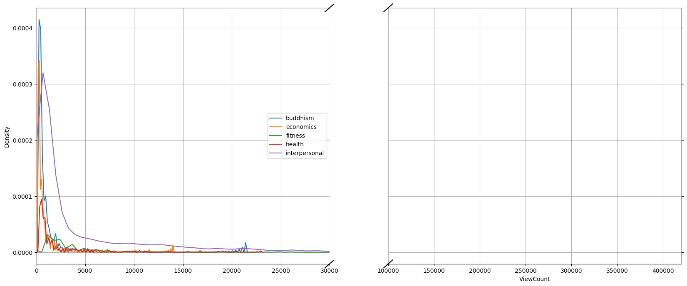
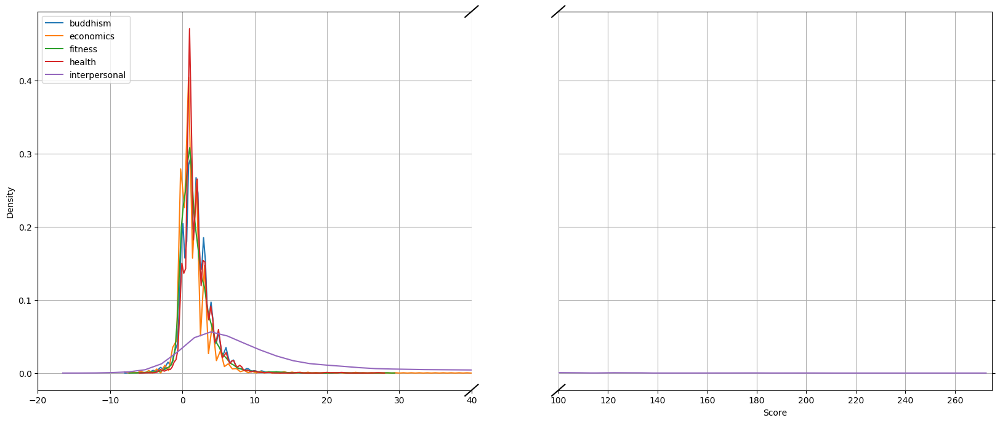
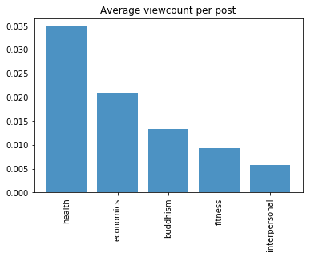
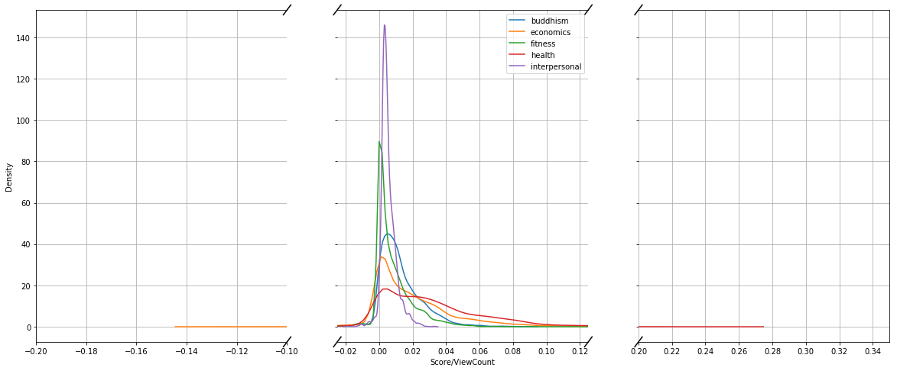

```{r setup, include=FALSE}
knitr::opts_chunk$set(echo = FALSE, message = FALSE)
# Note: include = false implies code is executed but not printed in pdf
```

<!-- set margins for body if different from frontmatter -->
<!-- \newgeometry{left=3.5cm, right=2cm, top=20mm ,bottom=4cm, top=2.5cm} -->

\newpage

<!-- INTRODUCTION: Aims of the study and a brief outline of the main sections of the dissertation -->

# Introduction \label{Intro}

Modern interpersonal communication technologies made possible by the internet have afforded us an exceptional level of connection and engagement with the world. Billions of individuals now interact online every split second, not only with people that they know, but with strangers millions of miles away. An extremely popular manner in which internet users have chosen to engage online is by knowledge sharing through specific question-and-answer (Q&A) websites such as Yahoo! Answers, Quora, the StackExchange family and forums of Massive Online Open Courses (MOOCs). These websites serve as platforms where users seek answers to and discussions on **complex and technical** questions that modern search engines are evidently yet unable to fully address.

<!--While there is no doubt that these technologies and interactions have promoted much productivity and utility around the world, they are not without considerable challenges.Work has recently been devoted to addressing widespread incivility in online communication [@Berry2017; @Gervais2015].-->

It goes without saying that producing legible, relevant and well-researched questions in online Q&A fora is particularly valuable, not least since platforms are particularly prone to "information overload" where cascades of new questions far outweigh the few expert resources available. This research aims to address this problem by determining to what extent positive community engagement can be predicted using only the textual content of questions - i.e. a question's `Title` and `Body`. 

The broad research question can therefore be defined as the following:

\begin{center}
\emph{To what extent can community engagement with questions in online Q\&A communities be accurately captured and predicted?}
\end{center}

While there is a substantial amount of literature that has addressed Q&A fora, it has focused on identifying expert users and high quality answers rather than given attention to questions, despite questions being the entry point for every interaction in communities. I draw heavily on and critique prior research done by @Ravi2014 and analyse question content from the [StackExchange](https://stackexchange.com/sites#) family of Q&A communities. These Q&A fora have a voting mechanism whereby registered community-members can signal how much value specific questions add to the community and it is precisely this metric which I identify as community engagement and aim to predict on.

This research goal thus takes the form of quantitative prediction task rather than qualitative, causal or inferential analysis. I leave it to further research to address the *how* and *why* of community engagement on online Q&A communities, rather than just the *what* that is explored here. I build a **elastic net, regularised** regression model to predict the community-assigned `Score` for each question, which is the result of aggregating all community up-votes and down-votes. 

This research thus has a concrete application to the real world: providing these predictions to questioners in real-time can encourage them to improve the "signal" of their questions before they submit new questions and add demand to the resources of a community. **In this way, it is hoped that the functioning and evolution of these online communities can be improved.** I believe that the fact that this research aims to predict a community-provided measurement of online engagement, has a direct real-life application and will be implemented on **diverse communities makes it the first of its kind.**

I find that **.......... and I conclude that the LDA topic model is not universally effective as @Ravi2014 claimed.**  **and evaluate using root-mean-square error (RMSE)**.

Previous work in the field of questions in online Q&A fora will now be discussed in more detail. This will be followed by a discussion of the data, exploration of the variables included in the model, a description of the model used, and a presentation and discussion of the results. Finally, some recommendations for areas of further research and concluding remarks are made.


\newpage

<!-- MAIN SECTIONS: Review of the literature, description of methods used and the results of the study -->

# Literature Review \label{Lit}

## Question-Answer Communities

Much research has concerned Q&A communities - i.e. on answer quality [@Jeon2006; @Tian2013; @Shah2010], on satisfaction of questioners [@Liu2008] and on the behaviour of so-called "expert" community members [@Riahi2012; @Sung2013]. Often, the framework for Q&A fora has been the optimising the routing of questions to experts [@Li2010; @Li2011; @Shah2018; @Zhou2012], or question routing in accordance with answerer interest in the form of a recommendation system [@Qu2009; @Szpektor2013; @Wu2008].

The research here contrasts with this prior work on Q&A fora in that I focus on the questions rather than user or answer characteristics, not only owing to questions having received substantially less attention literature-wise, but because the quality of questions can significantly impact the quality of answers [@Agichtein2008]. Evidently as questions also serve as the initially entry-point for the question answering process after which all community engagement follows, I believe this focus on questions is well-placed and will enhance the development and functioning of communities.

Another difference is that I place the research problem in a framework discordant of systems-based optimisation of question-answer matching and instead focus on predicting community engagement using only question content. Thus this is aimed at the very real application of potentially nudging users to update and enhance their question content before encumbering community resources. Owing to the large intuitive overlap between question quality and community engagement in Q&A communities, the body of work on question quality in Q&A fora is discussed next.


## Question Quality

High-quality questions assuredly lead to positive community engagement, however **the only difference may be the specific aspects of question content that communities value across communities.** Thus, while the literature discussed here refer to measuring and predicting "question quality", I assert that "community engagement" is a more robust interpretation of what they are measuring and so for the sake of discussion I will refer to question quality as well.

<!--
Lastly, I am of the opinion that question quality is a highly subjective issue, with different communities desiring different aspects of a question (closed-end for hard sciences or promoting-discussion in social sciences for example), hence why I choose to view the `Score` variable as a measure of community engagement instead of question quality. I further believe that this is not the only proxy for community engagement evident in the data, and so that it was I investigate next.
-->

Recent work has looking at predicting question quality for the large Q&A community [Yahoo! Answers](http://answers.yahoo.com) [@Agichtein2008; @Bian2009; @Li2012], but while this dataset has metrics for assessing answer quality in the form of answer "up-votes", it lacks a similarly community-attributed and objective metric for question quality. @Agichtein2008 thus define question quality using question semantic features (lexical complexity, punctuation, typos etc.), @Bian2009 manually label 250 questions and @Li2012 combine the number of answers, number of tags, time until the first answer, author judgement and domain expertise to construct their ground truth.

Fortunately, my datasets are from the StackExchange family of Q&A fora which are rich in community engagement variables like question up-/down-votes and view-counts. Coming directly from the data, these metrics are objective rather than human-labelled and are also therefore not limited in terms of samples from the data (we can use the whole dataset). 

The predictive models employed in the question quality literature have also evolved substantially. Previous work has modelled question quality based on the reputation of the questioner, question categories and lexical characteristics of questions (length, misspelling, words per sentence etc.) [@Agichtein2008; @Anderson2012; @Bian2009; @Li2012].

A fundamental distinction is that I use only the features available at the time a question is initially asked which is congruent with the goal of being able to provide real-time information to questioners before they submit questions to a community. I also don't use any features derived from user attributes, since doing otherwise would not work well for questions asked by new users.

<!--
By ignoring words, topics and other inherent question content and focusing instead on features of the question-asker, users asking questions for the first time would be largely ignored by models of this kind. This is directly opposed to my specific goal of predicting how communities will engage with all users, especially new and inexperienced users who are likely to not have their questions answered at all, let alone positively. For my modeling task, I therefore only focus on explanatory features derived from the contents of questions, not user attributes, history or other data.
-->


## @Ravi2014

A paper that made much headway in the classification and prediction of what they assume is question quality is @Ravi2014, who use the largest and oldest StackExchange site, [StackOverflow](https://stackoverflow.com) I mirror much of the analysis in @Ravi2014, however I believe I build on their analysis significantly and distinctly in a number of ways.

Firstly, as mentioned the literature speaks a lot about "question quality" and @Ravi2014 decide to incorporate a question's `Score` into their ground truth for question quality, yet I posit that what these studies are measuring is instead more accurately characterised as community engagement. My opinion is that question quality is much more nuanced than prior research has asserted, i.e. while most communities will value universal aspects of questions like legibility, coherence, relevance and prior-research, it is difficult to accurately define how much of this contributes to a universal inherent "quality" objectively compared to community-specific traits that communities will naturally value (i.e. closed-end questions in the natural sciences, discussion-promoting for social sciences). Thus while I also incorporate the `Score` metric into a response variable, my characterisation of this ground truth as community engagement is broader and more inclusive.

Another departure from the analysis in @Ravi2014 that I make, is I consider a far more diverse range of communities to compare how models perform across fora. @Ravi2014 specifically state that "[their] methods do not rely on domain-specific knowledge" and therefore "[they] believe [the methods] are applicable to other CQA settings as well" - this is something I particularly want to test and believe will be interesting to flesh out.

A last distinction between my analysis and @Ravi2014 is that they treat the research aim as a classification problem, quite arbitrarily defining a threshold for their response variable to distinguish between "good" and "bad" questions. Despite **making it a more complex problem**, I opt to predict on a continuous response since that would provide a better indication to users of how well it is predicted that a community will react to their question. 

@Ravi2014 manage impressive results however: using textual features and latent topics extracted from question content (i.e. question `Title` and `Body`), their predictions on `Score`/`ViewCount` yield accuracy levels of 72% on their StackOverflow dataset. I will be emulating this part of their research, and thus a discussion of topic modelling is necessary.


## Topic Modeling \label{model_lit}

Bayesian models have recently achieved immense popularity to solve a diverse range of structured prediction challenges in Natural Language Processing (NLP) [@Chiang2010]. @Blei2003 presented Latent Dirichlet Allocation (LDA) topic models as generative Bayesian models for documents to uncover hidden topics as probability distributions over words. LDA can therefore be useful in unearthing underlying semantic structures of documents and to infer topics of the documents. 

Attaining accuracy scores of up to 72% for "good" and "bad" questions, @Ravi2014 have indeed shown the capability of using latent topics derived from LDA modeling. @Ravi2014's final predictive model is based on work by @Allamanis2013, who also analysed the StackOverflow dataset, but did not look at **any form** of "question quality". They uses LDA models at three levels: across the whole question body, on code chunks in the question body, and on the question body without noun phrases.

@Ravi2014 choose to model latent topics 1) Globally in order to capture topics over questions as a whole, 2) locally to seize sentence-level topics, and finally use a Mallows model [@Fligner1986] for a global topic structure to administer structural constraints on sentence topics in all questions.

Since @Ravi2014 see no substantial gains in predictive accuracy using the Mallows model, I only employ the LDA features (**and maybe word-embedding features**), I also split my train/test temporally and differ in deleting low viewcount questions. Despite mirroring the methodology in @Ravi2014, I critique and build on it in many ways and will begin this discussion on my methodology now.


\newpage

# Methodology \label{Method}

## Data \label{Data} 

The [StackExchange](https://stackexchange.com/sites#traffic) family of online Q&A fora are a diverse range of over 170 community websites covering topics from vegetarianism to quantum computing to bicycles. Over and above the textual content of all questions, answers and comments posted since each communities initiation, rich meta-data on all communities is publicly available in XML files compressed in 7-Zip format at [archive.org](http://archive.org/download/stackexchange).

The **five** datasets that I chose to analyse are displayed in table \ref{tab:fora}, along with a short description.

\footnotesize

\begin{longtable} {@{} cccp{9cm} @{}}
\caption{\textbf{Dataset Details}}
\label{tab:fora}\\ 
\toprule
Forum & Questions & Answers & Description \\ 
\midrule
StackOverflow & 18m & 27m & Q\&A for professional and enthusiast programmers \\
Math & 1.1m & 1.5m & Q\&A for people studying math at any level \\
SuperUser & 415k & 601k & Q\&A for computer enthusiasts and power users \\ 
Russian StackOverflow & 273k & 310k & Q\&A for programmers (Russian) \\ 
English & 106k & 249k & Q\&A for linguists, etymologists, English language enthusiasts \\ 
Buddhism & 5.7k & 19k & Discussions on Buddhist philosophy, teaching and practice \\
Economics & 7.7k & 9.9k & For those studying, teaching, researching and applying economics/econometrics \\
Fitness & 8.2k & 16k & Q\&A for athletes, trainers and physical fitness professionals \\ 
Health & 5.6k & 4.5k & For professionals in the medical and allied health fields \\ 
Interpersonal & 3.1k & 13k & Q\&A for anyone wanting to improve their interpersonal skills \\ 
\bottomrule
\end{longtable}
\normalsize

**I extracted the full number of questions from each forum for analysis, resulting in a total number of questions of *so-much***, where the following variables are of interest to my analysis:

\setstretch{0.85}

* `Score`: The difference between registered-user attributed up-votes and down-votes for a question

* `ViewCount`: A counter for the number of page views the question receives (both registered and non-registered users views are taken into account)

* `Title`: The text of the question title

* `Body`: The text of the question body

* `CreationDate`: A datetime variable indicating when the question was initially posted

\setstretch{1.25}

The date ranges for questions from each community are as follows:

Buddhism: 2014-06-17 to 2019-03-02

Economics: 2014-11-18 to 2019-03-03

Fitness: 2011-03-01 to 2019-03-03

Health: 2015-03-31 to 2019-03-02

Interpersonal: 2017-06-27 to 2019-03-02


## Exploratory Analysis

The entire PySpark codebase for the processing and modelling of the data done can be found [here](https://github.com/BCallumCarr/msc-lse-thesis/tree/master/01-python-code). I downloaded the full data from the 5 selected fora, decompressed the 7-Zip files and converted the XML files into [Parquet](https://parquet.apache.org) format. 

Figure \ref{fig:desc} displays the question counts for each dataset. Fora with the largest question activity are Fitness at around 8000 questions, followed by Economics at just over 7000. Buddhism and Health both look approximately equal at 5500, and then substantially lower is Interpersonal at just under 3000.

\footnotesize
\begin{figure}
\caption{\textbf{Fora Descriptives}}
\label{fig:desc}
\begin{minipage}{1\textwidth}
```{r echo=FALSE, out.width='32%'}
knitr::include_graphics("../../01-python-code/00-workspace/01-graphs/post-counts-bar-graph.png")
knitr::include_graphics("../../01-python-code/00-workspace/01-graphs/ave-score-bar-graph.png")
knitr::include_graphics("../../01-python-code/00-workspace/01-graphs/ave-views-bar-graph.png")
```
\\ \centering
{\footnotesize Source: Own calculations in PySpark.}
\end{minipage}
\end{figure}
\normalsize


Interpersonal has a substantially higher average `Score` per question at over 16 compared to others which are just below, indicating that this community hands out votes the easiest. However, Interpersonal also has the highest `ViewCount`, signalling that it has the most viewing activity from both community-members and non-community members alike. When considering the composite variable, `Score`/`ViewCount`, Interpersonal interestingly comes last, showing that although they are overall the most generous at handing out up-votes, when compensating for how much viewing traffic the questions get the community actually has on average the least votes being cast out of the amount of views questions get (due to many non-community member views, many up-votes being offset by down-votes i.e. contentious issues??).

Needless to say, these communities appear to operate quite distinctly, making predicting community engagement by a single topic-based-model quite challenging, which would be contrary to the claim made by @Ravi2014. The above average figures only display one dimension however, so we further graph the density curves for all three variables in figures blah through blah.


## A Clear Definition of the Response Variable

In order to robustly define a response variable capturing community engagement, there are certain aspects of the data and functioning of the StackExchange sites that should be discussed. First of all, although questions on all StackExchange sites being open to the public, posting a question in a community requires registration with an email address and a username. Once registered, users start with a *reputation* level of 1 (https://meta.stackexchange.com/questions/7237/how-does-reputation-work). The reputation levels key to my analysis are laid out as follows: 

\setstretch{0.65}

* 15: Users are allowed to "up-vote" questions and answers

* 125: Users can "down-vote" questions and answers

* 1000: Users can edit any question or answer.

\setstretch{1.25}

One factor is that there seems to be a less-than-full consensus of when exactly to up- or down-vote\footnote{https://meta.stackexchange.com/questions/12772/should-i-upvote-bad-questions} despite general guidelines on StackExchange sites stating that up-votes should be given if a question shows prior research, is clear and useful, and down-voting the opposite. 

One possible confounding factor for the response variable that is worth considering is that questions can be edited, not only by the original poster, but by anyone with a level of reputation of 1000 or more. General cross-community guidelines for editing include addressing grammar and spelling issues, clarifying concepts, correcting minor mistakes, and adding related resources and links. The concern here is that users could vote, comment and answer on substantially different questions over time as a question is edited from it's original form. **The simplifying assumption that I make here is that most edits, if any at all, would happen quickly as moderators are made aware of offending questions and thus the majority of views and votes would happen on final, edited questions. I therefore choose final edited question content to predict on.**

The contrasting reputation levels for up- and down-voting privileges (15 and 125 respectively) also lead to a `Score` variable that is highly negatively skewed, making it more likely that questions will have a higher `Score` and giving the appearance that most questions are highly valued by a community. The density curves of the `Score` variable per community in figure \ref{fig:density} below confirm this. The negative skewness of all 5 curves is clearly evident, and all except Interpersonal are steeply centred just after 0.

\footnotesize
\begin{figure}
\caption{\textbf{Density Plots}}
\label{fig:density}
```{r echo=FALSE, out.width='80%', fig.align='center'}


```
\centering {\footnotesize Source: Own calculations in PySpark.}
\end{figure}
\normalsize

Despite the negative skewness, because I am predicting a continuous response variable as opposed to binary, **I believe this won't be an issue.** It is just the way that the site functions and thus my prediction model will not not be altered to try and force the data to my whim.

A really interesting aspect of the data and of the functioning of the StackExchange sites concerns the `Score` and `ViewCount` variables. **As mentioned**, only members that have registered with the community are able to up-vote and down-vote, thus contributing to the `Score`, but owing to all questions being open to the public, `ViewCount` variable registers views from 1) registered users that can vote, 2) registered users that can't vote due to a reputation level below 15), and 3) non-registered members.

This caveat influences the methodology of @Ravi2014 in two ways. First, they decide to use a composite response variable, `Score`/`ViewCount`, since thise would move in the direction of taking the proportion of users that have decided to vote out of the total number into account (i.e. the percentage of voters that decided to up-vote a question could be small in comparison to the total amount of users that viewed the question). As they rightly point out, considering `Score` alone might lead to conflating popularity with their goal of measuring question quality, since a higher `ViewCount` would definitely bias the `Score` variable upwards owing to the unsymmetrical reputation privileges.

That said, here we have a look at the correlations between the `Score` and `ViewCount` variable:

\footnotesize

\begin{longtable} {@{} cp{11cm} @{}}
\caption{\textbf{Best and Worst Fora Questions}}
\label{tab:bestworst}\\ 
\toprule
\textbf{Forum} & \textbf{Score/ViewCount Correlation} \\ 
\midrule
Buddhism & 0.441583990377997 \\
Economics & 0.29542738683698866 \\
Fitness & 0.35391344729176477 \\
Health & 0.14507264715830742 \\
Interpersonal & 0.8805605882358185 \\
\bottomrule
\end{longtable}
\begin{center} Source: Own calculations in PySpark.\end{center}
\normalsize


I like to place this challenge in a framework of "within-community" engagement, and "outer-community engagement". Votes from community members, and consequently the `Score` variable, is purely a within-community metric since you have to be registered with the community to contribute to this variable. `ViewCount` on the other hand, is both a within- and outer- community engagement variable, since it does not distinguish voting or non-voting status when registering question views. I choose not to mix these two metrics and focus solely on within-community engagement through the `Score` variable - although this may mean popularity may be entangled in this response variable I have chosen, I would assert that popularity is in itself a measurement of community engagement and users would really only be interested in this final `Score` prediction rather than something like `Score`/`ViewCount`.

The second methodological adjustment that @Ravi2014 make with their data is to only consider questions above a certain minimum `ViewCount` threshold. Their reasoning behind this is so that they can be more confident of the final dataset containing questions that have been viewed by qualifying users that can vote, or in other words their claim is that questions with higher `ViewCounts` have a higher probability of having been seen by community members able to vote.

I believe this is a false claim, since one could just as easily argue that new questions that begin with a low `ViewCount` are more likely to see engagement from proactive community members, especially if these questions doesn't generate enough webpage activity to rise as the top hit for search engines (which would lead to more non-community member activity contribution to views). Since there is additionally no data on the distribution of qualifying and non-qualifying user contributions to the `ViewCount` variable, therefore I opt to not disregard any questions below a certain `ViewCount` threshold.

<!--
\footnotesize
\begin{figure}
\caption{\textbf{Response Variable Exploration}}
\label{fig:response}
```{r echo=FALSE, out.width='100%', fig.align='center'}


```
\centering {\footnotesize Source: Own calculations in PySpark.}
\end{figure}
\normalsize
-->

Table \ref{tab:bestworst} displays the titles of a selection of community questions with the highest and lowest `Scores`, i.e. a selection of the "best" and "worst" questions according to the methodology I have chosen.

\footnotesize

\begin{longtable} {@{} cccp{11cm} @{}}
\caption{\textbf{Best and Worst Fora Questions}}
\label{tab:bestworst}\\ 
\toprule
\textbf{Forum} & \textbf{Score} & \textbf{ViewCount} & \textbf{Title} \\ 
\midrule
Buddhism &     55 &       6491 &  Is rebirth a delusional belief? \\
Buddhism &     -7 &        435 &       Why are buddhists hostile? \\
Buddhism &     -7 &        100 &        Who remembers the Buddha? \\
\hline
Economics &     94 &      17337 &  How will non-rich citizens make a living if jobs keep getting replaced by robots and are outsourced? \\
Economics &     -9 &        102 &                                      Has anyone made a successful economic prediction more than once? \\
\hline
Fitness &    111 &     132387 &  Is it healthy to exercise a muscle when it's still sore? \\
Fitness &     -7 &         51 &                       Gaining fat for muscles-stomach fat \\
\hline
Health &    103 &       5218 &                            How can I protect my eyesight when using computers? \\
Health &     -6 &        120 &  Would a stomach/bladder port allow for infinite and safe eating of junk food? \\
\hline
Interpersonal &    263 &      31487 &                     What to do if you are accidentally following someone? \\
Interpersonal &     -9 &       1327 &  How can I tell if family members consider my unvaccinated kids a threat? \\
Interpersonal &     -9 &        884 &             How to tell employees that I don't mean my insults seriously? \\
\bottomrule
\end{longtable}
\begin{center} Source: Own calculations in PySpark.\end{center}
\normalsize

**Table \ref{tab:bestworst} appears to show that questions that are considered the "best" tend to be honest and discussion-promoting, whereas the "worst" questions are often sarcastic and probably not genuinely looking for an answer - the questions from the Economics and Fitness fora illustrate this. Social norms also appear to play a strong part, since the "worst" question on the Interpersonal forum eludes to children being unvaccinated, which I assume would upset many individuals on the forum and lead to lowest `Score` per `ViewCount` for that forum.** We can see that this is now validated.

I split that set of questions, $Q$, into a training set $Q_\text{train}$ and testing set $Q_\text{train}$ using a point in time to mimic the reality of employing this tool at a certain point in time with historical training data. With the chosen date of **1/1/2017**, the ratio of $Q_\text{train}$ to $Q_\text{train}$ are ....... for ......... respectively. 

**This addresses something that has not been considered in the literature and introduces a temporal element into the analysis. While I do not employ time-series models, I leave it to further research to incorporate a way to "remember" which questions are good, so that in future there are no duplicates.**


## Model \label{Model} 

I employ a simple regularised regression with the `Body` and `Title` as inputs from questions $q_i$ out of $Q_\text{train}$, i.e. the learning goal is to find a coefficient vector $\bm{\beta}$ that minimises the Root Mean Squared Error:

\begin{align} \label{rmse}
\underset{\bm{\beta}}{\text{minimise}} \quad \sqrt{ \frac{1}{|Q_\text{train}|} \sum_{ q_{i} \in Q_{\text{train}} } ( y_i - {\bm{\beta}\phi(\bm{x'}_i}) )^2 + \lambda \bm{\beta}\bm{\beta'} }
\end{align}

The $y_i$ is the true value of the response variable, `Score`/`ViewCount`, and $\bm{\beta}\phi(\bm{x'}_i)$ is the predicted response. $\phi(\cdot)$ is a function on the features, and leads to the feature engineering, of which lda is discussed in section \ref{lda}. $\lambda$ is the regularisation parameter .......

I use the `pyspark.sql.mllib` package in PySpark and inherent online LDA learning framework to solve the optimisation problem \ref{rmse}.

I use 2-fold cross validation - 2 because increasing the number of folds did not lead to large gains in RMSE reduction, and also drastically increased computation time.

## Feature Engineering

A number of preprocessing steps was then applied to the question `Body` and `Title` - HTML parsing for the question content in the `Body` variable, tokenisation, removal of English stopwords and Russian stopwords for Russian StackOverflow and stemming of tokens.


# Results \label{Results} 

The results of the various models are displayed in tables. From it, we can see this this and that.


\footnotesize
\begin{longtable}[htbp] {@{} lccc @{}} 
\caption{\textbf{Constant Mean Model}} 
\label{tab:mean_model} \\
\toprule
\textbf{Forum} &  \textbf{Train RMSE} &  \textbf{Test RMSE} &  \textbf{Time (s)} \\
\midrule
Buddhism      &              3.744804 &              3.026707 &                0.19 \\
Economics     &              3.558443 &              2.629807 &                0.20 \\
Fitness       &              5.630797 &              3.168150 &                0.37 \\
Health        &              4.331709 &              2.568920 &                0.29 \\
Interpersonal &             25.585999 &             16.252211 &                0.16 \\
\bottomrule
\end{longtable}
\begin{center} Source: Own calculations in PySpark\end{center}
\normalsize

We use the mean of the training set as predictions for the test set in table \ref{tab:mean_model}, which is the low benchmark. Interestingly, test RMSE is lower for all communities than train RMSE, thus it appears that there is substantially more noise in the training sets (remember that the training sets are older questions as well).

This leads us to investigate the variation among train/test samples for the communities:

\footnotesize
\begin{longtable}[htbp] {@{} lccc @{}} 
\caption{\textbf{Random 80/20 Train/Test Descriptives}} 
\label{tab:tr-te} \\
\toprule
\textbf{Forum} &  \textbf{Train StdDev} &  \textbf{Test StdDev} \\
\midrule
Buddhism & 3.68 & 3.33 \\
Economics & 3.51 & 2.96 \\
Fitness & 5.28 & 5.28 \\
Health & 4.22 & 3.54 \\
Interpersonal & 24.33 & 23.09 \\
\bottomrule
\end{longtable}
\begin{center} Source: Own calculations in PySpark\end{center}
\normalsize

\footnotesize
\begin{longtable}[htbp] {@{} lccc @{}} 
\caption{\textbf{Temporal 80/20 Train/Test Descriptives}} 
\label{tab:tr-te} \\
\toprule
\textbf{Forum} &  \textbf{Train StdDev} &  \textbf{Test StdDev} \\
\midrule
Buddhism & 3.75 & 1.77 \\
Economics & 3.56 & 1.98 \\
Fitness & 5.63 & 2.2 \\
Health & 4.33 & 2.15 \\
Interpersonal & 25.59 & 11.72 \\
\bottomrule
\end{longtable}
\begin{center} Source: Own calculations in PySpark\end{center}
\normalsize

Data has heterogeneity when considered temporally, possibly because of interventions in communitites to effect answers?

<!--
\footnotesize
\begin{longtable}[htbp] {@{} lcccc @{}} 
\caption{\textbf{Viewcount Ravi Temporal Model}} 
\label{tab:vc_model} \\
\toprule
\textbf{Forum} &  \textbf{Train RMSE} &  \textbf{Test RMSE} &  \textbf{Test Gain (\%)} &  \textbf{Time (s)} \\
\midrule
Economics     &             0.026223 &          0.037722 &              0.185 &               5.96 \\
Buddhism      &             0.014088 &          0.015799 &             -0.317 &               5.23 \\
Fitness       &             0.012161 &          0.020627 &              0.674 &               4.32 \\
Health        &             0.035242 &          0.040102 &              0.162 &               4.07 \\
Interpersonal &             0.004805 &          0.008177 &              2.597 &               4.09 \\
\bottomrule
\end{longtable}
\begin{center} Source: Own calculations in PySpark\end{center}
\normalsize
-->


\footnotesize
\begin{longtable}[htbp] {@{} lcccc @{}} 
\caption{\textbf{ViewCount Model}} 
\label{tab:vc_model} \\
\toprule
\textbf{Forum} &  \textbf{Train RMSE} &  \textbf{Test RMSE} &  \textbf{Test Gain (\%)} &  \textbf{Time (s)} \\
\midrule
Buddhism      &             3.374630 &          2.613928 &             13.638 &               5.22 \\
Economics     &             3.415546 &          2.394207 &              8.959 &               4.94 \\
Fitness       &             5.281202 &          2.798655 &             11.663 &               4.92 \\
Health        &             4.287559 &          2.522763 &              1.797 &               4.32 \\
Interpersonal &            12.321576 &          5.702388 &             64.913 &               4.30 \\
\bottomrule
\end{longtable}
\begin{center} Source: Own calculations in PySpark\end{center}
\normalsize

Table \ref{tab:vc_model} is the high benchmark, since it is vacuous (the final `ViewCount` of a question is not available for new questions) and a higher `ViewCount` would definitely lead to higher `Score`. 

\footnotesize
\begin{longtable}[htbp] {@{} lcccccc @{}} 
\caption{\textbf{Tokens Model}} 
\label{tab:token_model} \\
\toprule
\textbf{Forum} &  \textbf{Train RMSE} &  \textbf{Test RMSE} &  \textbf{Test Gain (\%)} &  \textbf{Time (s)} & \textbf{Elastic Param} &  \textbf{Reg'tion Param} \\
\midrule
Buddhism      &          3.744804 &       3.026707 &           0.00 &           87.81 &               1.0 &               1.0 \\
Economics     &          3.558443 &       2.629807 &           0.00 &          139.93 &               1.0 &               1.0 \\
Fitness       &          5.630797 &       3.168150 &           0.00 &          141.84 &               1.0 &               1.0 \\
Health        &          4.331709 &       2.568920 &           0.00 &           91.37 &               1.0 &               1.0 \\
Interpersonal &         20.579032 &      17.264799 &           -6.23 &          120.35 &               1.0 &               1.0 \\
\bottomrule
\end{longtable}
\begin{center} Source: Own calculations in PySpark\end{center}
\normalsize

The results of using unigram text of question titles and bodies is displayed in table \ref{tab:token_model}. This model struggles particularly, only predicting constant mean predictions for every community except for Interpersonal, where it actually performs worse than just predicting the mean by 6%. Interestingly, the grid search gives an elastic parameter of 1 and regularisation parameter of 1 for all models.

<!--
\footnotesize
\begin{longtable}[htbp] {@{} lcccccc @{}} 
\caption{\textbf{Tokens Ravi Temporal Model}} 
\label{tab:vc_model} \\
\toprule
\textbf{Forum} &  \textbf{Train RMSE} &  \textbf{Test RMSE} &  \textbf{Test Gain (\%)} &  \textbf{Time (s)} & \textbf{Elastic Param} &  \textbf{Reg'tion Param} \\
\midrule
Economics     &          0.026446 &       0.037769 &           0.061 &          606.66 &             0.001 &             1.000 \\
Buddhism      &          0.014281 &       0.015740 &           0.057 &          385.50 &             1.000 &             0.001 \\
Fitness       &          0.012305 &       0.020767 &          -0.000 &          571.22 &             0.001 &             1.000 \\
Health        &          0.035030 &       0.040057 &           0.274 &          374.23 &             0.001 &             1.000 \\
Interpersonal &          0.004935 &       0.008395 &          -0.000 &          458.33 &             1.000 &             1.000 \\
\bottomrule
\end{longtable}
\begin{center} Source: Own calculations in PySpark\end{center}
\normalsize
-->


DISCUSS WHY RMSE IS DIFFERENT PER COMMUNTIY


# Limitations \label{Limit}

Different motivations behind voting.

Different interventions from StackExchange sites (nudges introduced already.)

One aspect of this research that stands out as an area for further research is the fact that only one target variable was considered (i.e. `Score`/`ViewCount`) as a measurement of community interaction, whereas in reality there are others already available in the data. There are metrics recording how many interactions a question receives, such as `AnswerCount` (the number of answers for a question) and `CommentCount` (the number of comments for a question), which all signify at least some engagement with a question, although whether this is positive or negative engagement is unknown. In response to this, one could construct a variable relating to the linguistic sentiment of the answers (not comments, since comments need not be directed at the original questioner), however the subtleties of identifying sarcastic and condescending answers and comments might be overly difficult, especially since communities would value pleasant critical feedback. 

Another variable that is a direct indication of questioner satisfaction is whether they deem an answer to have successfully addressed their question, which is recording in the variable `AcceptedAnswer`. This variable is not without its own issues, since users may find utility from multiple answers and neglect to formally select an accepted answer at all, biasing the number of formally solved questions downwards and confounding the response variable. Furthermore, answers are commonly posted as comments and vice-versa (see https://meta.stackexchange.com/questions/17447/answer-or-comment-whats-the-etiquette), and this too would confound the predictive results for this variable. Comments being posted as answers (i.e. "clogging up" the list of answers), can be a case of users who don't have the required level of reputation to comment yet or a case of users chasing reputation points by using jokes, which obscurs the reputation measurement as users get voted up for being humourous rather than their expertise. Treating this variable as the target variable also situates the research problem in terms of exclusive utility to the user, whereas the `Score` variable is a more broader measurement of how the community values questions, which in turn should translate into utility for the questioner. One assumption that would mitigate issues surrounding the `AcceptedAnswer` variable would state that the discussed anomalies are not common enough and are not biased to specific posts with an even and randomly distribution over the data it would not significantly effect the results.

One last response variable for consideration is the number of times a post is edited, the `EditCount`. This variable could have two implications however - more edits signify more effort needed to bring the question in the desired state (i.e. it is inversely proportional to positive community engagement), or more edits signify more energy willingly devoted to improving the question because it will add value to the community (and thus it is directly proportional to positive community engagement).

Temporal aspect


<!-- CONCLUSION: Conclusions that can be drawn from your work, possible extensions and further work -->

\newpage

# Recommendations for Further Research \label{Recom}

**As has been discussed**, there are other response variables for consideration, each with their own merits and disadvantages, however further research could investigate these and address the issues surrounding each response.

As mentioned, one limitation is that questions can be edited not only by the original poster, but also by anyone with 2000 reputation or more. One suggestion for further research would be investigating average times-taken for events such as edits, answers, votes and views to ascertain if the assumption of most votes occurring before edits is permissable (NO DATA ON THIS THOUGH).

Another is that the above model does not take into account the temporal nature of questions - i.e. a good question that is asked will be received positively by the community, however if a very similar question is asked later on, the community will see that as "lack of prior research" and will respond negatively. This analysis is but just a first step in accurately predicting positive community reaction, so further research could address the temporal model.

<!--

Sentiment - direction 
ANSWER BEEN ACCEPTED/AT LEAST ONE ANSWER
T-SNE DOESN'T CONSERVE DISTANCE
NOISE IN PCA
GOOD/GREAT QUESTION STRING IN COMMENTS/ANSWER
EMBEDDING
HIGH REPUTATION ANSWERERS BEHAVIOUR - LOOK AT THE QUESTIONS THAT THEY LOOK AT

THREE HYPOTHESES - SCORE OF ANSWERS, 
RANK ACCORDING 
Kruskal-Wallis TEST, WHAT THE DIFFERENT METRICS HAVE SCORED, CHECK ASSUMPTIONS

Can view this from a different angle as to how much a question adds value to a community, but since I decided to put the emphasis on the user and not the community to help improve initialy information retrieval requests, this is what I did.-->


\newpage

# Concluding Remarks \label{Concl}

The aim of this research was to predict the range of positive/negative community engagement that questions elicit. I believe that no prior research has endeavoured with the methodology here in this respective framework to predict and capture community engagement. At the very least, the research here has improved upon the extent of how community engagement can be ascertained from online Q&A communities, and has yielded insight into how homogeneously community engagement exists over diverse communities with various subject matter. I believe that using this tool, online Q&A users will be assisted in improving their submitted questions which will enhance the productivity of all online Q&A communities wholly. Furthermore, room exists for implementation on any assortment of Q&A sites, counting Massive Open Online Courses.


<!-- BIBLIOGRAPHY -->

\newpage

\section*{References}


<!-- APPENDICES: Not encouraged

\newpage

# Appendix {.unnumbered}

\setcounter{table}{0}

A table in the Appendix:

\footnotesize
\begin{longtable}[htbp] {@{} lrrrrrrrr @{}} 
\caption{\textbf{Modelling Results}} 
\label{tab:Results} \\
\toprule
\textbf{Forum} &  \textbf{Constant Mean: RMSE} &  \textbf{Constant Mean: Time(s)} &  \textbf{Tokens: RMSE} &  \textbf{Tokens: Time(s)} &  \textbf{Tokens: Improve} &  \textbf{ViewCount: RMSE} &  \textbf{ViewCount: Time(s)} &  \textbf{ViewCount: Improve} \\
\midrule
English           &         0.020986 &              1.23 &     0.032631 &        800.51 &         -55.489 &        0.020949 &            17.27 &              0.176 \\
Math              &         0.027263 &              1.97 &          NaN &           NaN &             NaN &        0.027226 &            62.91 &              0.136 \\
Rus\_Stackoverflow &         0.023957 &              0.83 &          NaN &           NaN &             NaN &        0.023914 &            21.44 &              0.179 \\
Stackoverflow     &         0.022020 &              0.85 &          NaN &           NaN &             NaN &        0.022019 &            31.06 &              0.005 \\
Superuser         &         0.020280 &              0.87 &          NaN &           NaN &             NaN &        0.020267 &            24.81 &              0.064 \\
\bottomrule
\end{longtable}
\begin{center} Source: Own calculations in PySpark\end{center}
\normalsize
-->