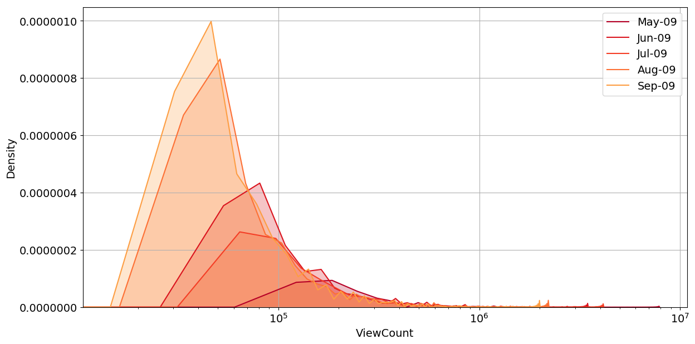
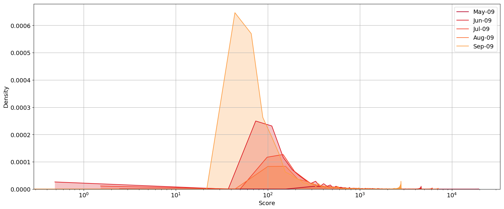
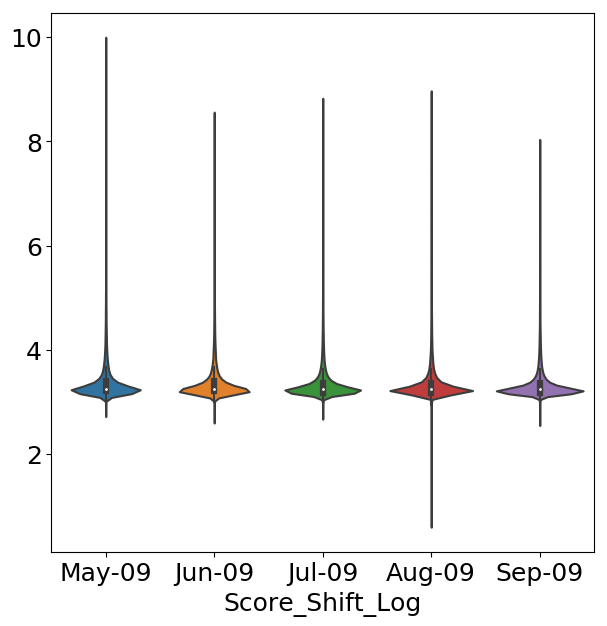
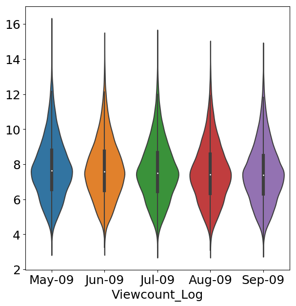
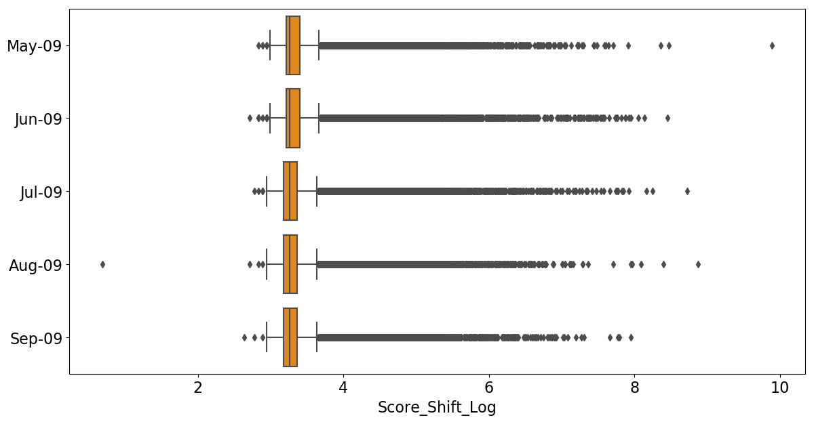
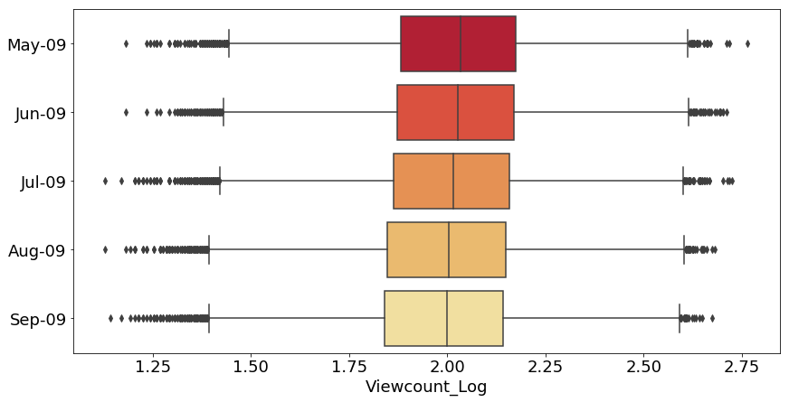
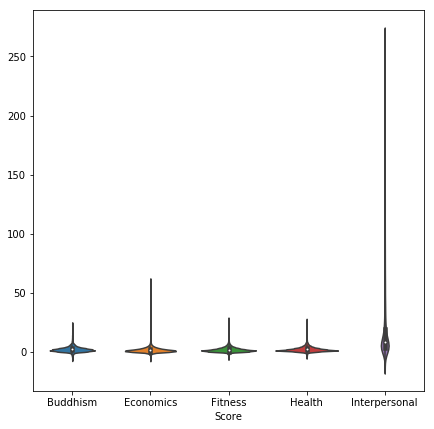
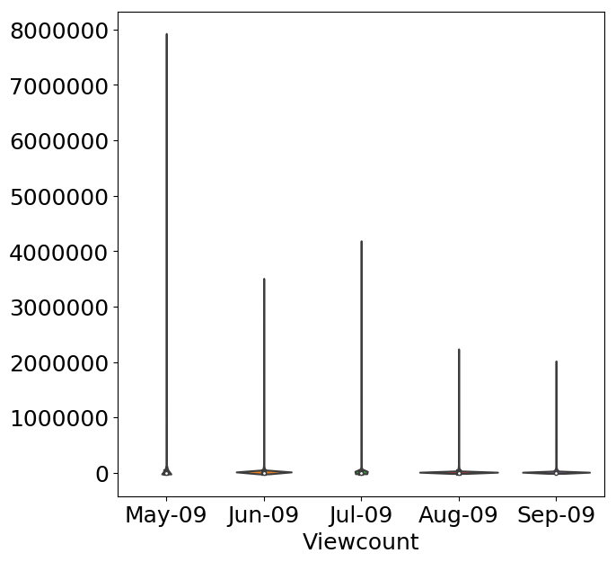

```{r setup, include=FALSE}
knitr::opts_chunk$set(echo = FALSE, message = FALSE)
# Note: include = false implies code is executed but not printed in pdf
```

<!-- set margins for body if different from frontmatter -->
<!-- \newgeometry{left=3.5cm, right=2cm, top=20mm ,bottom=4cm, top=2.5cm} -->
<!--   after employing feature engineering techniques sourced from the relevant literature across all fora.** Having taken the step to predict a continuous proxy measurement of online community engagement and begun **addressing temporal issues**, I belive my **unique and original** research shows that there is still much to be done to predict online community engagement objectively and effectively, especially when considering the **chronological nature of online Q&A data**. My findings **challenge** those of prior research showing that features derived from the length and topics of questions yield **large** improvements over baseline predictions and further that **topic models perform universally well on diverse datasets**.  -->

\newpage

<!-- INTRODUCTION: Aims of the study and a brief outline of the main sections of the dissertation -->

# Introduction \label{Intro}

Modern interpersonal communication technologies made possible by the internet have afforded us an exceptional level of connection and engagement with the world. Billions of individuals now interact online instantly, not only with people that they know, but with strangers millions of miles away. One avenue of online interaction that has become an extremely popular way in which users share knowledge about diverse and nuanced subject matter is question-and-answer (Q&A) websites such as Yahoo! Answers, Quora, the StackExchange family and forums of Massive Online Open Courses (MOOCs). These websites serve as dynamic, engaging platforms where users seek answers to and discussions on complex and technical questions that modern search engines are evidently yet unable to fully address.

Producing relevant, well-researched and high-quality questions in these online Q&A fora is especially valuable, not least since these platforms suffer in particular from a low ratio of expert resources to volume of new questions - an example of the problem known as *information overload* [@Eppler2004]. The overarching hypothesis of this research is that if questioners in online Q&A fora were provided with information specifically related to how well their questions would be received by communities, they could then iterate to "increase the signal" of their questions before exerting demand on community resources, mitigating the problem of information overload. If this were possible, it would no doubt benefit questioners in that they would effectively garner expert answers to their improved questions, but also entire communities as overall functioning and efficiency would be enhanced community-wide.

Predicting how positively or negatively online communities would react to user questions in real time is a non-trivial problem however, since these predictions would have to be made using only the information available when new questions are formulated. This implies that predictive models would only be able to learn from features derived from question content, as opposed to features such user characteristics, final webpage viewing statistics etc. 

Ideally, final predictions given to questioners would also ideally be highly granular and direct questioners towards how best to improve their questions in the form of a recommendation system, however the aim of this research is to progress one step from previous work on questions in online Q&A communities and ascertain if community engagement in online Q&A fora can actually be predicted with some measure of accuracy.

The broad research question for this paper can therefore be summarised as the following:

\begin{center}
\emph{To what extent can community engagement with questions in online Q\&A communities be accurately predicted using only question content?}
\end{center}

While there is a substantial amount of literature that has addressed online Q&A communities, interestingly the focus has been on identifying expert users and high quality answers rather than on questions, despite questions being the entry point for every interaction in communities. In an attempt to answer the research question above, I build on the small collection of research on *question quality* in online Q&A fora and draw heavily on<!-- and critique--> work done by @Ravi2014 on the popular computer programming community [StackOverflow](https://StackOverflow.com). I critique and expand the analysis of @Ravi2014 by considering a continuous response variable measuring community engagement as opposed to binary and analyse multiple, chronological **monthly** StackOverflow datasets.

Since the StackOverflow online Q&A community records an aggregation of all community *up-votes* and *down-votes* for questions in a `Score` variable, I argue that this comprehensively captures community engagement and predict this variable using only the textual content of questions. In line with the analysis of @Ravi2014, I employ latent Dirichlet allocation [@Blei2003] (LDA) to engineer latent topic features from question content for predictions. I use **elastic-net** regularised regression for the learning task and evaluate models using root-mean-square error (RMSE). 

It should be highlighted that the goal of this research is quantitative prediction rather than qualitative, causal or inferential analysis.<!--While I will briefly touch on the differences between predictive model results across the communities I analyse, --> I leave it to further research to address more precisely the *how* and *why* of community engagement in online Q&A communities, rather than just the *if* that is explored here. To my knowledge this research is the first of its kind to test latent topic models on a continuous and objective measurement of online community engagement over chronological time periods as well as have a real-life use-case, resulting in a practical and unique contribution.

\newpage

**My findings** show that there is still much work to be done to accurately predict community engagement in online Q&A fora.<!--Contrary to results from @Ravi2014 (although I do use a slightly different response variable),--> I find that models that include features derived from the lengths and topics of questions do **NOT** perform better than a baseline of just average `Score` prediction from the training question set. **leading me to believe that in order to accurately predict future community engagement, models need to incorporate temporal and time-series elements.**

In the following section I discuss relevant literature in more detail. This is followed by section \ref{Method} which discusses the data, explores and validates my choice of the `Score` variable as an objective measurement of community engagement and describes the predictive model used. Section \ref{Results} presents and discusses the results, section \ref{Recom} explores some recommendations for areas of further research and finally section \ref{Concl} makes some concluding remarks.


\newpage

<!-- MAIN SECTIONS: Review of the literature, description of methods used and the results of the study -->

# Literature Review \label{Lit}

## Question-Answer Communities

There is a substantial collection of research that has investigated online Q&A communities. Prior work has addressed answer quality [@Jeon2006; @Tian2013; @Shah2010], satisfaction of questioners [@Liu2008] and the behaviour of highly productive, expert community members [@Riahi2012; @Sung2013]. Two common frameworks for prior work has been the optimisation of routing questions to experts [@Li2010; @Li2011; @Shah2018; @Zhou2012], and matching questions in accordance with answerer interest in the form of a recommendation system [@Qu2009; @Szpektor2013; @Wu2008].

My research differs from this previous work on Q&A fora in two respects. Firstly, I focus on questions rather than user or answer characteristics, not only because they have received substantially less attention in the literature, but because it has been shown that question quality can substantially impact the quality of answers [@Agichtein2008]. Questions in online Q&A fora are also the initial event that all community engagement follows from and thus maximising positive community engagement with questions will almost certainly improve the evolution and functioning of communities.

The second divergence from prior research is the framework in which this research is placed. I choose a framework of community engagement and interaction with user actions rather than the systems-based optimisation of question-answer routing and matching and instead concentrate on how questioners can be nudged to improve the content of their questions before encumbering community resources. 

**Community engagement is a rather broad term in literature ranging across fields and disciplines, but I have not found any literature relating to community engagement in the context of online Q&A fora.**

With the promise of this real-life application which significantly benefit both questioners and communtities, it remains to be seen if community engagement in online Q&A fora can be successfully predicted. Owing to a large overlap between this goal and the literature on predicting question quality in online Q&A communities, I discuss this literature next.

<!-- questions also serve as the entry-point for the question answering process after which all community engagement follows-->


## Question Quality

Naturally, community engagement and question quality go hand in hand: high quality questions will no doubt lead to positive community feedback in the form of many up-votes, answers and discussion promoting comments. I argue later point that *community engagement* is a more accurate and thorough definition of what the following literature claims to measure, however for the sake of discussion I will refer to *question quality* here as well.

A recent line of work has looked at predicting question quality in the large Q&A community [Yahoo! Answers](http://answers.yahoo.com) [@Agichtein2008; @Bian2009; @Li2012] - a dataset which has metrics for assessing answer quality in the form of answer up-votes, however regrettably lacks a similarly community-attributed and objective metric for question quality. This has resulted in subjective attempts to define question quality: @Agichtein2008 define question quality using questions' semantic features (lexical complexity, punctuation, typos etc.), @Bian2009 use manual labels for 250 questions and a semi-supervised coupled mutual reinforcement framework to label a larger number of questions, and @Li2012 combine the number of answers, number of tags, time until first answer, author judgement and domain expertise to construct their ground truth.

Fortunately, the StackOverflow datasets that I analyse are rich in objective community-attributed metrics such as question up- and down-votes, comments, and views, all over and above community answers themselves. These metrics are objective in the sense that they do not require construction or labeling form the researchers' side, and subsequently allow for a large collection of questions to be analysed automatically.

Another aspect of the literature that has evolved substantially over time are the predictive models employed to predict question quality. Previous work has modelled question quality based on the reputation of the questioner, question categories and lexical characteristics of questions (length, misspelling, words per sentence etc.) [@Agichtein2008; @Anderson2012; @Bian2009; @Li2012]. By ignoring the actual textual and topical content of questions and focusing on features of the questioner however, these approaches would perform poorly on questions from new users without a community history. 

Owing to my research goal centering around predicting community engagement for all community members, and in particular new and inexperienced users who have a higher likelihood of receiving negative community engagement due to poorly constructed questions, I use only features available when a question is initially asked (and forego features derived from user attributes). The methodology that I have thus far laid out mirrors work done by @Ravi2014 to predict question quality for the StackOverflow community, and so I discuss their contributions next.


## @Ravi2014

My research is based on and closely follows work done in @Ravi2014. @Ravi2014 extract 410\ 049 questions between 2008 and 2009 from the coding community [StackOverflow](https://stackoverflow.com) to predict a binary notion of question quality, i.e. a prediction whether questions are "good" or "bad". Using features derived from the length, textual content and latent topics in questions, they achieve accuracy levels of approximately 70%, substantially beating out a baseline "popularity" model using only question-webpage views by 10%. Their conclusion is that, through the use of latent topic models, they are able to automatically predict a notion of question quality that extends beyond just popularity.

While I will implement the same models on the **same dataset** as @Ravi2014, I build on and diverge from their methodology in a number of ways. The first and clearest distinction in my analysis concerns the response variable to be predicted. @Ravi2014 decide to construct a response variable by dividing the community-attributed question `Score` (the aggregation of all user up-votes and down-votes) by the number of views a question receives, or a questions' `ViewCount`. They rightly state that using the `Score` variable alone would risk conflating question quality and popularity since questions that receive higher views are more likely to be voted on. Since my research objective differs in that I frame my research problem in terms of community engagement rather than question quality, I use only the question `Score` as my response variable. As will be expanded upon later, I believe this metric comprehensively represents within-community engagement, of which popularity and the ability to attract views is an integral component.

This leads me to another extension of the work in @Ravi2014 that I make which concerns their treating the prediction problem as binary classification, i.e. predicting "good" versus "bad" questions. In predicting their composite response variable, `Score`/`ViewCount`, they quite arbitrarily decide on a threshold of 0.001 to distinguish between the good (above 0.001) and bad questions (equal to 0), and analyse only a subset of 66\ 398 questions (or only 16% of the questions they extracted). I opt to use the continuous `Score` variable **as it is**, mitigating any arbitrary decisions on label boundaries for good and bad questions. In this way, not only would questioners be provided with a more informative prediction of how well a community will react to their questions, but it is easily interpretated and understandable.

**Another way** in which I extend on the analysis in @Ravi2014 is in considering a diverse range of communities/diverse range of time periods for the StackOverflow dataset. **Temporal stuff, different time periods.** Lastly, at the end of my analysis I will split the train and test set temporally to take a step towards predicting *future* community engagement from *past* engagement, which I believe will complicate things, especially since I do not employ a time-series model.

**More broadly**, I believe a framework of community engagement is more robust and methodologically accurate than an interpretation of "question quality". I am of the opinion that question quality as a definition is much more nuanced than the prior research has asserted, not least because the definition of quality itself is highly subjective. As an example, while most communities may universally value certain aspects of questions such as legibility, coherence, relevance and prior-research etc., there could be just as many or more question traits that different communities value disproportionately - i.e. closed-end questions may be valued in the natural sciences to a greater extent compared to say discussion-promoting questions in the social sciences. Furthermore, a community's notion of "quality" could evolve over time. A framework of community engagement as opposed to question quality therefore allows for heterogeneity in how questions are valued across communities and over time, yet still it still preserves common and interpretable metrics for whether engagement is *positive* or *negative*.

Since @Ravi2014 use the textual features and latent topics extracted from question content and I will be emulating this part of their research, I discuss topic modelling next.

<!--
## Community Engagement

While there is no doubt that these technologies and interactions have promoted much productivity and utility around the world, they are not without considerable challenges. Work has recently been devoted to addressing widespread incivility in online communication [@Berry2017; @Gervais2015].
-->


## Topic Models \label{model_lit}

Over the last decade and a half, Bayesian models have recently become increasingly attractive in solving a range of structured Natural Language Processing (NLP) prediction problems [@Chiang2010]. Topic modelling is one such area where Bayesian inference has become particularly prominent and which has been applied to NLP tasks such as query-focused summarisation [@Daume2006], deriving concept-attribute attachments [@Reisinger2009], co-reference resolution across documents [@Haghighi2010], modeling selection preferences [@Ritter2010] and name ambiguity resolution [@Kozareva2011].

Topic models like LDA conceived by @Blei2003 are unsupervised generative probabilistic models that can be used on textual documents to represent hidden topics as probability distributions over words underneath the semantic structure of the text. One valuable use for LDA and similar methods is thus to infer assortment of topics for a collection of documents.

@Allamanis2013 applied LDA to questions from the StackOverflow dataset and proposed a three tiered technique: an LDA model over the whole question body, another on code chunks in the question body, and a last model on the question body without noun phrases. Since @Allamanis2013 do not attempt to predict a measure of question quality or community engagement, @Ravi2014 extend their analysis to demonstrate that inferred latent topics are significant predictors of their measurement of question quality.

Indeed, with accuracy scores of up to 72% in classifying high and low quality questions, the analysis in @Ravi2014 hints strongly at the capabilities of features derived from latent topics for prediction. As in @Allamanis2013, @Ravi2014 build models to capture topical elements of questions at three levels, however they choose 1) a global model to derive topics over all questions, 2) a local topic model for sentence-level topics, and 3) a Mallows model [@Fligner1986] for global topic structure enforcing structural constraints on sentence topics in all questions.

Since @Ravi2014 see no substantial gains in predictive accuracy when incorporating the Mallows model, I exclude this from my methodology, **leaving me employing** the first two levels of the methodology of @Ravi2014, engineering latent topic features from questions on both the global level and local sentence level. Following the methodology of @Ravi2014 and extending it to a prediction on the continuous `Score` variable which is assumed to be a measure of community engagement, I will be able to ascertain if latent topic models are as effective in this new learning task, and as effective over time with multiple StackOverflow datasets. I begin the discussion of the data and thorough motivations for my choice of the `Score` variable in the next section.


\newpage

# Methodology \label{Method}

## Data Selection \label{Data} 

<!--
\footnotesize
\begin{longtable} {@{} cccccp{7cm} @{}}
\caption{\textbf{Details of Datasets}}
\label{tab:fora}\\ 
\toprule
Forum & Questions & Answers & Users & Site Age & Description \\ 
\midrule
StackOverflow & 18m & 28m & 11m & 11yrs & Q\&A for professional and enthusiast programmers \\
SuperUser & 420k & 605k & 795k & 10yrs & Q\&A for computer enthusiasts and power users \\ 
Math & 1.1m & 1.6m & 567k & 9yrs & Q\&A for people studying math at any level \\
Cross Validated (Stats) & 143k & 143k & 209k & 9yrs & Q\&A for people interested in statistics \\ 
English & 107k & 250k & 267k & 9yrs & Q\&A for English language enthusiasts \\ 
Fitness & 21k & 8.2k & 16k & Q\&A for athletes, trainers and physical fitness professionals & \\ 
Economics & 17k & 7.8k & 9.9k & For those studying, teaching, researching and applying economics/econometrics & \\
Buddhism & 9.7k & 5.8k & 19k & Discussions on Buddhist philosophy, teaching and practice & \\
Health & 13k & 5.6k & 4.5k & For professionals in the medical and allied health fields & \\ 
Interpersonal & 22k & 3.1k & 13k & Q\&A for anyone wanting to improve their interpersonal skills & \\
\bottomrule
\end{longtable}
\normalsize
-->

The [StackExchange](https://stackexchange.com/sites#traffic) family of online Q&A fora are a diverse range of over 170 community websites covering topics from vegetarianism to quantum computing to bicycles. Over and above the textual content of questions, of answers and of comments posted since each community's conception, rich meta-data on an array of community interactions is publicly available in XML files compressed in 7-Zip format at [archive.org](http://archive.org/download/stackexchange). 

At over 11 years of age with 18\ million questions, 11\ million users and 9.3\ million site visits a day, [StackOverflow](https://stackoverflow.com) is not only the oldest and largest StackExchange Q&A community, but is arguably the largest dedicated computer programming community on the internet. After launching in July 2008, StackOverflow has averaged 2\ million questions posted each year since 2012, encounters 6\ 200 new questions every day [@StackExchange.com] and is ranked the 41st most popular website according to Alexa Internet's ranking [@Alexa.com].

I choose to analyse **four monthly** StackOverflow question datasets starting from **May 2009**. This choice broaches an aspect of the research problem that has yet to be considered in the literature - the temporality of online Q&A data, and the potentially very difficult challenge of predicting *future* community engagement from *past* community engagement.

Predicting future community engagement is a particularly ambitious endeavour since there is little doubt that how questioners formulate questions and how communities value/engage with questions are subject to change over time. The public and open nature of the StackOverflow community, the dynamically evolving compositions of questioners and registered-users comprising the community, and the volatile nature of the computer programming field would all enmesh temporal trends into how questions are formulated and received in the community.

By choosing a date range close to the start of the community and by analysing short, uniform **monthly** snapshots of the StackOverflow community, a number of key issues realting to temporal endogeneity are addressed. Firstly, the choice of 2009 as the year of analysis ensures that I don't include very recent questions that have not had enough time to garner votes and views. The use of short timespans also minimises the possibility of questions evolving over time, by increasingly distinct groups of individuals (questioner- and question-specific variation). 

In using short time-periods I also mitigate confounding aspects regarding the community itself evolving and changing how it values and engages with questions (community-specific variation), or the formal structure of the community changing (community-structure variation). Examples of the structure of the StackOverflow community changing would include various nudges and guides that have been implemented for users to ask better questions or the increasing "gamification" of the reputation metric. Lastly, using **monthly** chronological datasets results in minimal size differences between datasets (of which the months from **May 2009 to August 2009** had the least size differentials). Note that my final underlying assumption is thus that there are no temporal elements or trends in the **monthly** datasets I analyse, and so I do not employ time-series models, but treat each isolated portion of the full data as a homogenous, unbiased dataset.

The **four monthly** datasets have sizes ranging from 26\ 026 in **May 2009**, to 32\ 998 in **August 2009**.<!-- , roughly matching the selection of 66\ 398 questions between 2008 and 2009 that @Ravi2014 analysed.--> Owing to the size of these datasets (120\ 331 questions in total), I process and analyse the data with PySpark, a Python API for the open-source cluster-computing framework [Apache Spark](http://spark.apache.org). Due to RAM and CPU capacity constraints on my local machine, I rent powerful virtual machines on the [Google Cloud Platform](https://cloud.google.com/) for the modeling section of the analysis. In the interests of transparency and reproducibility, the entire PySpark codebase for the processing and modelling of the data done can be found at [https://github.com/BCallumCarr/msc-lse-thesis/](https://github.com/BCallumCarr/msc-lse-thesis/). 

Since the StackOverflow dataset is also publicly and freely available for selective querying on [Google Big Query](https://cloud.google.com/bigquery), I use this tool to download my variables of interest from **May to August 2009** in JSON files and convert to [Parquet](https://parquet.apache.org) format. The following resulting variables are of interest to my analysis:

\setstretch{0.95}

* `Score`: An aggregate variable calculated from the difference between registered-user granted up-votes and down-votes for a question

* `ViewCount`: A counter for the number of page views a question receives (from both registered and non-registered users)

* `Title`: The text of the question title

* `Body`: The text of the question body

* `CreationDate`: A datetime variable indicating when the question was initially posted

* `AnswerCount`: The number of answers a question has received

* `CommentCount`: The number of comments a question has received

* `FavoriteCount`: The number of times registered-users have favourited a question

* `AcceptedAnswerId`: An indication of which answer the question-asker has selected as accepted

* `LastEditDate`: A datetime variable indicating when the post was last edited

* `ClosedDate`: A datetime variable indicating if a question was closed


\setstretch{1.25}

**In the following section I validate my choice of the `Score` variable as a comprehensive and informative measurement of community engagement to be used as a response to predict on.**

<!--
There are two options for selecting the final data I wish to analyse: Selecting an equal number of questions from communities with the datasets spanning different lengths of time, or selecting a common length of time but then having datasets with different sizes. This is our first insight into how the temporal nature of online Q&A data can complicate analyses. Since the main goal of this research is not to compare communities (although a natural comparison will evidently surface), I choose to mitigate as much temporal nature in the datasets by choosing a relatively short and uniform time period in which to extract the final data. The combination of analysing data over a uniform time period, and also trimming away recent questions that would not have existed in communities long enough to garner sufficient votes and views results in a final dataset that should have little to no temporal nature and bias.

The dates I choose to examine the datasets are from the **1st of September 2010 to the 1st of September 2011**, since this is from the start date of Maths, Stats and English. I use only one year of data to mitigate any temporal effects that may be in the data. This trims the initial number of questions down to **1 113 802** questions, or more specifically 1 042 477 for StackOverflow, 40 589 for SuperUser, 18 131 for Math, 8 537 for English and 4 068 for Stats.

It should be noted that the variation in the length of time periods from which questions were extracted across fora may complicate comparison between fora if the data exhibit temporal effects and trends - this will be explored in more detail a bit later. however since this first step in analysing community engagement does not attempt to address temporal effects, it is assumed that there are no confounding temporal effects inherent in the different datasets. I now move onto formalising the measurement of community engagement that will be predicted on.

Buddhism: 2014-06-17 to 2019-06-01
Economics: 2014-11-18 to 2019-06-02
Fitness: 2011-03-01 to 2019-06-01
Health: 2015-03-31 to 2019-06-02
Interpersonal: 2017-06-27 to 2019-06-02
Stackoverflow: 2008-08-01 to 2019-06-02
Rus_Stackoverflow: 2010-10-10 to 2019-03-03
Math: 2010-03-27 to 2019-03-03
English: 2009-06-16 to 2019-06-02
Superuser: 2008-08-01 to 2019-03-03
-->


<!--\newpage-->

## Capturing Community Engagement

### Justification of the `Score` Variable \label{Vars}

There are a number of ways that StackOverflow members engage and interact with each other aside from the fundamental activities of asking/answering questions and up-/down-voting questions and answers. Questioners are able to indicate that an answer has explicitly answered their question, users can "favourite" questions and there are also further privileges for users with enough site *reputation*. 

Although questions on all StackExchange sites are open to the public, posting a question in a community requires registration with an email address and a username - once registered, users start with a *reputation* level of 1. According to the guidelines of the StackOverflow community, reputation is a "rough measurement of how much the community trusts you; it is earned by convincing your peers that you know what you’re talking about" (see https://meta.stackexchange.com/questions/7237/how-does-reputation-work). Key reputation levels for this analysis include: 

\setstretch{0.95}

* 1: Users can ask questions and contribute answers

* 15: Users can up-vote questions and answers

* 15: Users can flag posts to bring them to the attention of the community

* 50: Users can comment on questions and answers

* 125: Users can down-vote questions and answers

* 2000: Users can immediately edit any question or answer

* 3000: Users can vote to close questions that are off-topic, unclear, duplicates, too-broad or too opinion-based

\setstretch{1.25}

Despite the fact that there are many proxies for community engagement and that they are all richly recorded in the data, there are few if any that match the holistic, comprehensive and informative nature of the `Score` variable.

Since the `Score` variable is the aggregation of all registered community members' up-votes and down-votes (in accordance with their reputation levels) it is able to register both positive (up-votes), negative (down-votes) and neutral (abstentions) community engagement. This metric also represents a core behaviour of the majority of the community since users can vote regardless of their reputation level. Providing `Score` predictions of new questions to questioners would also be highly valuable because it provides a continuous, granular indication of how likely that will succeed in their request for information from the community (a high score prediction) or essentially be rejected by the community (a low or negative score).

<!--The desirable attributes for our final measurement of community engagement are that 1) it accurately represents the core behaviour of a majority of the community with little room for confounding due to community manipulation for whatever reason or confusion as to how it works etc., 2) it is valuable to questioners in that it allows them to make informed decisions on whether to improve their new question or not, and 3) is informative and granular for questioners, i.e. continuous rather than binary.-->

Some metrics are easier to eliminate as alternatives to the `Score` variable than others. `FavouriteCount`, or the number of times a question is favourited by registered users, has no capacity to register negative engagement (i.e. you cannot negatively favourite questions) and it is also not a **core functioning of the community**. `CommentCount` intuitively feels like a potentially valuable indication of community engagement, yet comments need not be directed at the original questioner (they could be directed at other commenters) and without employing sentiment analysis it would be difficult to ascertain what number of comments constitute positive/negative community engagement.

Using `AnswerCount` as the response variable could indicate to questioners how many answers their question is predicted to receive, but this variable would be biased downwards for more difficult questions. Compare this to how users can still up-vote difficult questions and signifying that the community appreciates the question, which is what is recorded in the `Score` variable.<!--One could construct a variable relating to the linguistic sentiment of the answers however the subtleties of identifying sarcastic and condescending answers and comments might be overly difficult, especially since communities would value pleasant critical feedback.--> `EditCount` is another continuous variable which could indicate community engagment in the number of edits a question receives. **Unfortunately**, there is again uncertainty as to whether a high value for this variable shows that the community has had to go through much effort to get the question to a valuable state, or otherwise indicates that the community deems the question useful enough to spend much energy refining it.

This leaves two essentially binary, but possibly highly relevant variables for consideration, `ClosedDate` and `AcceptedAnswerId`. Informing questioners on whether a question is likely to be closed or not is likely very valuable as a measurement of community engagement, but **the `Score` variable essentially does this anyways**. `AcceptedAnswerId` could be effectively indicate whether a questioner's overarching goal has been satisfied, i.e. whether they indicate their request for information has been completed and therefore be of high utility to questioners. This variable is not without its own complications however. Firstly, questioners may neglect to formally select an accepted answer at all, biasing the number of formally solved questions downwards and confounding this response variable. Furthermore, answers are commonly posted as comments and vice-versa (see https://meta.stackexchange.com/questions/17447/answer-or-comment-whats-the-etiquette), and this too would confound the analysis for this variable.<!--Comments being posted as answers (i.e. "clogging up" the list of answers), can be a case of users who don't have the required level of reputation to comment yet or a case of users chasing reputation points by using jokes, which obscurs the reputation measurement as users get voted up for being humourous rather than their expertise.--> Treating this variable as the target variable also situates the research problem in terms of exclusive utility to the user, whereas the `Score` variable for example is a more broader measurement of how the community values questions, which in turn would translate into utility for the questioner. 

One variable that hasn't been given any attention thus far is the `ViewCount` variable. Since the `Score` and `ViewCount` variables **may be measuring essentially the same** underlying attribute, I thoroughly explore both variables in the next section.


### `Score` and `ViewCount`

The descriptive statistics for both the `Score` and `ViewCount` variables are displayed in tables \ref{tab:viewc_desc} and \ref{tab:score_desc} below: 

\footnotesize
\begin{longtable} {@{} lccccc @{}}
\caption{\textbf{Descriptives for the ViewCount Variable}}
\label{tab:viewc_desc}\\ 
\toprule
\textbf{Dataset} & \textbf{Count} & \textbf{Mean} & \textbf{SD} & \textbf{Min} & \textbf{Max} \\ 
\midrule
May-09 &  26\ 026 &  13\ 817 &  8\ 1233  &   26 &  7\ 906\ 137 \\
Jun-09 &  28\ 555 &  13\ 948  &  77\ 666  &   26 &  3\ 488\ 812 \\
Jul-09 &  32\ 752 &  11\ 898  &  65\ 538  &   22 &  4\ 170\ 244 \\
Aug-09 &  32\ 998 &  10\ 517  &  48\ 036  &   22 &  2\ 223\ 778 \\
Sep-09 &  33\ 268 &   9\ 555  &  39\ 505  &   23 &  2\ 009\ 096 \\
\bottomrule
\end{longtable}
\begin{center} Source: Own calculations in PySpark.\end{center}
\normalsize

\footnotesize
\begin{longtable} {@{} lccccc @{}}
\caption{\textbf{Descriptives for the Score Variable}}
\label{tab:score_desc}\\ 
\toprule
\textbf{Dataset} & \textbf{Count} & \textbf{Mean} & \textbf{SD} & \textbf{Min} & \textbf{Max} \\ 
\midrule
May-09 &  26\ 026 &  13.3 &   142.0 &   -7 &  19\ 640 \\
Jun-09 &  28\ 555 &  13.4 &    87.2 &   -9 &   4\ 655 \\
Jul-09 &  32\ 752 &  11.3 &    76.6 &   -8 &   6\ 145 \\
Aug-09 &  32\ 998 &   9.9 &    70.8 &  -22 &   7\ 133 \\
Sep-09 &  33\ 268 &   8.7 &    47.1 &  -10 &   2\ 809 \\
\bottomrule
\end{longtable}
\begin{center} Source: Own calculations in PySpark.\end{center}
\normalsize


Despite choosing 2009 as a very distant year of analysis, as well as opting for short monthly datasets, there still appears to be substantial heterogeneity in both the centres and spreads of both variables across the four datasets. Most notably, there is a downward trend for both the means and standard deviations over time, with decreases in these statistics of between 24% and 50% from May to August. 

While initial analyses of multiple StackExchange communities, including StackOverflow, revealed a decreasing trend for dataset variance over time, it is unclear whether this is the primary reason for the heterogeneity in the datasets displayed above or if it is specific to this period in 2009. What this does tell us is how the StackOverflow community has evolved in such a short time-span with monthly-delineated data. 

Density plots are made for both the `ViewCount` and `Score` variables in figures \ref{fig:viewc_dens} and \ref{fig:score_dens} below respectively. It should be noted that that `Score` variable for each dataset was adjusted upwards by the minimum value across datasets to allow for a log-scaled x-axis.

\footnotesize
\begin{figure}
\caption{\textbf{ViewCount Density Plot}}
\label{fig:viewc_dens}
```{r echo=FALSE, out.width='100%', fig.align='center'}

```
\centering {\footnotesize Source: Own calculations in PySpark.}
\end{figure}
\normalsize

\footnotesize
\begin{figure}
\caption{\textbf{Score Density Plot}}
\label{fig:score_dens}
```{r echo=FALSE, out.width='100%', fig.align='center'}

```
\centering {\footnotesize Source: Own calculations in PySpark.}
\end{figure}
\normalsize

As hinted at by table \ref{tab:viewc_desc} and \ref{tab:score_desc}, the most apparent aspect of the figures above are the differences in distributions for both the `Score` and `ViewCount` variables. The dataset for May seems to be particularly distinct from the others for both variables, with substantially flatter and right-extended distributions. 

Despite the differences between distributions, both variables for all datasets are negatively skewed, **despite the x-axis already being log-scaled**. For the `Score` variable in \ref{fig:score_dens}, the contrasting reputation levels for up- and down-voting privileges (15 and 125 respectively) discussed in the previous section are no doubt a primary driver of the negative skewness, since it is more likely that questions will receive an up-vote than a down-vote resulting in more questions having higher positive `Scores` and creating the perception that questions are on average more positively received than negatively.

**The explanation** of the negative skewness for the `ViewCount` variable in \ref{fig:viewc_dens} seems to stem from the posts in **online Q&A communities** obeying Benford's, Zipf's and Pareto's laws (see https://workplace.meta.stackexchange.com/questions/5018/massive-viewcount-difference). As evident in the figures above, these laws point to a small subset of questions being outliers and having high `ViewCounts` and `Scores`, whereas the majority of questions do not. **This may complicate modelling**.

**I now permanently use a logged viewcount variable and a shifted + logged score variable**. These variables are plotted below in violin and boxplots to investigate outliers:


\footnotesize
\begin{figure}
\caption{\textbf{Outlier Plots}}
\label{fig:outlier}
\begin{minipage}{1\textwidth}
```{r echo=FALSE, out.width='49%'}




```
\\ \centering
{\footnotesize Source: Own calculations in PySpark.}
\end{minipage}
\end{figure}
\normalsize


This brings us to a discussion of what the distinction between the `Score` and `ViewCount` variables actually is. When looking at the two variables' correlations across datasets in table \ref{tab:corr} below, it is clear they are both heavily correlated. We know that more views, and thus a higher `ViewCount`, implies a higher `Score` since owing to unsymmetrical up/down-voting privileges if a question was to get a vote at all, it is most likely to get an up-vote, but we don't know how much questions with higher `Scores` spur on more views (as the questions rise to the top of popular search engines etc.), or how much more views spur on more views for that matter. 

\footnotesize
\begin{longtable} {@{} cc @{}}
\caption{\textbf{Score and ViewCount Correlations}}
\label{tab:corr}\\ 
\toprule
\textbf{Dataset} & \textbf{Correlation} \\ 
\midrule
May-09 & 0.86 \\
Jun-09 & 0.85 \\
Jul-09 & 0.81 \\
Aug-09 & 0.71 \\
Sep-09 & 0.76 \\
\bottomrule
\end{longtable}
\begin{center} Source: Own calculations in PySpark.\end{center}
\normalsize

Regardless, it is worth noting that only members that have registered with the community are able to up-vote and down-vote and thus contribute to the `Score`, but that fact that all questions are open to the public implies that the `ViewCount` variable registers views from 1) registered users that can vote, 2) registered users that can't vote due to a reputation level below 15, and 3) non-registered members.

Therefore while @Ravi2014 considers `ViewCount` as a proxy for popularity and consequently in the interest of measuring question quality divides `Score` by `ViewCount` to mitigate conflating popularity with question quality - I assert that we have no way of knowing what the composition of the views for a given question is - i.e. even though they normalise, are they dividing by views from people that can't vote or can vote?

I establish a different frame work of *within-community* engagement versus *outer-community engagement*. With these two definitions in mind, it is easy to see that the `Score` variable is primarily a within-community engagement metric because users are required to commit and register with a community to contribute to this variable by voting. `ViewCount` on the other hand, can be seen as both a within- and outer- community engagement variable, since it does not distinguish regarding voting or non-voting status when registering question views. 

**In this vein,** I believe the decision to focus solely on within-community engagement in my methodology and analysis is robust and comrephensive, and therefore use the `Score` variable as it is rather than normalise by the `ViewCount` variable. While popularity, or outer-community engagement, still may influence this variable to some extent as views drive more registered users to the question who subsequently vote, I take it as given that having the ability to attract views is yet another facet of attracting positive community engagement. It should lastly be noted that questioners would be more interested in seeing their final `Score` prediction rather than `ViewCount` or `Score`/`ViewCount`.

<!--
**Lastly, as mentioned in section \ref{}, I believe question quality is a highly subjective issue, which is another motivation for choosing the `Score` variable as a measure of community engagement instead of question quality.**

\footnotesize
\begin{figure}
\caption{\textbf{Violin Plots}}
\label{fig:violin}
\begin{minipage}{1\textwidth}
```{r echo=FALSE, out.width='49%'}


```
\\ \centering
{\footnotesize Source: Own calculations in PySpark.}
\end{minipage}
\end{figure}
\normalsize

Using `Score`/`ViewCount` also revolves around the idea of  proportion of users that have decided to vote out of the total number into account (i.e. the percentage of voters that decided to up-vote a question could be small in comparison to the total amount of users that viewed the question).
-->

Finally, table \ref{tab:bestworst} displays the titles and details of StackOverflow questions with the highest and lowest `Scores` per dataset.

\footnotesize
\begin{longtable} {@{} cccp{11cm} @{}}
\caption{\textbf{Highest and Lowest Scored Questions Across Datasets}}
\label{tab:bestworst}\\ 
\toprule
\textbf{Dataset} & \textbf{Score} & \textbf{ViewCount} & \textbf{Title} \\ 
\midrule
May-09 &  19640 &    7906137 &  How do I undo the most recent local commits in Git? \\
May-09 &     -7 &        792 &                       List Element without iteration \\
Jun-09 &   4655 &    2729671 &                            How do I include a JavaScript file in another JavaScript file? \\
Jun-09 &     -9 &       1664 &  How can I use a class from a header file in a source file using extern but not \#include? \\
Jul-09 &   6145 &    3792462 &    How do I force "git pull" to overwrite local files? \\
Jul-09 &     -8 &        349 &  Why does this C function not return an integer value? \\
Aug-09 &   7133 &    1018228 &  What does "use strict" do in JavaScript, and what is the reasoning behind it? \\
Aug-09 &    -22 &        934 &                                      Getting Row from Gridview in Dev Express? \\
Sep-09 &   2809 &     559244 &  Move existing, uncommitted work to a new branch in Git \\
Sep-09 &    -10 &        362 &        Which object is created in which part of memory? \\
\bottomrule
\end{longtable}
\begin{center} Source: Own calculations in PySpark.\end{center}
\normalsize

By using just the `Score` variable in my methodology as a response variable, the above questions show that **everything works.**


### Potential Methodological Issues \label{Issues}

Regarding confounding issues for the `Score` variable, it is worth remembering that questions can be edited, not only by the original poster, but by anyone with a level of reputation of 2\ 000 or more. General cross-community guidelines for editing include addressing grammar and spelling issues, clarifying concepts, correcting minor mistakes, and adding related resources and links. The concern here is that users could vote, comment and answer on substantially different questions over time as a question is edited further away from it's original form. The simplifying assumption that I make here is that most edits, if any at all, happen quickly as moderators and high-reputation users are made aware of offending questions and thus the majority of views and votes would happen on final, edited questions. I therefore choose to analyse the final edited question content.

Another factor is community behaviour confusion - there seems to be a less-than-full consensus of when exactly to up- or down-vote (see https://meta.stackexchange.com/questions/12772/should-i-upvote-bad-questions) despite general guidelines on StackExchange sites stating that up-votes should be given if a question shows prior research, is clear and useful, and down-voting the opposite. I assume that this confusion is small and evenly distributed over the data.

A second methodological adjustment that @Ravi2014 make with their data is to only consider questions above a certain minimum `ViewCount` threshold. Their reasoning behind this is to increase their confidence that the final dataset contains questions that have been viewed by qualifying users that can vote<!--, or in other words their claim is that questions with higher `ViewCounts` have a higher probability of having been seen by community members able to vote-->. Again, we do not know if views are from people that can or can't vote, so assuming is wrong. I believe this is a false claim, since one could just as easily argue that new questions that begin with a low `ViewCount` are more likely to see engagement from *proactive* community members, especially if these questions don't generate enough webpage activity to rise as the top hit for search engines (which would lead to more non-community member activity contribution to views). Since there is also no data on the distribution of qualifying and non-qualifying user contributions to the `ViewCount` variable, I opt to *not* disregard any questions below a certain `ViewCount` threshold.


\newpage

## Model \label{Model} 

### Elastic-net Regularised Regression Model

Let $q_i$ denote question $i$ out of all questions $Q$ with score $s_i$. I use elastic-net regularised regression to predict $s_i$ for each question using only features derived from the raw textual `Body` and `Title` independent variables, which I denote $\bm{x'}_i$. A choice now needs to be made between using the root-mean-square error (RMSE) or the mean-absolute error (MAE) to evaluate and compare models. 

@Chai2014 investigate the aversion to use RMSE in the literature in more detail. Contrary to prior work advocating for the avoidance of RMSE, they note that RMSE is the more appropriate metric when the error distribution of the model is expected to be Gaussian instead of uniform and RMSE gives more weight to outliers, therefore penalising variance. It should also be noted, that by definition, RMSE can never be smaller than MAE.


The learning objective can therefore be summarised as finding a coefficient vector $\bm{\beta}$ which minimises the chosen metric:

\begin{align} \label{eq:rmse}
\underset{\bm{\beta}}{\text{minimise}} \quad \sqrt{ \frac{1}{|Q_\text{train}|} \sum_{ q_{i} \in Q_{\text{train}} } ( s_i - {\bm{\beta}\bm{x'}_i} )^2 + \Psi }
\end{align}

where

\begin{align} \label{eq:penalty}
\Psi = \lambda \sum_{j=1}^p ( \alpha\beta_j^2 + (1-\alpha)|\beta_j| )
\end{align}

is the elastic net penalty term. **WHY CHOSE RMSE AS METRIC**

In this term, $\lambda$ is the regularisation parameter for the prevention of over-fitting, $\alpha$ is a weighting coefficient for the $L_1$ and $L_2$ norms of the input variables, corresponding to the lasso and ridge penalties for $\alpha=1$ and $\alpha=0$ respectively. **MORE**

**LASSO better when there are variables that are useless (they get shrunken to 0), RIDGE better when all are useful because it will shrink parameters but not eliminate.**


### Train/Test Split

I split the datasets into a training set $Q_\text{train}$ (50%) and a testing set $Q_\text{test}$ (50%). I choose a 50/50 train/test split because I believe that the size of the datasets allows for enough training data, and this decision coincides with the train/test split of @Ravi2014. The standard deviations of a random splitting of training and testing sets is displayed in table \ref{tab:rand_tr_te} below.

**Use SD or $\sigma$?**

\footnotesize
\begin{longtable}[htbp] {@{} lccc @{}} 
\caption{\textbf{Random Train/Test Split Standard Deviations}} 
\label{tab:rand_tr_te} \\
\toprule
\textbf{Dataset} &  \textbf{Train SD} &  \textbf{Test SD} & \textbf{\% Difference} \\
\midrule
May-09 & 0.595 & 0.582 & -2.185 \\
Jun-09 & 0.586 & 0.596 & 1.706 \\
Jul-09 & 0.551 & 0.566 & 2.722 \\
Aug-09 & 0.525 & 0.53 & 0.952 \\
Sep-09 & 0.504 & 0.514 & 1.984 \\
\bottomrule
\end{longtable}
\begin{center} Source: Own calculations in PySpark\end{center}
\normalsize


We see in table \ref{tab:rand_tr_te} that the standard deviations are ...

However, just to be sure we also split the training and testing data temporally within each of the eight datasets to cautiously test my assumption of homogeneity with regard to time within each dataset. These standard deviations are shown in table \ref{tab:time_tr_te}.


\footnotesize
\begin{longtable}[htbp] {@{} lccc @{}} 
\caption{\textbf{Temporal Train/Test Split Standard Deviations}} 
\label{tab:time_tr_te} \\
\toprule
\textbf{Dataset} &  \textbf{Train SD} &  \textbf{Test SD} & \textbf{\% Difference} \\
\midrule
May-09 & 0.585 & 0.592 & 1.197 \\
Jun-09 & 0.599 & 0.582 & -2.838 \\
Jul-09 & 0.576 & 0.54 & -6.25 \\
Aug-09 & 0.529 & 0.526 & -0.567 \\
Sep-09 & 0.514 & 0.505 & -1.751 \\
\bottomrule
\end{longtable}
\begin{center} Source: Own calculations in PySpark\end{center}
\normalsize

This shows that the data is **HOPEFULLY NOT** heterogenous with regard to time, supporting my hypothesis that the datasets do not exhibit temporal trends due to how the communities have evolved over time or how questions have evolved.

I thus use the random train/test split for **my entire analysis**. 

I use 2-fold cross validation - 2 because increasing the number of folds did not lead to large gains in RMSE reduction over models in general, and also drastically increased computation time. 


### Question Content

A number of preprocessing steps are applied to the `Body` and `Title` to obtain the final features $\bm{x'}_i$ that are discussed subsequently - I parsed the HTML of the question content in the `Body` variable, tokenised (with punctuation) both the `Body` and `Title` texts, removed English stopwords<!-- and Russian stopwords for Russian StackOverflow--> and stemmed tokens using Porter-stemming [@Porter1980].

I first extract features relating to the length of questions' `Body` and `Title`, i.e. token count, sentence count and character count. Then, the actual unigram text of the question `Body` and `Title` are used as features in the form of term frequency – inverse document frequencies (TF-IDF). **MORE** **Since @Ravi2014 do not use higher order ngrams, I also stick to unigrams, resulting in quick and compact learning.**


### Topic Modelling

I train an LDA model globally over all questions in $Q$. I use the online LDA learning framework in the Pyspark `pyspark.sql.ml` package to generate topic distributions over words for each question as a global LDA model, and over sentences as a local LDA model and add these as model features. This results in features made up of weights $\theta_{qt}$ for a topic $t$ in a question $q$, and with $\theta_{qt}=P(t|q).$

I choose $K=10$ topics 

**Online LDA works like this**


## EXTRA

This touches on a point that was not considered in @Ravi2014 nor in previous research to my knowledge - the temporal nature of online Q&A questions. I believe that predicting `Scores` of future questions may prove a substantially more difficult task than just randomising the training and testing question sets.

Note however that not included a temporal element to my model, so if there are some time-series trends in the data (to do with the struture of the websites changing etc.), then the temporal prediction will be poor.

**Since this analysis has already taken the first step from prior research to look more broadly at community engagement, and a continuous response in addition, potential temporality of the data will not be thoroughly explored in the form of implementation of time-series models, but will be touched on by comparing model results for a random train/test split versus chronological.**


\newpage

# Results \label{Results} 

To establish a baseline for the predictive performance of the models, table \ref{tab:rand_mean_model} displays training and testing RMSE values across datasets for a model that predicts the constant mean of the training set for every question in the testing set.


\footnotesize
\begin{longtable}[htbp] {@{} lccc @{}} 
\caption{\textbf{Constant Mean Model}} 
\label{tab:rand_mean_model} \\
\toprule
\textbf{Dataset} &  \textbf{Train RMSE} &  \textbf{Test RMSE} &  \textbf{Time (s)} \\
\midrule
May-09 &                186.25 &              75.07 &                 1.0 \\
Jun-09 &                 73.46 &              99.11 &                 1.0 \\
Jul-09 &                 61.77 &              89.03 &                 1.0 \\
Aug-09 &                 82.19 &              57.18 &                 2.0 \\
Sep-09 &                 49.50 &              44.58 &                 2.0 \\
\bottomrule
\end{longtable}
\begin{center} Source: Own calculations in PySpark\end{center}
\normalsize

The values in the Test RMSE column in table \ref{tab:rand_mean_model} are considered the low benchmarks that future models must improve upon. A few aspects area worthing noting in table \ref{tab:rand_mean_model} alone. Firstly, we see that the test RMSE is lower than train RMSE for both May and August. Secondly, the difference for May is stark, with the test RMSE being less than half the train RMSE. This nois in spite of a random splitting of train and test sets, and is evidence of the sheer amount of variation (and probably noise) in the data.

Looking back at \ref{tab:tab:score_desc}, we see that May was the dataset with the largest standard deviation for the `Score` variable. The RMSE is different per community owing to the different standard deviations of the data as a whole seen in the EDA.


\footnotesize
\begin{longtable}[htbp] {@{} lcccc @{}} 
\caption{\textbf{ViewCount Model}} 
\label{tab:rand_view_model} \\
\toprule
\textbf{Dataset} &  \textbf{Train RMSE} &  \textbf{Test RMSE} &  \textbf{Test Gain (\%)} &  \textbf{Time (s)} \\
\midrule
May-09 &                82.59 &             66.83 &              10.98 &               18.0 \\
Jun-09 &                33.33 &             56.60 &              42.89 &               13.0 \\
Jul-09 &                38.58 &             52.49 &              41.04 &               11.0 \\
Aug-09 &                60.83 &             35.49 &              37.93 &               10.0 \\
Sep-09 &                33.45 &             27.65 &              37.98 &               10.0 \\
\bottomrule
\end{longtable}
\begin{center} Source: Own calculations in PySpark\end{center}
\normalsize

Table \ref{tab:rand_view_model} above is the high benchmark owing to the strong correlations seen in table \ref{tab:corr} and the fact that it is measuring essentially both within-community engagement and outer-community engagement. Column Test Gain shows the percentage improvement over the test RMSE of the low benchmark models. If any of the models come close to achieving these improvements, it would be great. It should obviously be noted that this model is vacuous, since the final `ViewCount` of a question is not available for new questions.


\footnotesize
\begin{longtable}[htbp] {@{} lcccccc @{}} 
\caption{\textbf{Length Model}} 
\label{tab:rand_count_model} \\
\toprule
\textbf{Dataset} &  \textbf{Train RMSE} &  \textbf{Test RMSE} &  \textbf{Test Gain (\%)} & \textbf{$\lambda$} & \textbf{$\alpha$} &  \textbf{Time (s)} \\
\midrule
May-09 &            186.21 &          75.03 &            0.05 &               1.0 &              1.00 &            18.0 \\
Jun-09 &             73.38 &          99.04 &            0.07 &               1.0 &              0.01 &            15.0 \\
Jul-09 &             61.70 &          88.98 &            0.06 &               1.0 &              0.01 &            16.0 \\
Aug-09 &             82.16 &          57.14 &            0.07 &               1.0 &              1.00 &            15.0 \\
Sep-09 &             49.44 &          44.53 &            0.11 &               1.0 &              0.01 &            15.0 \\
\bottomrule
\end{longtable}
\begin{center} Source: Own calculations in PySpark\end{center}
\normalsize

Table \ref{tab:rand_count_model} shows minuscle improvements over the constant mean benchmark, with approximately 0.06% improvements in RMSE depicted in the Test Gain column. There are also almost barely any improvements across the train RMSE. We see that the best models selected by the grid search all had a regularisation parameter of 1, implying that full regularisation was employed, but the May and September datasets stand out as the only models where **ridge** was selected (alpha=0.01) where a selection of parameters were not entirely shrunk to 0.

\footnotesize
\begin{longtable}[htbp] {@{} lcccccc @{}} 
\caption{\textbf{Unigram Textual Model}} 
\label{tab:rand_token_model} \\
\toprule
\textbf{Dataset} &  \textbf{Train RMSE} &  \textbf{Test RMSE} &  \textbf{Test Gain (\%)} & \textbf{$\lambda$} & \textbf{$\alpha$} &  \textbf{Time (s)} \\
\midrule
May-09 &             96.65 &         299.68 &         -297.61 &               1 &              1 &          1359.0 \\
Jun-09 &             61.96 &         123.07 &          -45.18 &               1 &              1 &          1736.0 \\
Jul-09 &             21.55 &         208.94 &         -212.74 &               1 &              0.000001 &          1793.0 \\
Aug-09 &             34.47 &          98.17 &          -76.98 &               1 &              1 &          1981.0 \\
Sep-09 &             30.67 &          58.73 &          -14.89 &               1 &              1 &          2106.0 \\
\bottomrule
\end{longtable}
\begin{center} Source: Own calculations in PySpark\end{center}
\normalsize

The results of using unigram text of question titles and bodies is displayed in table \ref{tab:rand_token_model}. This model struggles particularly, evidently overfitting on the training set to obtain extremely low train RMSE values across models, but hopelessly underperforming on the test set with RMSEs rocketing up to as high as 552.

Interestingly, the grid search gives an elastic parameter of 1 and regularisation parameter of 1 for all models except for July.


\footnotesize
\begin{longtable}[htbp] {@{} lcccccc @{}} 
\caption{\textbf{Global and Local Topic Model}} 
\label{tab:rand_topic_model} \\
\toprule
\textbf{Dataset} &  \textbf{Train RMSE} &  \textbf{Test RMSE} &  \textbf{Test Gain (\%)} & \textbf{$\lambda$} & \textbf{$\alpha$} &  \textbf{Time (s)} \\
\midrule
May-09 &            186.08 &          75.25 &           -0.24 &               1.0 &               1.0 &            17.0 \\
Jun-09 &             73.39 &          99.03 &            0.08 &               1.0 &               1.0 &            18.0 \\
Jul-09 &             61.67 &          89.05 &           -0.02 &               1.0 &               1.0 &            20.0 \\
Aug-09 &             82.19 &          57.18 &           -0.00 &               1.0 &               1.0 &            19.0 \\
Sep-09 &             49.47 &          44.55 &            0.07 &               1.0 &               1.0 &            19.0 \\
\bottomrule
\end{longtable}
\begin{center} Source: Own calculations in PySpark\end{center}
\normalsize


What we have garnered is that the **datasets are very heterogenous**, having seen large differences in both the descriptive statistics and predictive results - different parameters come out as optimal for the length and topic models. 


\footnotesize
\begin{longtable}[htbp] {@{} lcccccc @{}} 
\caption{\textbf{Length and Topic Model}} 
\label{tab:rand_final_model} \\
\toprule
\textbf{Dataset} &  \textbf{Train RMSE} &  \textbf{Test RMSE} &  \textbf{Test Gain (\%)} & \textbf{$\lambda$} & \textbf{$\alpha$} &  \textbf{Time (s)} \\
\midrule
May-09 &           186.04 &         75.23 &          -0.21 &              1.0 &              1.0 &           18.0 \\
Jun-09 &            73.32 &         98.96 &           0.15 &              1.0 &              1.0 &           17.0 \\
Jul-09 &            61.60 &         89.00 &           0.03 &              1.0 &              1.0 &           16.0 \\
Aug-09 &            82.15 &         57.15 &           0.05 &              1.0 &              1.0 &           18.0 \\
Sep-09 &            49.43 &         44.51 &           0.16 &              1.0 &              1.0 &           16.0 \\
\bottomrule
\end{longtable}
\begin{center} Source: Own calculations in PySpark\end{center}
\normalsize


**Temporal Train/Test Split**

\footnotesize
\begin{longtable}[htbp] {@{} lcccccc @{}} 
\caption{\textbf{Length and Topic Model For Temporal Train/Test Split}} 
\label{tab:time_token_model} \\
\toprule
\textbf{Dataset} &  \textbf{Train RMSE} &  \textbf{Test RMSE} &  \textbf{Test Gain (\%)} & \textbf{$\lambda$} & \textbf{$\alpha$} &  \textbf{Time (s)} \\
\midrule
May-09 &            71.65 &        187.57 &        -148.87 &              1.0 &             1.00 &           20.0 \\
Jun-09 &            88.74 &         85.34 &          -0.67 &              1.0 &             1.00 &           12.0 \\
Jul-09 &            87.05 &         64.26 &           3.82 &              1.0 &             1.00 &           13.0 \\
Aug-09 &            62.62 &         78.07 &         -40.74 &              1.0 &             1.00 &           13.0 \\
Sep-09 &            47.18 &         46.76 &           8.53 &              1.0 &             0.01 &           15.0 \\
\bottomrule
\end{longtable}
\begin{center} Source: Own calculations in PySpark\end{center}
\normalsize


<!-- CONCLUSION: Conclusions that can be drawn from your work, possible extensions and further work -->

\newpage

# Recommendations for Further Research \label{Recom}

A number of areas for further research stand out from the methodology I developed here. Firstly, there are still many more complex features that can be derived from question content alone that were not included in the models in this research. Word-embeddings (@reference) might be **more** successful in predicting community engagement metrics.

As discussed **in detail** in section \ref{Vars}, there are also a myriad of other options for community engagement besides the `Score` variable, each with their own advantages and disadvantages. While I believe I thoroughly justified and validated my choice of the continuous `Score` variable as a comprehensive and objective response variable, not least because accurate predictions of it would be **highly useful information for questioners wishing to improve their questions**, a thorough exploration and predictive modeling of other measurements of community engagement with the models developing here would be extremely valuable.

Another area previously discussed that is ripe for further research is the editing of questions. As a reminder, questions can be edited not only by the original poster, but also by anyone with **2000** reputation or more. One suggestion for further research would be investigating how much editing takes place over questions, in what average timeframe edits are completed compared to votes cast and views accumulated, as well as how evenly editing is distributed over questions. This research would then be able to test my assumption that most edits, if any, take place before the majority of votes and views are recorded.

There are also finer nuances regarding the functioning of the StackExchange sites, **some of which were** discussed in section \ref{Issues}. For registered users in various communities, there remains some confusion on when to up-vote and down-vote questions (see https://meta.stackexchange.com/questions/12772/should-i-upvote-bad-questions). This links with how there are potentially vastly different motivations behind voting? Over time various communities have also implemented different interventions to nudge users to better formulate and structure their questions, i.e. reminders of doing prior research, including reproducible code for programming websites, and even going as far as to check that the `Title` of new questions do not match previous questions too closely for fear of allowing a duplicate question to be asked in the community. These nudges would no doubt affect the distribution and evolution of questions temporally in the data, and consequently affect metrics such as `Score` and `ViewCount`, which links with the next final recommendation for further research.

**Most** importantly as hinted throughout and demonstrated at the end of this analysis, temporality of the data is something that needs to be taken into account. This is at least true in the sense that questions which have existed longer in communities trivially would have had more time to accumulate votes and views, but my further hypothesis is that the variation in community engagement metrics has decreased substantially over time as users and communities have refined how they permit and value certain questions - this new hypothesis of heterogeneity over time can be tested with variance equivalence testing for samples across time. All of this suggests that any model aiming to predict future community engagement in online Q&A fora must be expanded to include temporal effects and time-series elements. 

Even if the temporality issue was solved however, another challenge is getting the model to pick up duplicate questions (which are ill-considered in all communities). This would mean instilling in the model that a question can be similar enough to previous questions for the model to learn that it's a good question, however not too similar so that the community perceives it as a duplicate, assumes a "lack of prior research" on the questioner's part and then reacts negatively to the question. As one can see therefore, there is still much work to be done in order to accurately predict future communtity engagement in online Q&A fora.

**I also find that models across fora have varying** levels of performance, **providing evidence** against claims in @Ravi2014 that topic models are applicable to different online Q&A settings. While comparison across fora is limited owing to differences in community age, daily traffic, number of users etc... . @Ravi2014 specifically state that "[their] methods do not rely on domain-specific knowledge" and therefore "[they] believe [the methods] are applicable to other CQA settings as well". I believe that community behavior is too diverse to be universally predicted by a single model, thus I will begin to gain some insight into whether the predictive model I build works as effectively across all the communities I analyse. 


## EXTRA 

While I do not employ time-series models, I leave it to further research to incorporate a way to also "remember" which questions are good, so that in future there are no duplicates.

**EVEN AFTER GETTING RID OF A SUBSTANTIAL AMOUNT OF DATA FOR CERTAIN DATASETS BY USING ONLY A YEAR WORTH OF DATA in the early stages of the communitites' existence, THE TEMPORAL MODEL STILL STRUGGLES SUBSTANTIALLY.**


\newpage

# Concluding Remarks \label{Concl}

The aim of this research was to predict the range of positive/negative community engagement that questions elicit, with the practical application of providing this information to questioners so that they can improve their questions before adding demand to a community. I believe that no prior research has endeavoured with the methodology here in this respective framework to predict and capture community engagement. At the very least, the research here has improved upon the extent of how community engagement can be ascertained from online Q&A communities, and has yielded insight into how homogeneously community engagement exists over diverse communities with various subject matter. I believe that using this tool, online Q&A users will be assisted in improving their submitted questions which will enhance the productivity of all online Q&A communities wholly. Furthermore, room exists for implementation on any assortment of Q&A sites, counting Massive Open Online Courses.

**There is much heterogeneity in the data I have analysed with regard to time. This, as well as the fact that I have attempted to predict on a continuous variable rather than binary, makes the problem of predicting community engagement from text-only data substantially more difficult, as can be seen from the poor predictive performance of the models employed. I leave it to future research to employ more sophisticated time-series models to capture temporal effects/features from the data.**


<!-- BIBLIOGRAPHY -->

\newpage

\section*{References}


<!-- APPENDICES: Not encouraged

\newpage

# Appendix {.unnumbered}

\setcounter{table}{0}

A table in the Appendix:

\footnotesize
\begin{longtable} {@{} cccp{11cm} @{}}
\caption{\textbf{Highest and Lowest Scored Questions Across Fora}}
\label{tab:bestworst}\\ 
\toprule
\textbf{Forum} & \textbf{Score} & \textbf{ViewCount} & \textbf{Title} \\ 
\midrule
Buddhism &     24 &       7228 &  Is low self-esteem a Western phenomenon? \\
Buddhism &     -7 &        103 &                 Who remembers the Buddha? \\
Buddhism &     -7 &        447 &                Why are buddhists hostile? \\
\hline
Economics &     61 &      14055 &  What are some results in Economics that are both a consensus and far from common sense? \\
Economics &     -7 &        179 &                                                              What is feminist economics? \\
\hline
Fitness &     28 &      12376 &  Why does one person have lots of stamina and another doesn't? \\
Fitness &     -6 &         54 &                            Gaining fat for muscles-stomach fat \\
\hline
Health &     27 &       4364 &  What are known health effects of smoking e-cigarettes \\
Health &     -5 &         35 &  Do "whole body jolts" experienced from things like tasting vinegar, a puppy licking one's hear, chalk screeching, etc. reach the median nerve? \\
\hline
Interpersonal &    265 &      32147 &                     What to do if you are accidentally following someone? \\
Interpersonal &     -9 &       1327 &  How can I tell if family members consider my unvaccinated kids a threat? \\
Interpersonal &     -9 &        937 &             How to tell employees that I don't mean my insults seriously? \\
\bottomrule
\end{longtable}
\begin{center} Source: Own calculations in PySpark.\end{center}
\normalsize


\footnotesize
\begin{longtable}[htbp] {@{} lrrrrrrrr @{}} 
\caption{\textbf{Modelling Results}} 
\label{tab:Results} \\
\toprule
\textbf{Forum} &  \textbf{Constant Mean: RMSE} &  \textbf{Constant Mean: Time(s)} &  \textbf{Tokens: RMSE} &  \textbf{Tokens: Time(s)} &  \textbf{Tokens: Improve} &  \textbf{ViewCount: RMSE} &  \textbf{ViewCount: Time(s)} &  \textbf{ViewCount: Improve} \\
\midrule
English           &         0.020986 &              1.23 &     0.032631 &        800.51 &         -55.489 &        0.020949 &            17.27 &              0.176 \\
Math              &         0.027263 &              1.97 &          NaN &           NaN &             NaN &        0.027226 &            62.91 &              0.136 \\
Rus\_Stackoverflow &         0.023957 &              0.83 &          NaN &           NaN &             NaN &        0.023914 &            21.44 &              0.179 \\
Stackoverflow     &         0.022020 &              0.85 &          NaN &           NaN &             NaN &        0.022019 &            31.06 &              0.005 \\
Superuser         &         0.020280 &              0.87 &          NaN &           NaN &             NaN &        0.020267 &            24.81 &              0.064 \\
\bottomrule
\end{longtable}
\begin{center} Source: Own calculations in PySpark\end{center}
\normalsize


\footnotesize
\begin{longtable}[htbp] {@{} lcccc @{}} 
\caption{\textbf{Viewcount Ravi Temporal Model}} 
\label{tab:vc_model} \\
\toprule
\textbf{Forum} &  \textbf{Train RMSE} &  \textbf{Test RMSE} &  \textbf{Test Gain (\%)} &  \textbf{Time (s)} \\
\midrule
Economics     &             0.026223 &          0.037722 &              0.185 &               5.96 \\
Buddhism      &             0.014088 &          0.015799 &             -0.317 &               5.23 \\
Fitness       &             0.012161 &          0.020627 &              0.674 &               4.32 \\
Health        &             0.035242 &          0.040102 &              0.162 &               4.07 \\
Interpersonal &             0.004805 &          0.008177 &              2.597 &               4.09 \\
\bottomrule
\end{longtable}
\begin{center} Source: Own calculations in PySpark\end{center}
\normalsize


\footnotesize
\begin{longtable}[htbp] {@{} lcccccc @{}} 
\caption{\textbf{Tokens Ravi Temporal Model}} 
\label{tab:vc_model} \\
\toprule
\textbf{Forum} &  \textbf{Train RMSE} &  \textbf{Test RMSE} &  \textbf{Test Gain (\%)} &  \textbf{Time (s)} & \textbf{Elastic Param} &  \textbf{Reg'tion Param} \\
\midrule
Economics     &          0.026446 &       0.037769 &           0.061 &          606.66 &             0.001 &             1.000 \\
Buddhism      &          0.014281 &       0.015740 &           0.057 &          385.50 &             1.000 &             0.001 \\
Fitness       &          0.012305 &       0.020767 &          -0.000 &          571.22 &             0.001 &             1.000 \\
Health        &          0.035030 &       0.040057 &           0.274 &          374.23 &             0.001 &             1.000 \\
Interpersonal &          0.004935 &       0.008395 &          -0.000 &          458.33 &             1.000 &             1.000 \\
\bottomrule
\end{longtable}
\begin{center} Source: Own calculations in PySpark\end{center}
\normalsize
-->
