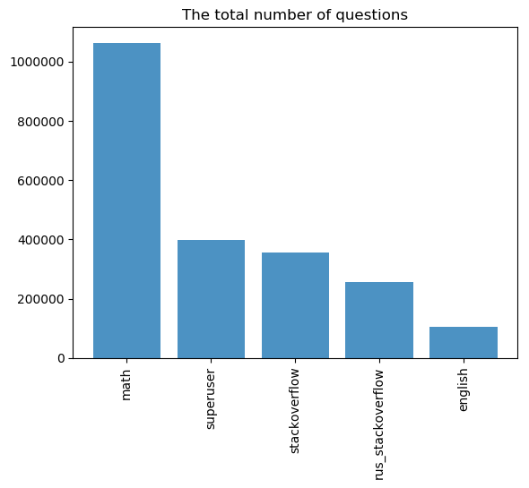
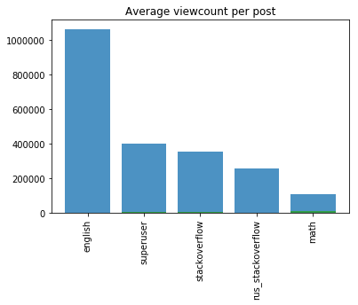
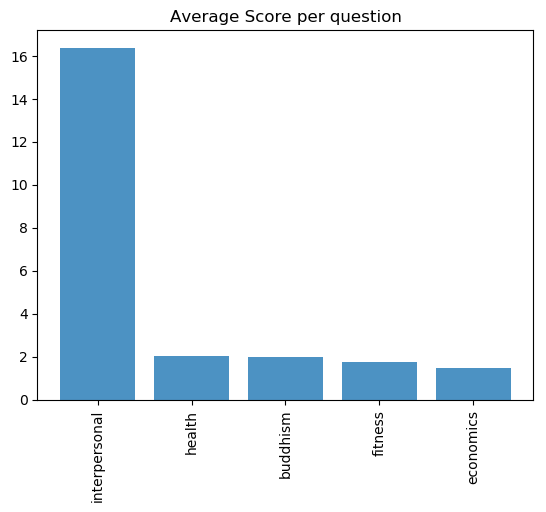
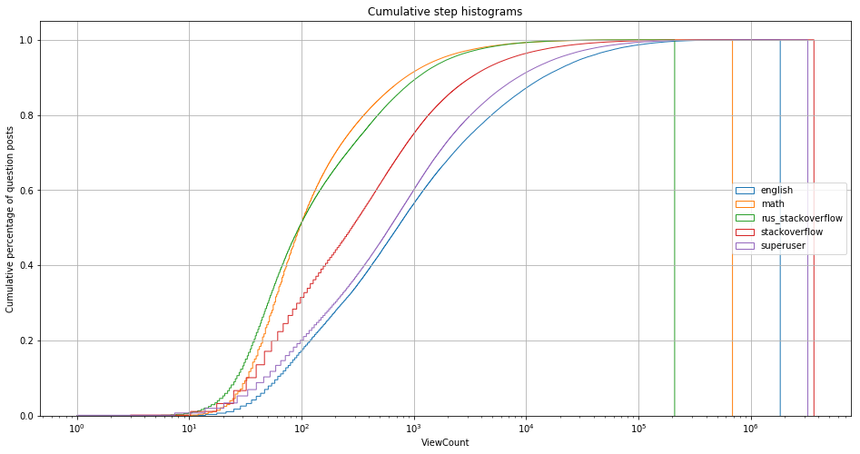

```{r setup, include=FALSE}
knitr::opts_chunk$set(echo = FALSE, message = FALSE)
# Note: include = false implies code is executed but not printed in pdf
```
\renewcommand{\vec}[1]{\mathbf{#1}}
\newgeometry{left=3.5cm, right=2cm, top=20mm ,bottom=4cm, top=2.5cm}

<!-- SUMMARY: 300 WORDS -->

\section*{Summary}

\color{blue}The world wide web and the technologies that have accompanied it have given us the exceptional ability to comment on, engage with and question the world. While much attention has been given to identifying high-quality answers online, less consideration has been afforded to how we can improve our questions, which can be particularly beneficial for online question-answering communities where subject matter is often technical and expert resources are scarce.

One avenue to address issues of limited resources and information overload on online communities is to nudge questioners to enhance the "signal" of their questions before adding demand to a community, and this can be achieved by modeling and predicting positive community engagement for questions. The research presented here takes the first step towards this objective by building on and validating work already done on question quality and community engagement in online fora. By analysing question content from a diverse range of online communities, I am able to shed light on optimal thresholds for labeling positive and negative community engagement, improving upon work done in this area.


<!-- INTRODUCTION: Aims of the study and a brief outline of the main sections of the dissertation -->

# Introduction \label{Intro}

The advent of the internet and the interpersonal communication technologies that have evolved from it have given us an unprecedented level of connection and potential interaction with the world. Every day, billions of individuals engage online not only with people they know, but with complete strangers from across the globe. A considerable challenge with these online interactions is widespread incivility, with substantial work being devoted to understanding and addressing this [@Berry2017; @Gervais2015].

Online social question-answer (Q&A) fora present environments where community engagement (up-votes, answers, comments) and community guidelines should mitigate many of the issues experienced by other more provocative online platforms, yet these communities are not without issues of their own. Certain fora, such as popular Massive Online Open Courses (MOOCs), suffer from "information overload" where the degree of off-topic activity and discussion makes it difficult for answerers to find and engage with questions they *can* answer, let alone review all questions in the community.

Scarcity of expert resources is also a persistent problem in social Q&A systems, and thus the motivation for this research is to address precisely this imbalance by tackling question-formulation before questions place demand on expert resources. I plan to achieve this by eventually building a classification model that predicts positive community engagement with questions and provides this information to questioners so that they can be nudged into improving the "signal" of their questions. Since questions are the entry-point of every online Q&A community engagement, it is hoped that this will improve the overall functioning and development these communities.

The broad research question is therefore the following:

\begin{center}
\emph{To what extent can we capture positive community engagement with questions on online Q\&A communities?}
\end{center}

Here, positive community engagement is defined as constructive, amicable interactions with user questions through answers, comments, votes, edits and so on. One assumption that is made is that questions are heterogeneous, i.e. they have varying levels of "quality" which evoke either positive and negative community reaction.

\newpage

The research presented in this paper is but an initial step in the ultimate goal of classifying user questions and serves to build on methodologies and approaches already taken to measure question quality/community engagement. In it, I analyse a diverse range of questions in fora from the family of Q&A communities, StackExchange. I use a metric for community engagement to label questions as "good" and "bad" (receiving positive and negative community engagement respectively) and find more optimal thresholds for this labeling by calculating similarity metrics and linguistic differences across good/bad samples.

I now move onto a brief discussion of previous work in this field. This is followed by descriptions of the datasets used,  pre-processing steps taken as well as exploratory analysis. I then discuss the methodology for measuring community engagement with a specifically defined variable, I present and discuss the results and lastly I make some concluding remarks.


<!-- MAIN SECTIONS: Review of the literature, description of methods used and the results of the study -->


\newpage

# Literature Review \label{Lit}

Much work has gone into investigating online Q&A communities. Research has looked at answer quality [@Jeon2006; @Shah2010; @Tian2013], behaviour of community experts [@Riahi2012; @Sung2013] and question-asker satisfaction [@Liu2008]. Also, a common framework for engagement in Q&A communities is the optimisation of matching questions and community experts [@Li2010; @Li2011; @Zhou2012; @Shah2018], or recommending questions in line with answerers' interests [@Wu2008; @Qu2009; @Szpektor2013].

I choose to focus on questions, not only because they have received far less attention in the literature, but because question quality impacts answer quality [@Agichtein2008] and because they are trivially the initial touch-point of a community/questioner interaction. It is highly likely therefore that increasing positive community engagement will improve how these communities function and evolve.

Since community engagement and question quality can be seen as two sides of the same coin ("good" questions leading to favourable community engagement), this research corresponds to a body of work on capturing question quality in online question-answer communities which I briefly discuss next. Note that while I consider community engagement a more accurate definition of what the following literature measures, I refer to "question quality" instead of community engagement to aid the discussion.

Recent work [@Agichtein2008; @Bian2009; @Li2012] attempted to model question quality using [Yahoo! Answers](http://answers.yahoo.com), however this dataset lacks objective and definitive measures for question quality. The data that I will be using on the other hand is richer in that there a numerous proxies for question quality/community engagement available for large sets of observations. Most importantly, these variables are derived directly from the data rather than labeled manually, which enables a more objective, automatic and principled characterisation of the variable of interest.

One paper that made strides in classifying and predicting what they assume to be question quality is @Ravi2014. Using latent topics extracted from Latent Dirichlet Allocation models on question content, they predict "question quality" with accuracy levels of 72% for the computer coding StackExchange community, StackOverflow. 

@Ravi2014 decide on using a question's `Score` as an indicator of question quality. I question this assumption and put forth the notion that a question’s `Score` better characterises community engagement, since I believe it is difficult to define "quality" subjectively owing to communities valuing different facets of questions (i.e. closed-end for natural sciences or discussion-promoting in the social sciences). I thus characterise it as such and also use it as a response variable. This brings me to the aim of this paper, which is to critique and build on how to use the `Score` variable to label questions as attracting positive or negative community engagement.


\newpage

# Data \label{Data} 

## StackExchange Communities

The data I use for this analysis are question-content text from the family of online Q&A communities, [StackExchange](https://stackexchange.com/sites#traffic). There are more than 170 diverse StackExchange fora ranging from science-fiction world building to bicycles to quantum computing, with all the data publicly available in compressed XML files at [archive.org](http://archive.org/download/stackexchange).

I chose to use five of the largest StackExchange datasets, details of which are displayed below in table \ref{tab:fora}.

\renewcommand{\thetable}{\arabic{table}}
\footnotesize

\begin{longtable} {@{} cccp{12cm} @{}}
\caption{\textbf{Dataset Details}}
\label{tab:fora}\\ \hline \hline
Forum & Questions & Answers & Description \\ 
\hline
StackOverflow & 18m & 27m & Q\&A for professional and enthusiast programmers \\
Math & 1.1m & 1.5m & Q\&A for people studying math at any level and professionals in related fields \\
SuperUser & 415k & 601k & Q\&A for computer enthusiasts and power users \\ 
Russian StackOverflow & 273k & 310k & Q\&A for programmers (Russian) \\ 
English & 106k & 249k & Q\&A for linguists, etymologists, and serious English language enthusiasts \\ 
\hline \hline
\end{longtable}
\begin{center} Source: Own calculations in Python.\end{center}
\normalsize


For each forum, the following data is available per post in a `Posts.xml` file:

\setstretch{0.65}

* `Id`: An identity variable for a post (chronological)

* `PostTypeId`: Indicates if a post is a question (==1) or answer (==2)

* `ParentId`: Indicates which question an answer belongs to (answers only)

* `AcceptedAnswerId`: Indicates which answer the question-asker selects as accepted (questions only)

* `CreationDate`: Indicates the date a post was originally made

* `Score`: The difference between up-votes and down-votes for a post

* `ViewCount`: The number of times a post has been viewed (not just site-registered users)

* `Body`: Main post content

* `OwnerUserId`: Indicates the user ID of a post's owner

* `LastEditorUserId`: Indicates the user ID of the last user to edit a post

* `LastEditDate`: Indicates the date a post was last edited

* `LastActivityDate`: Indicates the date that there was last activity on the post (not including views)

* `Title`: Post title (questions only)

* `Tags`: Collection of tags linked when a question is made (questions only)

* `AnswerCount`: Number of answers a question receives (questions only)

* `CommentCount`: Number of comments a post receives

* `FavoriteCount`: Number of times users favourite a question (questions only)

* `ClosedDate`: A date variable indicating if a question was closed (questions only)

\setstretch{1.25}

This analysis will only use the `PostTypeId`, `Score`, `ViewCount` and `Body` variables.


## Noteworthy elements \label{noteworthy}

It is worth discussing the functioning of StackExchange sites in general to more thoroughly understand the data. Questions across fora are publicly available viewable by anyone on the internet, but posting a question on forum requires email registration with the forum. After registering, users start with 1 reputation (https://meta.stackexchange.com/questions/7237/how-does-reputation-work). The reputation levels that are key to this analysis are: 

\setstretch{0.65}

* 15: Gives you the ability to "up-vote" questions and answers

* 50: You can comment on questions and answers

* 125: You can "down-vote" questions and answers

* 2000: You can edit any question or answer.

\setstretch{1.25}

A number of methodological issues arise from how the sites operate. Firstly, owing to all questions being open to the public, many people may view questions without the ability to vote and thus still contribute to the `ViewCount` variable. Additionally, the asymmetries for privileges of up-voting and down-voting lead to a `Score` variable that is highly negatively skewed, making it appear that there are more "good" questions versus "bad" ones. Lastly, a major confounding factor is the editing of questions, not only by original posters, but also by anyone with 2000 reputation. This complicates much of the engagement between question-askers and communities because no data is available on the timing of answers, comments, votes, views etc. in relation to question edits.


## Preprocessing and Exploratory Analysis

The entire analysis of the data was done with the statistical software package [`R`](https://cran.r-project.org) and a link to the full code used in the analysis can be found [here](https://github.com/BCallumCarr/msc-lse-thesis/tree/master/01-r-code). After downloading and decompressing the data on the 8 selected forums, I used the `R` functions `xmlParse` and `xmlToList` from the `XML` package to parse and load the data into an `R` tibble from the `tidyverse` `R` package. Some regular expression work was needed to clean up the HTML text in questions from the `Body` variable. The `PostTypeId` variable was then used to separate out the question and answer posts, and finally the descriptive bar graphs in figure \ref{fig:desc} were created using `ggplot2`.

In figure \ref{fig:desc}, we see that average `Score` and `ViewCount` per question vary substantially across fora. Questions on the Interpersonal and Outdoors fora have average `Scores` of approximately 17 and 11 respectively, compared to around 3 or 4 for the other fora. Interpersonal also has a significantly higher average `ViewCount` at approximately 4400 views per question followed by Fitness, Outdoors and Spanish which all have an average of around 3000.

\renewcommand{\thefigure}{\arabic{figure}}

\footnotesize
\begin{figure}
\caption{\textbf{Fora Descriptive Statistics}}
\label{fig:desc}
```{r echo=FALSE, out.width='50%', fig.align='center'}



```
\centering
{\footnotesize Source: Own calculations in Python.}
\end{figure}
\normalsize


\begin{figure}
\caption{\textbf{Cumulative Graph for Question Viewcounts}}
\label{fig:cumul}
```{r echo=FALSE, out.width='100%', fig.align='center'}

```
\centering
{\footnotesize Source: Own calculations in Python.}
\end{figure}
\normalsize

Figure \ref{fig:cumul} plots cumulative percentages of questions as a function of `ViewCount` in each fora. There are two aspects of the graph that are noteworthy - the order of the curves from left to right, and the fact that they maintain this order (i.e. they are roughly parallel). The further right a curve is is indicative of high `ViewCounts` per post overall, and we see that this does mirror the averages calculated in the `ViewCount` descriptive bar graph in figure \ref{fig:desc}. 

A crossing of curves in figure \ref{fig:cumul} would indicate that there are certain `ViewCount` thresholds where a forum becomes more popular (experiences more viewing traffic) than another. Since there is very little crossing of curves over all fora, if at all, it appears as though the distribution of `ViewCount` across fora is fairly homogeneous and has relatively constant variance.

\color{black}


\newpage

# Methodology \label{Meth} 

## Empirical Model \label{Model} 

This is an equation:

\begin{align} \label{eq:EP1}
A_{it}=f(T_i^{(t)},S_i^{(t)},P_i^{(t)},B_i^{(t)},I_i),
\end{align}


# Results \label{Results} 


<!-- CONCLUSION: Conclusions that can be drawn from your work, possible extensions and further work -->

\newpage

# Recommendations for Further Research \label{Recom}


\newpage

# Concluding Remarks \label{Concl}


<!-- BIBLIOGRAPHY -->

\newpage

# References


<!-- APPENDICES: Not encouraged

\newpage

# Appendix {.unnumbered}

\setcounter{table}{0}
\renewcommand{\thetable}{A\arabic{table}}

A table in the Appendix:

\begin{longtable}[htbp] {@{} l r r r r r @{}} \caption{
\textbf{Summary statistics of model variables}} \label{tab:Desc}  \\ \hline\hline
                \textbf{Variable } & \textbf{Mean} & \textbf{S.D.} & \textbf{Min} & \textbf{Max} & \textbf{N}\\
\hline
\bf{\emph{Educational Outcomes}} & & & & \\
   Maths Score (\%)  &   27.58797 &   17.82077 &          0 &        100 &     102048 \\
   Science Score (\%) &   41.04531 &   18.54542 &          0 &   95.83334 &     102045 \\
   English Score (\%) &   38.49276 &    24.3848 &          0 &        100 &     102048 \\
\hline \hline
\multicolumn{5}{@{}l}{Source: Own calculations in Stata using 2004 Grade 6 Intermediate Phase Systemic Evaluation.}
\end{longtable}

 -->
