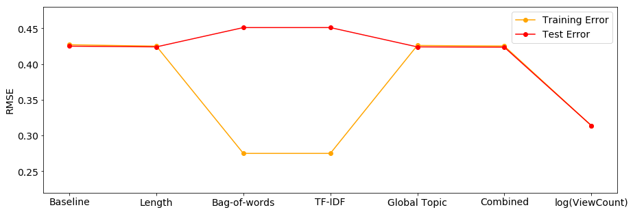
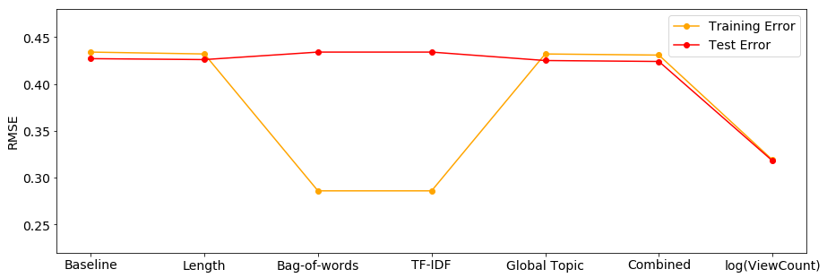
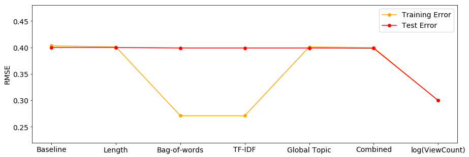
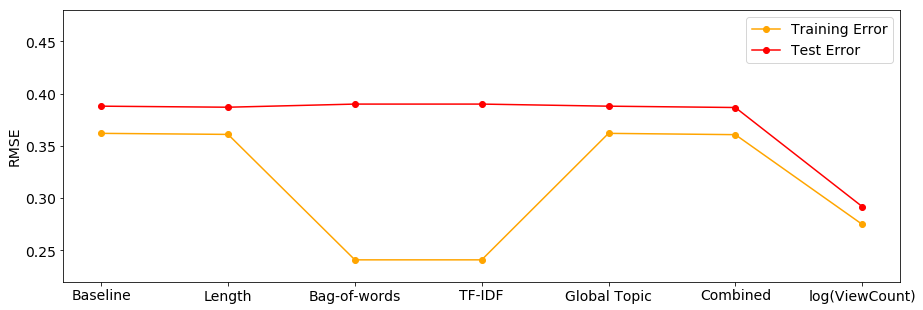
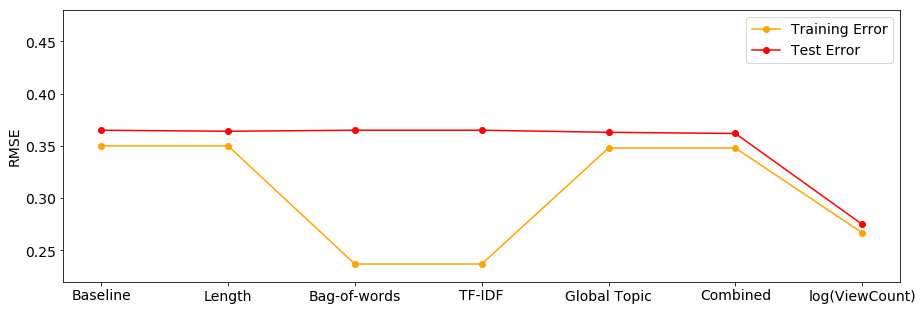

```{r setup, include=FALSE}
knitr::opts_chunk$set(echo = FALSE, message = FALSE)
# Note: include = false implies code is executed but not printed in pdf
```

<!--\newcolumntype{C}[1]{>{\centering\let\newline\\\arraybackslash\hspace{0pt}}m{#1}}-->

<!-- set margins for body if different from frontmatter -->
<!-- \newgeometry{left=3.5cm, right=2cm, top=20mm ,bottom=4cm, top=2.5cm} -->
<!-- which is not only one of the largest online Q&A communities, but the 41st most popular website according to the [Alexa rank](https://www.alexa.com/topsites) at the time of writing .after employing feature engineering techniques sourced from the relevant literature across all fora.** Having taken the step to predict a continuous proxy measurement of online community engagement and begun **addressing temporal issues**, I belive my **unique and original** research shows that there is still much to be done to predict online community engagement objectively and effectively, especially when considering the **chronological nature of online Q&A data**. My findings **challenge** those of prior research showing that features derived from the length and topics of questions yield **large** improvements over baseline predictions and further that **topic models perform universally well on diverse datasets**.  -->

<!-- FOR INCREASING SIZE OF SUMMATION SIGN
\newlength{\depthofsumsign}
\setlength{\depthofsumsign}{\depthof{$\sum$}}
\newlength{\totalheightofsumsign}
\newlength{\heightanddepthofargument}

\newcommand{\nsum}[1][3]{% only for \displaystyle
    \mathop{%
        \raisebox
            {-#1\depthofsumsign+1\depthofsumsign}
            {\scalebox
                {#1}
                {$\displaystyle\sum$}%
            }
    }
}
-->


\newpage

<!-- INTRODUCTION: Aims of the study and a brief outline of the main sections of the dissertation -->

# Introduction \label{Intro}

Modern interpersonal communication technologies made possible by the internet have afforded us an exceptional level of connection and engagement with the world. Billions of individuals now interact online instantly, not only with people that they know, but with strangers thousands of miles away. One avenue of online interaction that has become an extremely popular way in which users share knowledge about diverse and nuanced subject matter is question-and-answer (Q&A) websites such as Yahoo! Answers, Quora, the StackExchange family and forums of Massive Online Open Courses (MOOCs). These websites serve as dynamic, engaging platforms where users seek answers to and discussions on complex, technical questions that modern search engines are evidently yet unable to fully address.

Producing relevant, well-researched and high-quality questions in online Q&A fora is especially valuable, not least since these platforms suffer in particular from a low ratio of expert resources to volume of new questions - an example of an increasingly ubiquitous problem known as *information overload*, of which a broader summary can be found in @Eppler2004. The overarching hypothesis of this research is that information overload in online Q&A communities would be mitigated if questioners were notified in advance of how well their questions would be received by a community. This would allow them to iterate and increase the "signal" of their questions before exerting demand on community resources. If this were possible, it would not only benefit questioners as they would more effectively garner expert answers to their improved questions, but also entire communities as overall functioning and efficiency is enhanced community-wide.

Predicting the extent to which online communities would react positively to user questions in real time is a non-trivial problem however, since predictions must be made using only the information available when new questions are formulated<!--, and predicting *future* engagement from *past* engagement **would add another level of complexity**-->. This implies that predictive models must learn from features derived from question content alone and not features such user characteristics, final webpage viewing statistics and so on. Ideally, final predictions given to questioners would also be highly granular and direct questioners towards how best to improve their questions as a type of recommendation system, however the aim of this research is only to take one step forward from previous work on questions in online Q&A communities and ascertain if community engagement in online Q&A fora can actually be predicted with some measure of accuracy.

The broad research question for this paper can therefore be summarised as the following:

\begin{center}
\emph{To what extent can community engagement with questions in online Q\&A communities be accurately predicted using only question content?}
\end{center}

While there is a substantial amount of literature that has addressed online Q&A communities, curiously the focus has been on identifying expert users and high quality answers rather than on questions, despite questions being the entry point for every interaction in communities. In an attempt to answer the research question above, I build on the small collection of research on *question quality* in online Q&A fora and draw heavily on work done by @Ravi2014 with data from the popular computer programming community [StackOverflow](https://StackOverflow.com). 

@Ravi2014 predicted a binary notion of question quality ("good" versus "bad"), and their classifier significantly beats out a strong baseline with accuracies of 55.5%, 65.8% and 64.2% for a length, textual-content and latent Dirichlet allocation (LDA) latent topic model respectively. I critique, mirror and expand the analysis of @Ravi2014 in three core ways: 1) I consider community engagement to be a more objective and definitive metric to predict on than question quality, 2) I use the community-granted question `Score` as a comprehensive measurement of community engagement, and 3) I employ a regression model to allow for predictions to be continuous and informative as opposed to binary.

The `Score` variable is an aggregation of all community *up-votes* and *down-votes* for each question in the StackOverflow community, and I predict this variable in multiple monthly StackOverflow datasets using only the textual content of questions. In line with the analysis of @Ravi2014, I engineer length, textual-content and latent topical features from question content for the prediction problem. I use regularised regression for the learning task and evaluate models using root-mean-square error (RMSE). 

It should be noted that the goal of this research is quantitative prediction rather than qualitative, causal or inferential analysis. I leave it to further research to address more precisely the *how* and *why* of community engagement in online Q&A communities, rather than just the *if* that is explored here. To my knowledge this research is the first of its kind to test latent topic models on a continuous, objective measurement of online community engagement as well as pertain to a feasible and valuable use-case, which I believe makes it a practical and unique contribution.

The findings from my analysis show that there is still much work to be done to accurately predict community engagement in online Q&A fora. Contrary to the impressive classification accuracies in the results of @Ravi2014, I find that models which include textual question content features do not perform any better over a modest baseline of constant mean prediction. Evidently, accurately predicting a continuous measurement of community engagement in a regression setting is an ambitious task, and I recommend that future research employ more sophisticated models and feature engineering, as well as incorporate time-series aspects.

In the following section I discuss the relevant literature in more detail. This is followed by section \ref{Method} which discusses the data, explores and validates my choice of the `Score` variable as an objective measurement of community engagement, and describes the predictive model used. Section \ref{Results} presents and discusses the results, section \ref{Recom} explores some recommendations for further research and finally section \ref{Concl} concludes.


\newpage

<!-- MAIN SECTIONS: Review of the literature, description of methods used and the results of the study -->

# Literature Review \label{Lit}

My work involves the extraction of textual features from question content submitted to the online Q&A fora, and the training and evaluation of predictive regression models. This section provides brief summaries of previous work related to this research problem. Section \ref{qacomm} discusses previous work on online Q&A communities and section \ref{qquality} discusses work on predicting *question quality* in online Q&A communities. Section \label{ravi} summarises the approach and results of @Ravi2014, and finally section \label{lda_lit} briefly introduces how latent topic models have been applied to questions in online Q&A fora.


## Question-Answer Communities \label{qacomm}

There is a substantial collection of research that has investigated online Q&A communities. Prior work has addressed answer quality [@Jeon2006; @Tian2013; @Shah2010], satisfaction of questioners [@Liu2008] and the behaviour of highly productive, expert community members [@Riahi2012; @Sung2013]. Two common frameworks for prior work have been the optimisation of routing questions to experts [@Li2010; @Li2011; @Shah2018; @Zhou2012], and matching questions in accordance with answerer interest in the form of a recommendation system [@Qu2009; @Szpektor2013; @Wu2008].

My research differs from this previous work on Q&A fora in two respects. Firstly, I focus on questions rather than user or answer characteristics, not only because they have received substantially less attention in the literature, but because it has been shown that question quality can substantially impact the quality of answers [@Agichtein2008]. Questions in online Q&A fora are also the initial touch point from which all community engagement follows - maximising positive community engagement with questions will thus almost certainly improve the functioning of these communities.

I also deviate from prior research in the framework that I place this research in. I steer clear of the systems-based optimisation of question-answer routing/matching and instead concentrate on how questioners can be nudged to improve the content of their questions before adding demand to community resources. Although there is substantial literature on community engagement in a broad range of fields and disciplines, this literature is either too disparate from the field of research in this paper or focuses on online engagement in other forms. To my knowledge therefore, this work is the first of its kind to characterise and predict community engagement with questions in the context of online Q&A fora. Owing to the fact that the framework I have chosen coincides with a large collection of research on predicting question quality in online Q&A communities, I discuss this literature next.

<!--With the promise of this real-life application which significantly benefit both questioners and communities, it remains to be seen if community engagement in online Q&A fora can be successfully predicted.--> 


## Question Quality \label{qquality}

Naturally, community engagement and question quality go hand in hand: high quality questions will no doubt lead to positive community feedback in the form of numerous up-votes, answers and discussion promoting comments. I argue in the following section that *community engagement* is a more accurate and thorough definition of what the following literature claims to measure, but for the sake of discussion I will refer to question quality here as well.

A recent line of work has looked at predicting question quality in the large Q&A community [Yahoo! Answers](http://answers.yahoo.com) [@Agichtein2008; @Bian2009; @Li2012] - a dataset which has metrics for assessing answer quality in the form of answer up-votes, but regrettably lacks a similarly community-attributed and objective metric for question quality. This has resulted in subjective attempts at defining question quality: @Agichtein2008 define question quality using questions' semantic features (lexical complexity, punctuation, typos etc.), @Bian2009 use manual labels for 250 questions and a semi-supervised coupled mutual reinforcement framework to label a larger number of questions, and @Li2012 combine the number of answers, number of tags, time until first answer, author judgement and domain expertise to construct their ground truth.

Fortunately, I analyse data from the [StackOverflow](https://StackOverflow.com) Q&A community which is rich in objective community-attributed metrics such as question up- and down-votes, comments, and views, all of which is over and above the textual content of questions and answers themselves. These metrics are objective in the sense that they do not require construction or labelling form the researchers' side, and subsequently allow for large collections of questions to be analysed automatically.

Another aspect of the literature that has evolved substantially are the models employed to predict question quality. Previous work has modelled question quality based on the reputation of the questioner, question categories and lexical characteristics of questions such as length, misspelling, words per sentence etc. [@Agichtein2008; @Anderson2012; @Bian2009; @Li2012]. By ignoring the actual textual and topical content of questions and focusing on features of the questioner however, these approaches would perform poorly on questions from new users without a community history. 

Since my research goal is centred around predicting community engagement for all community members, and in particular new and inexperienced users who are more likely to receive negative community responses to poorly constructed questions, I use only features available when a question is initially asked and forego features derived from user attributes. The methodology that I have thus far laid out mirrors work done by @Ravi2014 to predict question quality for the StackOverflow community. Since I will be closely emulating their methodology, I now demonstrate their contributions.


## @Ravi2014 \label{ravi}

@Ravi2014 analyse a large number of questions from the StackOverflow community to predict a binary notion (i.e. "good" versus "bad") of question quality using features derived from question length, textual-content and latent topics. Their *length* model achieves an accuracy of 55.5%, their *text* model achieves 65.8% accuracy, their global *topic* model achieves 64.2% accuracy, a combined model with all three types of features obtains 70.5% accuracy, all above a modest page-view feature benchmark of 61.1%.

They compare their significant results to a baseline "popularity" model that only includes a variable indicating question webpage views (which achieves 61.1% accuracy), and subsequently claim that their models are able to capture a notion of question quality that extends   beyond popularity. Owing to these impressive results and the appeal that these models could be used to successfully predict community engagement, my research closely follows their methodology, but also critiques and extends it in a number of ways.

The first and clearest distinction in my analysis concerns the response variable that is predicted. @Ravi2014 decide to construct a composite response variable by dividing the community-attributed question `Score` (the aggregation of all user up-votes and down-votes) by the number of views a question receives, or a questions' `ViewCount` (which is also the independent variable that is used in their benchmark popularity model). While they rightly state that using the `Score` variable alone risks conflating "question quality" and "popularity" since questions that receive higher views are more likely to receive votes, my research objective differs in that I aim to predict community engagement rather than question quality - I thus use only the question `Score` as my response variable. As will be expanded upon later, I believe this metric comprehensively characterises within-community engagement, of which popularity and the ability to attract views is an integral component.

Out of the 410\ 049 questions that @Ravi2014 extract between 2008 and 2009, they further define the "worst" and "best" questions according to a rather arbitrary threshold of 0.001 on their `Score`/`ViewCount` metric, resulting in only 33\ 199 "bad" questions being eventually labelled and analysed. On the other hand, my data selection consists of using all questions from five monthly StackOverflow datasets in 2009, which coincides with the time frame of extracted questions in @Ravi2014, but not in dataset size. While the reasons for my choice of dataset time-span will be more thoroughly discussed later, I believe it is good practice to include all the questions for a given time-period owing to the aim of providing accurate predictive information to questioners. I therefore do not select a specific subset of questions.<!--so that eventual prediction information provided to questioners is as robust as possible.-->

The fact that I predict on the `Score` variable as a continuous measurement of community engagement also has a number of advantages. Firstly, any decisions on potentially arbitrary label boundaries for discrete categories of questions are eliminated, and indeed there is actually no need for categories of questions since each questions' community engagement is represented on a continuous range. Providing predictions of a questions' `Score` to questioners as an indication of how well the StackOverflow community will react to their question is also more informative than a binary good/bad prediction, and has the added benefit of being easily interpreted and understandable. Lastly, predicting on the `Score` variable alone ensures that when I consider the benchmark `ViewCount` model, I am not predicting on a composite variable that incorporates `ViewCount` itself.

More broadly, I believe a framework of community engagement is more robust and methodologically accurate than a rationale of question quality. I am of the opinion that question quality is much more nuanced than the prior research has asserted, not least because the definition of quality itself is highly subjective. As an example, while most communities may universally value certain aspects of questions such as legibility, coherence, relevance and prior-research etc., there are numerous question traits that communities could value to different extents - i.e. closed-end questions being valued in the natural sciences as opposed to discussion-promoting questions in the social sciences.

Beyond differences in inter-community or even intra-community valuation of questions, a community's notion of "quality" could also evolve over time. A framework of community engagement therefore allows for heterogeneity in how questions are valued across communities, sub-communities and over time, yet it still preserves a notion of *positive* or *negative* engagement in metrics that are assumed to measure it.

Although I extend the methodology of @Ravi2014 in the key areas discussed above, I will emulate their prediction task to ascertain whether these models are as effective in this new framework and in a regression setting. Since a substantial development in the analysis of @Ravi2014 was the use of features derived from latent topics, I briefly introduce this literature next.

<!--
## Community Engagement

While there is no doubt that these technologies and interactions have promoted much productivity and utility around the world, they are not without considerable challenges. Work has recently been devoted to addressing widespread incivility in online communication [@Berry2017; @Gervais2015].
-->


## Topic Models \label{lda_lit}

Bayesian inference schemes have recently become prominent in solving a range of structured Natural Language Processing (NLP) prediction problems owing to their ability to allow researchers to include prior knowledge flexibly, as well as to manage uncertainty regarding model parameters [@Chiang2010]. One notable application of Bayesian inference is in topic modelling, which has recently been employed in a broad range of NLP and information retrieval tasks, such as query-focused summarisation [@Daume2006], deriving concept-attribute attachments [@Reisinger2009], co-reference resolution across documents [@Haghighi2010], computing selection preferences [@Ritter2010] and name ambiguity resolution [@Kozareva2011].

LDA was originally introduced by David Blei and his co-authors in 2003 [@Blei2003] and it remains a popular topic model used to infer a set of topics inherent in a corpus (collection) of documents. LDA is an unsupervised generative probabilistic model which assumes that each document in a corpus is a mixture of some number of hidden topics, and that each word in a document is generated according to one of these topics. Finer details of LDA will be discussed in section \label{lda}.

LDA has already been applied to the StackOverflow dataset by @Allamanis2013, however they did not attempt to predict a measurement of community engagement with their model. In analysing the StackOverflow dataset, @Allamanis2013 propose a modelling technique using three LDA models: one over the question body as a whole, another model on the code chunks in each question, and a last model on the question body without noun phrases. 

@Ravi2014 build on the three-tiered approach of @Allamanis2013 and demonstrate that inferred latent topics are significant predictors of their measurement of question quality. The three levels that they choose to capture topical aspects of questions are: a global model to capture topics over each question as a whole (coinciding with the first model in in @Allamanis2013), a local topic model for sentence-level topics, and finally a Mallows model [@Fligner1986] which enforces structural constraints over sentence-level topics to capture a "global topic structure".

<!--Since @Ravi2014 see no substantial gains in predictive accuracy when incorporating the Mallows model, I exclude this from my methodology as well as the local sentence-level topic model and only -->I employ only the global topic model implemented in both @Allamanis2013 and @Ravi2014. With the continuous `Score` variable as my measurement of community engagement, my goal is to ascertain if latent topic models are as effective in the framework I have developed here, as well as if results are consistent over multiple monthly StackOverflow datasets. I begin a thorough discussion of the data and exploration of the `Score` variable in the next section.


\newpage

# Methodology \label{Method}

My main work comprises of three parts: data preparation, data processing which includes feature selection, and then learning and evaluation. This section presents the above methodologies in the order stated. The sourcing and selection of data according to specified time ranges are discussed in section \ref{sourcing} and \ref{selection} respectively. Final, section \ref{comgage} motivates the `Score` variable as a measurement of community engagement, as well as discusses the similarities of the `ViewCount` and `Score` variable and corresponding methodological issues.


## Data Sourcing \label{sourcing} 

The [StackExchange](https://stackexchange.com/sites#traffic) family of online Q&A fora are a diverse range of over 170 community websites covering topics from vegetarianism to quantum computing to bicycles. Over and above the textual content of questions, answers and comments posted since each community's conception, rich meta-data on an array of community interactions is publicly available in XML files compressed in 7-Zip format at [archive.org/download/stackexchange](http://archive.org/download/stackexchange). 

At over 11 years of age with 18\ million questions, 11\ million users and 9.3\ million site visits a day, [StackOverflow](https://stackoverflow.com) is not only the oldest and largest StackExchange Q&A community, but is arguably the largest dedicated computer programming community on the internet. After launching in July 2008 StackOverflow has averaged 2\ million questions posted each year since 2012, now encounters 6\ 200 new questions every day [@StackExchange.com2019] and is ranked the 40th most popular website according to Alexa Internet's ranking at the time of writing [@Alexa.com2019].

Since the StackOverflow dataset is also publicly and freely available for selective querying on [Google Big Query](https://cloud.google.com/bigquery), I use this tool to extract my variables of interest from May to September 2009 in JSON files and then convert to [Parquet](https://parquet.apache.org) format. The following resulting variables are of interest to my analysis:

\setstretch{0.7}

* `Score`: An aggregate variable calculated from the difference between registered-user granted up-votes and down-votes for a question

* `ViewCount`: A counter for the number of page views a question receives (from both registered and non-registered users)

* `Title`: The text of the question title

* `Body`: The text of the question body

* `CreationDate`: A datetime variable indicating when the question was initially posted

\setstretch{1.5}

These additional variables are briefly discussed in section \ref{Vars} as alternatives to the `Score` variable as a response variable:

\setstretch{0.7}

* `AnswerCount`: The number of answers a question has received

* `CommentCount`: The number of comments a question has received

* `FavoriteCount`: The number of times registered-users have favourited a question

* `AcceptedAnswerId`: An indication of which answer the question-asker has selected as accepted

* `LastEditDate`: A datetime variable indicating when the post was last edited

* `ClosedDate`: A datetime variable indicating if a question was closed

\setstretch{1.5}


## Data Selection \label{selection}

I analyse five monthly StackOverflow question datasets from May 2009 to September 2009. This choice broaches an aspect of the research problem that has yet to be considered in the literature - the temporality of online Q&A data, and the potentially very difficult challenge of predicting *future* community engagement from *past* community engagement. Predicting future community engagement is a particularly ambitious endeavour since there is little doubt that how questioners formulate questions and how communities value questions are subject to change over time. The public and open nature of the StackOverflow community, the dynamically evolving compositions of registered-users comprising the community, and the volatile nature of the computer programming field would all contribute temporal elements to how questions are formulated and received in this community.

By choosing a date range close to the start of the community and by analysing short, monthly snapshots of the StackOverflow community, a number of key issues relating to temporal endogeneity are addressed. Firstly, the choice of 2009 as the year of analysis ensures that I don't include very recent questions (i.e. in the last few years) that have not had enough time to garner votes and views. The use of short time-spans also minimises the possibility of questions evolving over time and being asked by increasingly distinct groups of individuals (questioner and question-specific variation). 

In using short time-periods I also mitigate confounding aspects regarding the community itself evolving and changing how it values and engages with questions (community-specific variation), or the formal structure of the community changing (community-structure variation). Examples of the structure of the StackOverflow community changing would include various nudges and guides that have been implemented for users to ask better questions. Lastly, using monthly chronological datasets results in minimal size differences between datasets<!-- (of which the months from May 2009 to August 2009 had the least size differentials)-->. Note that my final underlying assumption is that there are no temporal elements or trends in the monthly datasets I analyse - I therefore do not employ time-series models, but treat each isolated monthly dataset as homogeneous.

The five monthly datasets have sizes ranging from 26\ 026 questions in May 2009, to 33\ 268 in September 2009, with 153\ 599 questions in total. I process and analyse the data with PySpark, a Python API for the open-source cluster-computing framework [Apache Spark](http://spark.apache.org).<!-- Due to RAM and CPU capacity constraints on my local machine, I rent powerful virtual machines on the [Google Cloud Platform](https://cloud.google.com/) for the modelling section of the analysis.In the interests of transparency and reproducibility, the entire PySpark codebase for the processing and modelling of the data done can be found at [github.com/BCallumCarr/msc-lse-thesis](https://github.com/BCallumCarr/msc-lse-thesis/). --> 


<!--\newpage-->

## A Notion of Community Engagement \label{comgage}

### Potential Candidates for Community Engagement \label{Vars}

Since there are a number of ways that StackOverflow members engage and interact with each other aside from the fundamental activities of asking/answering questions and up-/down-voting questions and answers, it is worth considering if there are candidates more suited to capturing community engagement and informing questioners rather than the `Score` variable. For example, questioners are able to indicate that an answer has explicitly answered their question, users can "favourite" questions and there are also further privileges for users with enough site *reputation*. 

Although questions on StackOverflow are open to the general public, posting a question in the community requires registration with an email address and a username - once registered, users start with a *reputation* level of 1. According to the guidelines of the StackOverflow community, reputation is a "rough measurement of how much the community trusts you; it is earned by convincing your peers that you know what you’re talking about" (see meta.stackexchange.com/questions/7237/how-does-reputation-work). 

\newpage

Key reputation levels for this analysis include: 

\setstretch{0.95}

* 1: Users can ask questions and contribute answers

* 15: Users can up-vote questions and answers

* 15: Users can flag posts to bring them to the attention of the community

* 50: Users can comment on questions and answers

* 125: Users can down-vote questions and answers

* 2000: Users can immediately edit any question or answer

* 3000: Users can vote to close questions that are off-topic, unclear, duplicates, too-broad or too opinion-based

\setstretch{1.5}

<!--Despite the fact that there are many proxies for community engagement and that they are all richly recorded in the data, there are few that match the holistic, comprehensive and informative nature of the `Score` variable.-->

Since the `Score` variable is the aggregation of all registered community members' up-votes and down-votes (in accordance with their reputation levels) it is able to register both positive (up-votes), negative (down-votes) and neutral (abstentions) community engagement. This metric also represents a core behaviour of the majority of the community since users can vote regardless of their reputation level. Providing `Score` predictions of new questions to questioners would also be highly valuable because it provides a continuous, granular indication of how likely that will succeed in their request for information from the community (a high score prediction) or essentially be rejected by the community (a low or negative score).

<!--The desirable attributes for our final measurement of community engagement are that 1) it accurately represents the core behaviour of a majority of the community with little room for confounding due to community manipulation for whatever reason or confusion as to how it works etc., 2) it is valuable to questioners in that it allows them to make informed decisions on whether to improve their new question or not, and 3) is informative and granular for questioners, i.e. continuous rather than binary.-->

Some metrics are easier to eliminate as alternatives to the `Score` variable than others. `FavouriteCount`, or the number of times a question is favourited by registered users, has no capacity to register negative engagement (i.e. you cannot negatively favourite questions) and it is also not a core functioning of the community. `CommentCount` intuitively feels like a potentially valuable indication of community engagement, yet comments need not be directed at the original questioner (they could be directed at other commenters) and without employing sentiment analysis it would be difficult to ascertain what number of comments constitute positive/negative community engagement.

Using `AnswerCount` as the response variable could indicate to questioners how many answers their question is predicted to receive, but this variable would be biased downwards for more difficult questions. An added advantage of the `Score` variable in this regard, is that users can still up-vote difficult questions and signify that the community appreciates the question.<!--One could construct a variable relating to the linguistic sentiment of the answers however the subtleties of identifying sarcastic and condescending answers and comments might be overly difficult, especially since communities would value pleasant critical feedback.--> 

`EditCount` is another continuous variable which could indicate community engagement in the number of edits a question receives. Unfortunately, there is again uncertainty as to whether a high value for this variable shows that the community has had to go through much effort to get the question into a valuable state, or otherwise indicates that the community deems the question useful enough to spend much energy refining it.

This leaves two variables for consideration, `ClosedDate` and `AcceptedAnswerId`. Indeed, using the `ClosedDate` variable to inform questioners on whether their question is likely to be closed would be very valuable as a measurement of community engagement. `AcceptedAnswerId` on the other hand, would effectively indicate whether a questioner's overarching goal has been satisfied, i.e. whether they indicate their request for information has been completed and therefore be of high utility to questioners. While these variables may be highly relevant for community engagement and valuable to questioners, they can essentially only be represented as binary variables, over which the `Score` variable again has an advantage.

<!--Regarding the `AcceptedAnswerId` variable - questioners may neglect to formally select an accepted answer at all, biasing the number of formally solved questions downwards and confounding this response variable. Furthermore, answers are commonly posted as comments and vice-versa (see http meta.stackexchange.com/questions/17447/answer-or-comment-whats-the-etiquette), and this too would confound the analysis for this variable. Comments being posted as answers (i.e. "clogging up" the list of answers), can be a case of users who don't have the required level of reputation to comment yet or a case of users chasing reputation points by using jokes, which obscurs the reputation measurement as users get voted up for being humourous rather than their expertise. Treating this variable as the target variable also situates the research problem in terms of exclusive utility to the user, whereas the `Score` variable for example is a more broader measurement of how the community values questions, which in turn would translate into utility for the questioner.-->

It is thus quite clear that, out of the recorded metrics available in the StackOverflow community data, the `Score` variable is a comprehensive and informative measurement of community engagement. One variable that I haven't been given any attention thus far however, is the `ViewCount` variable. As I will motivate in the next section though, the `Score` and `ViewCount` variables measure very similar underlying attributes, and so I now explore both of these variables.


\newpage

### Conceptualising `Score` and `ViewCount` \label{scorevc_vis}

While the `Score` and `ViewCount` variables may appear to be measuring different phenomena, in this section I contrast and compare them to motivate that they are two sides of a similar coin. The first evidence of this is the correlations between the both variables, shown in table \ref{tab:corr} below. With correlations ranging from 0.71 to 0.86, it is clear that they are both highly positively correlated. 

\footnotesize
\begin{longtable} {@{} cc @{}}
\caption{\textbf{Score and ViewCount Correlations}}
\label{tab:corr}\\ 
\toprule
\textbf{Dataset} & \textbf{Correlation} \\ 
\midrule
May-09 & 0.86 \\
Jun-09 & 0.85 \\
Jul-09 & 0.81 \\
Aug-09 & 0.71 \\
Sep-09 & 0.76 \\
\bottomrule
\end{longtable}
\begin{center} Source: Own calculations in PySpark.\end{center}
\normalsize

Descriptive statistics for both the `Score` and `ViewCount` variables are now displayed in tables \ref{tab:score_desc} and \ref{tab:viewc_desc}, and density plots are made for both variables in figures \ref{fig:score_dens} and \ref{fig:viewc_dens}. It should be noted that that `Score` variable for each dataset was adjusted upwards by the minimum value across datasets to allow for a log-scaled x-axis.

\footnotesize
\begin{longtable} {@{} lccccc @{}}
\caption{\textbf{Score Variable Descriptive Statistics}}
\label{tab:score_desc}\\ 
\toprule
\textbf{Dataset} & \textbf{Count} & \textbf{Mean} & \textbf{SD} & \textbf{Min} & \textbf{Max} \\ 
\midrule
May-09 &  26\ 026 &  13.3 &   142.0 &   -7 &  19\ 640 \\
Jun-09 &  28\ 555 &  13.4 &    87.2 &   -9 &   4\ 655 \\
Jul-09 &  32\ 752 &  11.3 &    76.6 &   -8 &   6\ 145 \\
Aug-09 &  32\ 998 &   9.9 &    70.8 &  -22 &   7\ 133 \\
Sep-09 &  33\ 268 &   8.7 &    47.1 &  -10 &   2\ 809 \\
\bottomrule
\end{longtable}
\begin{center} Source: Own calculations in PySpark.\end{center}
\normalsize

\footnotesize
\begin{longtable} {@{} lccccc @{}}
\caption{\textbf{ViewCount Variable Descriptive Statistics}}
\label{tab:viewc_desc}\\ 
\toprule
\textbf{Dataset} & \textbf{Count} & \textbf{Mean} & \textbf{SD} & \textbf{Min} & \textbf{Max} \\ 
\midrule
May-09 &  26\ 026 &  13\ 817 &  8\ 1233  &   26 &  7\ 906\ 137 \\
Jun-09 &  28\ 555 &  13\ 948  &  77\ 666  &   26 &  3\ 488\ 812 \\
Jul-09 &  32\ 752 &  11\ 898  &  65\ 538  &   22 &  4\ 170\ 244 \\
Aug-09 &  32\ 998 &  10\ 517  &  48\ 036  &   22 &  2\ 223\ 778 \\
Sep-09 &  33\ 268 &   9\ 555  &  39\ 505  &   23 &  2\ 009\ 096 \\
\bottomrule
\end{longtable}
\begin{center} Source: Own calculations in PySpark.\end{center}
\normalsize

\footnotesize
\begin{figure}
\caption{\textbf{Score Variable Density Plot}}
\label{fig:score_dens}
```{r echo=FALSE, out.width='100%', fig.align='center'}
knitr::include_graphics("../../01-python-code/00-workspace/01-eda/01-graphs/score-sgl-density-plot.png")
```
\centering {\footnotesize Source: Own calculations in PySpark.}
\end{figure}
\normalsize

\footnotesize
\begin{figure}
\caption{\textbf{ViewCount Variable Density Plot}}
\label{fig:viewc_dens}
```{r echo=FALSE, out.width='100%', fig.align='center'}
knitr::include_graphics("../../01-python-code/00-workspace/01-eda/01-graphs/viewcount-sgl-density-plot.png")
```
\centering {\footnotesize Source: Own calculations in PySpark.}
\end{figure}
\normalsize

In the tables and figures above, we see that the distributions differ across monthly datasets for both the `ViewCount` and `Score` variables, and both variables appear to be highly positively skewed. The dataset for May seems to be particularly distinct from the others, with substantially flatter distributions for both variables. For the `Score` variable, the contrasting reputation levels for up- and down-voting privileges (15 and 125 respectively) discussed in the previous section no doubt are a primary driver of its positive skewness. This is due to the fact that if a question is to receive a vote at all, it is more likely to receive an up-vote. <!--This also creates the perception that questions are on average more positively received than negatively.-->

<!--**Another source of the positive skewness for both variables is likely due to the variables following the Pareto distribution, with very few posts having very large `Score` and `ViewCount` values, and a sizable majority have very few. This poses an interesting challenge for the predictive task, since capturing and predicting the specific aspects of the highest and lowest valued questions in a community may be difficult.**-->

In light of the positive skewness of both the `ViewCount` and `Score` variables, I opt to take their natural logarithm for the predictive task. In this way, errors in predicting very high scores and very low scores will affect the final evaluation metric in the prediction step equally. The descriptive statistics for the resulting `logScore` and `logViewCount` variables are displayed in tables \ref{tab:viewcl_desc} and \ref{tab:scorel_desc} below.

\newpage

\footnotesize
\begin{longtable} {@{} lccccc @{}}
\caption{\textbf{logViewCount Variable Descriptive Statistics}}
\label{tab:viewcl_desc}\\ 
\toprule
\textbf{Dataset} & \textbf{Count} & \textbf{Mean} & \textbf{SD} & \textbf{Min} & \textbf{Max} \\ 
\midrule
May-09 &  26\ 026 &   7.8 &     1.7 &  3.3 &  15.9 \\
Jun-09 &  28\ 555 &   7.7 &     1.7 &  3.3 &  15.1 \\
Jul-09 &  32\ 752 &   7.6 &     1.7 &  3.1 &  15.2 \\
Aug-09 &  32\ 998 &   7.5 &     1.7 &  3.1 &  14.6 \\
Sep-09 &  33\ 268 &   7.5 &     1.7 &  3.1 &  14.5 \\
\bottomrule
\end{longtable}
\begin{center} Source: Own calculations in PySpark.\end{center}
\normalsize

\footnotesize
\begin{longtable} {@{} lccccc @{}}
\caption{\textbf{logScore Variable Descriptive Statistics}}
\label{tab:scorel_desc}\\ 
\toprule
\textbf{Dataset} & \textbf{Count} & \textbf{Mean} & \textbf{SD} & \textbf{Min} & \textbf{Max} \\ 
\midrule
May-09 &  26\ 026 &   3.4 &     0.4 &  2.8 &  9.9 \\
Jun-09 &  28\ 555 &   3.4 &     0.4 &  2.7 &  8.5 \\
Jul-09 &  32\ 752 &   3.4 &     0.4 &  2.8 &  8.7 \\
Aug-09 &  32\ 998 &   3.4 &     0.4 &  0.7 &  8.9 \\
Sep-09 &  33\ 268 &   3.4 &     0.4 &  2.6 &  7.9 \\
\bottomrule
\end{longtable}
\begin{center} Source: Own calculations in PySpark.\end{center}
\normalsize

This finally brings us to a discussion of what the distinction between the `Score` and `ViewCount` variables actually is. We now know that more views imply a higher `Score`, owing to the asymmetrical up- and down-voting privileges, but we don't know if there is reverse causality as well. An example of this would be questions with higher `Scores` spurring on more views as these questions rise to the top of popular search engines or "hot question" lists on the StackOverflow site. <!--or how much more views spur on more views for that matter.-->

Regardless of the intricacies of causality between the variables, it is worth noting that only members that have registered with the community are able to up-vote and down-vote and thus contribute to the `Score`. On the other hand, all questions are open to the public and therefore the `ViewCount` variable registers views from 1) registered users that can vote, 2) registered users that can't vote due to a reputation level below 15, and 3) non-registered members. This leads me on to a discussion on the decision of @Ravi2014 to predict on a final response of `Score` divided by `ViewCount`.

@Ravi2014 assert that `ViewCount` is a measurement of "popularity" and thus in order to strictly measure question quality, divides `Score` by `ViewCount` to mitigate conflating popularity with question quality. I point out however, that we have no way of knowing what the community-member composition of the `ViewCount` for given question is - i.e. when normalising by `ViewCount`, does this divide by a majority of individuals that can vote, can't vote or a entirely non-registered members in the community? The assumption of @Ravi2014 is that the composition is a majority of individuals that can vote, which I believe is not a strong assumption given the popularity of the StackOverflow site with many non-registered members.

I establish a different framework that I believe is sounder: that of *within-community* engagement versus *outer-community engagement*. With these two definitions in mind, it is plain to see that the `Score` variable is primarily a within-community engagement metric since users are required to commit and register with the StackOverflow community to contribute to this variable by voting. `ViewCount` on the other hand can be seen as both a within- and outer- community engagement variable, because it does not distinguish between voting or non-voting status when registering question views. One obvious difference between the two is that the `Score` variable is a categorical metric in that users can choose between positive, negative and neutral engagement, whereas `ViewCount` only registers one dimension of engagement (i.e. whether a question has been visited or not).

I consequently make the decision to focus solely on within-community engagement and therefore use the `Score` variable as it is rather than normalise by the `ViewCount` variable. While popularity, or outer-community engagement, still may influence this variable to some extent as views drive more registered users to the question who subsequently vote, I take it as given that having the ability to attract views is yet another facet of attracting positive community engagement. 

The choice of using a continuous `Score` variable also has two added benefits. Firstly, there is no need to choose a (potentially) arbitrary threshold to label good and bad questions for prediction. This decision in @Ravi2014 led to a selection of only 66\ 388 questions for analysis out of 410\ 049, or less than 17%. Lastly, I believe providing `Score` predictions over `Score`/`ViewCount` predictions would be more informative to questioners looking to improve their answers.

The final `logScore` variable is shown in a boxplot across all five monthly datasets in figures \ref{fig:score_box}. One last aspect to note is the significant number of outliers present over the datasets. Note that we do not want to remove these outliers, but aim to extract the features that make them so over- and under-valued in the StackOverflow community.

\footnotesize
\begin{figure}
\caption{\textbf{logScore Variable Box Plot}}
\label{fig:score_box}
\begin{minipage}{1\textwidth}
```{r echo=FALSE, out.width='100%'}
knitr::include_graphics("../../01-python-code/00-workspace/01-eda/01-graphs/score_shift_log-box-plot.png")
```
\\ \centering
{\footnotesize Source: Own calculations in PySpark.}
\end{minipage}
\end{figure}
\normalsize

<!--

\footnotesize
\begin{figure}
\caption{\textbf{logViewCount Box Plot}}
\label{fig:viewc_box}
\begin{minipage}{1\textwidth}
```{r echo=FALSE, out.width='100%'}
knitr::include_graphics("../../01-python-code/00-workspace/01-eda/01-graphs/viewcount_log-box-plot.png")
```
\\ \centering
{\footnotesize Source: Own calculations in PySpark.}
\end{minipage}
\end{figure}
\normalsize

Finally, table \ref{tab:bestworst} displays the `Titles` and details of StackOverflow questions with the highest and lowest `Scores` per dataset.

\footnotesize
\begin{longtable} {@{} cccp{11cm} @{}}
\caption{\textbf{Highest and Lowest Scored Questions Across Datasets}}
\label{tab:bestworst}\\ 
\toprule
\textbf{Dataset} & \textbf{Score} & \textbf{ViewCount} & \textbf{Title} \\ 
\midrule
May-09 &  19640 &    7906137 &  How do I undo the most recent local commits in Git? \\
May-09 &     -7 &        792 &                       List Element without iteration \\
Jun-09 &   4655 &    2729671 &                            How do I include a JavaScript file in another JavaScript file? \\
Jun-09 &     -9 &       1664 &  How can I use a class from a header file in a source file using extern but not \#include? \\
Jul-09 &   6145 &    3792462 &    How do I force "git pull" to overwrite local files? \\
Jul-09 &     -8 &        349 &  Why does this C function not return an integer value? \\
Aug-09 &   7133 &    1018228 &  What does "use strict" do in JavaScript, and what is the reasoning behind it? \\
Aug-09 &    -22 &        934 &                                      Getting Row from Gridview in Dev Express? \\
Sep-09 &   2809 &     559244 &  Move existing, uncommitted work to a new branch in Git \\
Sep-09 &    -10 &        362 &        Which object is created in which part of memory? \\
\bottomrule
\end{longtable}
\begin{center} Source: Own calculations in PySpark.\end{center}
\normalsize

**This methodology can be extended to any StackExchange online community, as well as other Q&A websites with a notion of upvotes and downvotes such as Quora and forums of Massive Online Open Courses (MOOCS).**
-->


### Potential Methodological Issues \label{Issues}

<!--For registered users in various communities, there remains some confusion on when to up-vote and down-vote questions (see https://meta.stackexchange.com/questions/12772/should-i-upvote-bad-questions). This links with how there are potentially vastly different motivations behind voting? I assume that this confusion is small and evenly distributed over the data.

Over time various communities have also implemented different interventions to nudge users to better formulate and structure their questions, i.e. reminders of doing prior research, including reproducible code for programming websites, and even going as far as to check that the `Title` of new questions do not match previous questions too closely for fear of allowing a duplicate question to be asked in the community. These nudges would no doubt affect the distribution and evolution of questions temporally in the data, and consequently affect metrics such as `Score` and `ViewCount`, which links with the next final recommendation for further research.-->

Two last potential methodological issues are discussed here. Firstly regarding the `Score` variable, one potential confounding factor is that questions can be edited, not only by the original poster, but by anyone with a reputation of 2\ 000 or more. General cross-community guidelines for editing include: addressing grammar and spelling issues, clarifying concepts, correcting minor mistakes, and adding related resources and links (https://stackoverflow.com/help/privileges/edit). The concern here is that users could vote, comment and answer on substantially different questions over time as a question is edited further away from its original form. The simplifying assumption that I make here is that most edits, if any at all, happen quickly as moderators and high-reputation users are made aware of offending questions and thus the majority of views and votes would happen on final, edited questions. Consequently, I choose to analyse final edited question content.

A second methodological adjustment that should be considered is the decision by @Ravi2014 to only consider questions above a certain `ViewCount` threshold (which they choose to be 1\ 000). The reasoning they give for this is to increase their confidence that the final dataset contains questions that have been viewed by qualifying users that can vote<!--, or in other words their claim is that questions with higher `ViewCounts` have a higher probability of having been seen by community members able to vote-->. Similarly to their decision to normalise their response variable with `ViewCount`, I assert that we can not know if views are contributed by community members that can or can't vote since there is no data on the distribution of qualifying and non-qualifying user contributions to views. One could also just as easily argue that new questions that begin with a low `ViewCount` are more likely to see engagement from proactive community members, especially if these questions don't generate enough webpage activity and views to rise to the top hit for search engines (which incidentally would most likely lead to more non-community member contribution to views). I therefore opt to not disregard any questions below a certain `ViewCount` threshold.

<!--**Besides, having logged our response variable means that errors from very high scores and low scores will be treated equally.**-->


\newpage

## Feature Selection

The features that I incorporate into the prediction task are extracted from only the textual content of questions. These features reduce variable-length documents to fixed-length vectors of real numbers, essentially numerically summarising documents so that they can be represented as features with the same dimensions. Common feature extraction methods include bag-of-words, term frequency-inverse document frequency (TF-IDF), latent Dirichlet allocation (LDA) and word-embeddings. Since I focus on textual features of questions only, all my features are based on the `Body` and `Title` content of questions. I apply the bag-of-words, TF-IDF and latent Dirichlet allocation feature extraction methods.


### Question Length

Length textual features are simple features that can be extracted from the number of characters, the number of words (or tokens) and the number of sentences. I will extract these features for both the `Body` and `Title` of each question, which will be used later in a *length* model in the prediction task.


### Bag-of-words

Bag-of-words is a simple textual feature extraction method which maps documents into *term-frequency* vector. This method does not take the order of words within a document into account, and if single words (unigrams) are extracted it does not take into account the co-occurrence of words. To include the co-occurrence of words, one can extract $n$ successive words, or ngrams. Naturally, bag-of-words assumes that the most relevant information in the document is included in the term frequency vector.

The bag-of-words method works by splitting each a document into an array of words or terms (tokenising), and takes their counts as features (with counts of 0 included) - this is the resulting term frequency vector. In order to extract these term frequency vectors from the string `Body` and `Title` of questions, I will parse the HTML content of the `Body` variable and tokenise lower-case terms from both the `Body` and `Title` content, without punctuation. I will also remove English stopwords, which are words that are void of meaning, according to Porter stemming [@Porter1980].

Once these term frequency vectors have been extracted, each term frequency for a term is considered a feature, with all the term frequencies in a term frequency vector representing a document. In this way, a corpus of documents is represented by a feature matrix with one row per document and one column per word/term.


### TF-IDF

Evidently in a large corpus, certain words will occur more often than others. While it is possible to remove many words that have little to no meaning (stopwords), the counts in the term frequency vector from bag-of-words will obviously weight more frequent words, potentially at the expense of words that are rarer, but more meaningful to the analysis. One popular method to address this problem is TF-IDF [@Salton1983].

The TF-IDF scheme is a method that re-weights and normalises the term frequencies and compares them to inverse document frequencies, which are also suitably normalised. Formally, let $\text{tf}(t, d)$ denote the term frequency of a term $t$ in a document $d$. The inverse document frequency for $t$ is then the following:

\begin{align} \label{eq:idf}
\text{idf}(t) = \log \frac{1 + D}{1 + df(t)}
\end{align}

where $D$ denotes the total number of documents in the corpus, and $df(t)$ denotes the number of documents containing term $t$. 

The TF-IDF vectors $\text{tf-idf}(t, d)$ are then given by

\begin{align} \label{eq:tf_idf}
\text{tf-idf}(t, d) = \text{tf}(t, d) \times \text{idf}(t)
\end{align}


\newpage

and are finally normalised using the Euclidean norm:

\begin{align} \label{eq:tf_idf_norm}
\text{tf-idf}(t, d)_{norm} = \frac{\text{tf-idf}(t, d)}{ \sqrt{\text{tf-idf}(1, d)^2 + ... + \text{tf-idf}(T, d)^2} }
\end{align}

where $T$ is the total number of terms in the corpus.

As in bag-of-words, the final result is a term-by-document matrix where columns now contain normalised TF-IDF values for each document and which can be used as features for in a predictive model.


### Latent Dirichlet Allocation \label{lda}

LDA [@Blei2003] is an unsupervised, generative, three-level hierarchical Bayesian model that can be used to discover the latent topics in a corpus. LDA assumes that each document is a finite mixture of a certain number of abstract topics, that each topic is a discrete probability distribution over words, and that each word is generated according to one of these topics. In practice, the topics and other structure are hidden, and so we have to infer them from the observable documents.

Topic mixtures across documents share a Dirichlet prior, and all word distributions of topics have another common Dirichlet prior [@Blei2010]. The Dirichlet distribution is a multivariate generalization of the beta distribution and is useful in facilitating LDA inference and parameter estimation algorithms because 1) it is in the exponential family, 2) it has finite dimensional sufficient statistics, and 3) it is conjugate to the multinomial distribution. Since Dirichlet distributions are distributions over multinomial parameter vectors (vectors of positive values that sum to one), they are also convenient to qualitatively infer what topics represent by examining the highest probability words per topic.

\newpage

To formalise notation:

\setstretch{0.9}

* Let the the number of assumed topics be denoted $K$

* Let the each of the document $d$ have length $N_d$, with $D$ questions in the corpus of interest

* Let $\text{Dir}(a)$ denote the Dirichlet distribution with symmetric parameter $a$

\setstretch{1.5}

The generative process assumed by LDA is then: \newline

\setstretch{0.9}

**for** each topic $k = 1, ..., K$ **do**
    
\quad Generate word-distribution $\beta_k \sim \text{Dir}(\gamma)$ 

**end for**

**for** each document $d = 1, ..., D$ **do**
    
\quad Generate topic-distribution $\theta_d \sim \text{Dir}(\alpha)$ 
    
\quad \textbf{for} each position $i = 1, ..., N_d$ in document $d$ **do**
        
\quad \quad Generate a topic $z_{id} \sim \text{Multinomial}(\theta_d)$.
        
\quad \quad Generate a word $w_{id} \sim \text{Multinomial}(\beta_{z_{id}})$.
    
\quad \textbf{end for}

**end for**  \newline

\setstretch{1.5}

Again, the words $w_{id}$ are the only variables that are observed, whereas the topic-document mixtures $\theta_d$ and topic-word distributions $\beta_k$ are latent, or hidden. The Dirichlet priors for the aforementioned multinomial distributions are $\alpha$ and $\gamma$ respectively, which represent the hyperparameters of the LDA model.

Since each document has a unique topic mixture, and these topics are distributions over the corpus vocabulary, LDA can also be viewed as a mixed membership model. A graphical model representation of LDA is depicted in figure \ref{fig:lda} below, which highlights the hierarchical and multi-level structure of the model.

\footnotesize
\begin{figure}
\caption{\textbf{A Probabilistic Graphical Model of LDA}}
\label{fig:lda}
```{r echo=FALSE, out.width='80%'}
knitr::include_graphics("../../01-python-code/00-workspace/lda-graph-represent.png")
```
\\ 
\centering {\footnotesize Source: Rasmussen (2015). Nodes are random variables, edges indicate dependence and shaded nodes indicate observed variables. Note that in this figure, all documents are assumed to have fixed length $N$.}
\end{figure}
\normalsize

Based on the data generation process above and given the hyperparameters $\alpha$ and $\gamma$, the joint distribution of the topic-word distribution, topic mixture, topic assignments and words is given by:

\begin{align} \label{eq:posterior}
\text{P}(\beta_{1:K}, \theta_{1:D}, \{z_{id}\}, \{w_{id}\} | \alpha, \gamma) = \prod_{k=1}^K \text{P}(\beta_k | \gamma) \prod_{d=1}^D \left[ \text{P}(\theta_d | \alpha) \prod_{i=1}^{N_d} [\text{P}(z_{id} | \theta_d) \text{P}(w_{id} | \beta_{1:K}, z_{id}) ] \right]
\end{align}


To analyse a corpus, the assumed data generation can be "reverse engineered" by computing the posterior modes of the latent variables given the words that have been observed. To compute the posterior over the parameters $\beta_{1:K}$ and $\theta_{1:D}$ given the words $\{w_{id}\}$ however, we have to marginalise out the latent topic assignments $\{z_{id}\}$, and this computation is intractable. <!--**NORMALISING CONSTANT OF POSTERIOR**--> This leaves researchers to call upon approximate posterior inference. 

Algorithms that are now available for this inference task include variational Bayesian (VB) inference proposed in the original paper by @Blei2003, maximum a posteriori estimation [@Chien2008] and collapsed Gibbs sampling which was derived for LDA in @Griffiths2004. I now move on to a formal discussion of VB inference.

In VB inference, the true posterior is approximated by a simpler distribution, $q(\{z_{id}\}, \eta, \phi)$, which is as close to the posterior as possible. More specifically, a simpler convex distribution is used to ascertain a flexible lower bound on the true posterior. The problematic coupling between $\theta$ and $\beta$ parameters are dropped to make computation tractable. Maximising the lower bound is equivalent to minimising the Kullback-Leibler (KL) divergence between $q(\{z_{id}\}, \eta, \phi)$ and the posterior in \ref{eq:posterior}, where the KL divergence is a measurement of how disparate distributions are and is given by:

\begin{align} \label{eq:kl}
\text{KL}(f||g) = \sum_{x \in \mathcal{X}} g(x) \log \Big( \frac{f(x)}{g(x)} \Big)
\end{align}

for two distributions $f$ and $g$ on a countable set $\mathcal{X}$.

Finally, the variational distribution has the bound given in equation for each document in the corpus \ref{eq:bound}, with the optimisation equation given in equation \ref{eq:opti}:

\begin{align} \label{eq:bound}
q(\theta, \{z_{id}\}|, \eta, \phi) = q(\theta | \eta) \prod_{i=1}^{N_d} q(\{z_{id}\}|\phi_i)
\end{align}

\begin{align} \label{eq:opti}
(\eta^*, \phi^*)) = \text{arg} \underset{(\eta, \phi)}{\text{min}} \text{D}(q(\theta, \{z_{id}\}|, \eta, \phi) \quad||\quad \text{P}(\theta, \{z_{id}\} | \{w_{id}\}, \alpha, \gamma)) 
\end{align}

<!--@Blei2003 originally used a variational Bayes (VB) approximation of the posterior distribution, and Gibbs sampling has been popularly applied in natural language literature. collapsed Gibbs sampling sequentially samples the hidden variables, $z_{q, i}$ conditioned on a full assignment to all others and integrates out the parameters @Griffiths2004. You can learn clustering using expectiation-maximisation on the likelihood function @Asuncion2009 and an online VB algorithm developed by @Hoffman2010.-->

The size of the datasets I have chosen to analyse necessitate a computationally efficient algorithm, of which two modern approaches stand out: online VB proposed by @Hoffman2010, and the expectation maximisation algorithm developed by @Asuncion2009, both of which can be implemented with the PySpark `pyspark.sql.ml.clustering.LDA` package. I will employ the online VB implementation in @Hoffman2010. This technique is based on online stochastic optimisation, and uses multiple passes to fit the LDA topic model to a dataset, updating the term-topic distribution adaptively. @Ravi2014 provide a summary of the algorithm as it relates to this research problem, which is stated below. \newline


\setstretch{0.9}

**Online LDA Inference Algorithm**

Until converged:
    
1) Randomly choose a mini-batch of questions.

2) For each question in the chosen mini-batch:

    a) Estimate the approximate posterior over which topics each word in each question came from
    
3) Partially update the approximate posterior over the topic distributions in accordance with the words that are believed to come from specific topics.

\setstretch{1.5}

Online LDA is not only efficient in analysing immense document collections, but also in dealing with streaming data, which would be useful to incorporate future questions incrementally on the StackOverflow site. Having discussed the LDA model and other textual feature extraction methods, this now brings us to the prediction task.

<!--
As @Rasmussen2015 notes, **In LDA, every word in a document can be drawn from a different topic, and every document has its own distribution over topics theta_d.** As @Blei2010 notes, a key limitation is the fact that LDA requires the number of topics be fixed in advance.
-->


\newpage

## Predictive model \label{Model}

In this section I describe the approach I take in modelling community engagement in the StackOverflow community, represented by the `logScore` variable. @Ravi2014 build models with features from the length, textual content and latent topics of questions for their binary classification of questions, and my goal is to investigate whether these models are as effective in predicting `logScore` as a measurement of community engagement in a regression setting.


### Regularised Regression

Let $q_i$ represent question $i$ out of all questions $Q$, which is split into a training set $Q_\text{train}$ (50%) and testing set $Q_\text{test}$ (50%). Let $s_i$ denote the `logScore` of each question. Using regularised regression, I predict $s_i$ using only features derived from the raw textual `Body` and `Title` of each question, where these features are denoted $\bm{x'}_i$. The learning objective therefore, is to find a weight vector $\bm{w}$ which minimises the residual sum of squares of the training corpus $Q_\text{train}$:

\begin{align} \label{eq:learn_obj}
\underset{\bm{w}}{\text{minimise}} \quad \sum_{ q_{i} \in Q_{\text{train}} } ( s_i - {\bm{w}\bm{x'}_i} )^2  + \lambda \sum_{j=1}^p w_j^2 
\end{align}

where $\lambda$ is a regularisation parameter to prevent overfitting. 

For the prediction task, I employ a grid search over the $\lambda$ parameter for a range of 0.001 to 1, and use 2-fold cross validation to select the best performing model on $Q_\text{train}$. I choose 2-fold cross validation since increasing the number of folds had no significant effect on predictive performance. <!--**Ridge regression introduced by @Hoerl1988.**-->


\newpage

### Train/Test Split

One area worth investigating before the prediction task, is potential heterogeneity in the train and test split, with specific focus on heterogeneity with regard to time. After randomly splitting $Q$ into $Q_\text{train}$ and $Q_\text{test}$ of equal sizes, descriptive statistics for each set are calculated and depicted in table \ref{tab:rand_tr_te}, rounded to two decimal places.

Table \ref{tab:rand_tr_te} demonstrates that the means and standard deviations within datasets are similar, with the largest absolute difference being 0.03 standard deviations in the August dataset. What is interesting however, is that there is a decreasing trend for both variables over time from May to August - however whether this is specific to this data range, or is an indication of downward trends in the mean and standard deviation of the `logScore` (and by implication the `Score`) variable is unknown. \newline


\footnotesize
\begin{longtable}[htbp] {@{} lcccccc @{}} 
\caption{\textbf{logScore Descriptive Statistics for Random Train/Test Split}} 
\label{tab:rand_tr_te} \\
\toprule
\textbf{Dataset} &  \textbf{Train Mean} &  \textbf{Test Mean} &  \textbf{Train SD} &  \textbf{Test SD} \\
\midrule
May-09 & 3.4 & 3.4 & 0.43 & 0.42 \\
Jun-09 & 3.4 & 3.4 & 0.43 & 0.43 \\
Jul-09 & 3.38 & 3.38 & 0.4 & 0.4 \\
Aug-09 & 3.36 & 3.37 & 0.36 & 0.39 \\
Sep-09 & 3.36 & 3.36 & 0.35 & 0.36 \\
\bottomrule
\end{longtable}
\begin{center} Source: Own calculations in PySpark\end{center}
\normalsize

In the interest of robustness I investigate whether there are substantial differences in means and standard deviations within datasets for a temporal train/test split. The descriptive statistics for a temporal train/test split are displayed in table \ref{tab:time_tr_te} below, again rounded to two decimal places. 

While there appears to be a common trend of slightly smaller means and standard deviations in the test sets for all months, these differences do not appear to be significantly larger than in the random train/test split. This at least provides some evidence for my assumption that the monthly StackOverflow datasets that I have selected are relatively homogeneous with respect to time. I now use the random train/test split for the modelling of the `logScore` variable.


\footnotesize
\begin{longtable}[htbp] {@{} lcccccc @{}} 
\caption{\textbf{logScore Descriptive Statistics for Temporal Train/Test Split}} 
\label{tab:time_tr_te} \\
\toprule
\textbf{Dataset} &  \textbf{Train Mean} &  \textbf{Test Mean} &  \textbf{Train SD} &  \textbf{Test SD} \\
\midrule
May-09 & 3.4 & 3.4 & 0.42 & 0.43 \\
Jun-09 & 3.4 & 3.4 & 0.44 & 0.42 \\
Jul-09 & 3.39 & 3.37 & 0.42 & 0.39 \\
Aug-09 & 3.37 & 3.37 & 0.38 & 0.37 \\
Sep-09 & 3.36 & 3.35 & 0.36 & 0.35 \\
\bottomrule
\end{longtable}
\begin{center} Source: Own calculations in PySpark\end{center}
\normalsize


### Features

I use the `Body` and `Title` content of questions as separate signals for feature extraction in the StackOverflow community. I extract numerical length features on both the pre-processed `Body` and `Title` variables, employ bag-of-words feature extraction to ascertain term frequency vector features and also translate these into TF-IDF features. I use only unigram features for the bag-of-words and TF-IDF feature extraction, since there were no improvements in performance for higher order ngrams from a held out dataset in the predictive task.

As discussed by @Ravi2014, there are a number of aspects that could define a good question, or in the framework presented here, a question that is highly valued by the StackOverflow community. Bag-of-words and TF-IDF may capture certain aspects about questions that are stated particularly clearly or that show prior research through the mentioning of key words, but there are also other more subtler aspects of questions, such as topical relevance, that could signal question constructiveness. 

Evidently, a range of overall topics is discussed in the StackOverflow community every day, week, month and so on. @Ravi2014 assert that there may be community engagement variation along these topics due to 1) differing behaviour of sub-communities in terms of how up- and down-votes are attributed to questions about specific topics, and 2) questions concerning popular versus unpopular topics receiving varying degrees of community engagement. They use this as a motivation for including features in their prediction task relating to "global" topic information - global here meaning that these topics reflect what entire questions are about. Since these global topics from questions in the StackOverflow community can be extracted in an unsupervised way with latent topic models, they employ LDA to do precisely this.

I employ global the LDA topic model from @Ravi2014, and train the online LDA model [@Hoffman2010] over all questions $Q$. I choose $K=10$ topics and sparse Dirichlet priors, setting hyperparameters $\gamma$ and $\alpha$ to a value of 0.01 to encourage the learning of fewer topics per question and sparser topic-word distributions. For each question $q_i \in Q$, I add a feature for topic $k$ with weight $\theta_{q_ik}$ (the inferred topic mixture for question $q_i$), resulting in 10 features $(\theta_{q_i1}, \theta_{q_i2}, ..., \theta_{q_i{10}})$ being incorporated for the prediction task per question. 

Table \ref{tab:top_words} shows the top three words per dataset for the 10 sample topics learned in the global LDA model. While these words can help the researcher interpret what the topics concern qualitatively, the true topics will still remain unknown to us. In table \ref{tab:top_words} we see a range of words that are intuitive, such as *file*, *system*, *twitter* and *socket* etc., as well as words that evidently relate to code extracts in the StackOverflow questions like *div*, *std*, *id*, and *class*. Computer programming languages that the topics appear to be capturing over the monthly datasets include Java, PHP, Ruby, Python and the distributed version-control system Git. All in all, it does appear as if the global LDA model is capturing the "aboutness" of questions to some extent.


\begin{landscape}

\vspace*{70px}

\footnotesize
\begin{longtable}[htbp] {@{} cccccc @{}} 
\caption{\textbf{Top Words of Global LDA Sample Topics}} 
\label{tab:top_words} \\
\toprule
\textbf{Topic} &  \textbf{May 2009} & \textbf{June 2009} & \textbf{July 2009} & \textbf{August 2009} & \textbf{September 2009} \\
\midrule
T1 & amp quot lib &    imagenam   usernam  dim & file          use   system   &       amp      mx   twitter & imag   menuviewcontrol   socket \\
T2 & myclass round treeview & xs width height &  helloworld         self      amp   & file    user     class &  lib               gem     rubi \\ 
T3 & nhibern station buffer & node   neutral   publickeytoken &   po   objnicitem   public    & char      th       org & public            string      xsd \\ 
T4 & xxx java assembl &    countri    branch             span &    amp         nbsp       me   & self     std       int & sbquo              task      amp \\ 
T5 & xsd wsdl anim &         div       std id & int       string      std & boost     xsl    system & java               org   eclips \\ 
T6 & control imag public &        lib       gem               rb &  java          org   hibern & div      id       php & class              file       id \\ 
T7 & id div tabl &         id    select             tabl &  py         date     cout & option    valu      woot &    system             param      dll \\
T8 & file string server &      java       xsl             file &  param       string   thread &  width      id      nbsp & mx            unsign   hibern \\     
T9 & encrypt system http &     cach     dword              age & div         text       id &  xs     org    schema & id        routecount      git \\
T10 & java org defaultactioninvoc &       int      list class &   bf          xsl       xs & java   apach       org &  xsl   menuviewcontrol     cell \\ 
\bottomrule
\end{longtable}
\begin{center} Source: Own calculations in PySpark\end{center}
\normalsize


\end{landscape}


### Evaluation \label{eval}

A question that still remains is what evaluation metric to use to compare across models and across datasets. Both the mean absolute error (MAE) and the root mean square error (RMSE) are frequently employed as model evaluation metrics in the broad literature, but as statistics that condense and summarise the data into a single value, they characterise model performance error characteristics in decidedly distinct manners.

Criticisms have been laid against RMSE asserting that 1) it does not indicate average model performance well and may be a misleading indicator of average error [@Willmott2005], and 2) it is ambiguous in interpretation because as a sums-of-squares-based statistic it does not satisfy the triangle inequality for distance metrics [@Willmott2009]. @Chai2014 demonstrate however that RMSE does satisfy the triangle inequality requirement however, and thus confirm that RMSE is not ambiguous in meaning. 

Contrary to the assertion that RMSE does not describe average model performance well, @Chai2014 go on further to affirm that RMSE is actually a more appropriate metric over MAE when the error distribution of the model is expected to be Gaussian instead of uniform, and when there are sufficient samples. They note that while RMSE is more sensitive to outliers, the Gaussian distribution describes the existence and probability of outliers well and moreover, since RMSE gives more weight to unfavourable conditions, it may discriminate better between model performance differences. <!--whereas MAE may be affected by large amounts of average error values and not adequately demonstrate large errors.-->

In light of the findings of @Chai2014, I choose to use RMSE to evaluate model performance. Firstly, my sample sizes are not small, ranging from 26\ 026 to 33\ 268. Secondly, the large number of outliers identified in the `logScore` variable and depicted in figure \ref{fig:score_box} in section \ref{scorevc_vis} are indeed not anomalies in the data, but are highly valuable data points because of the extent to which the StackOverflow community engages positively or negatively with these questions. I therefore believe that a higher weighting for these points is not problematic. Lastly, I assume that the error distributions of models for the `logScore` variable are more likely be Gaussian as opposed to uniform.


\newpage

# Results \label{Results} 

In order to be able to draw some comparisons of how well the predictive models are faring, I establish both a low and high benchmark for predictive performance on the `logScore` variable. The low benchmark consists of using the mean of `logScore` in the training set as the prediction for every question in the test set, and the high benchmark uses the `logViewCount` variable alone to predict on `logScore`. 

Figures \ref{fig:may_res} to \ref{fig:sept_res} display the training and test RMSE results for each model employed. The following models are listed from left to right on the x-axis:

\setstretch{0.9}

* The constant mean baseline

* The length model, which includes features derived from token counts, sentence counts and character counts

* The bag-of-words model (which @Ravi2014 refer to as the *text* model)

* The TF-IDF model

* The global LDA topic model, which includes inferred latent topic mixtures 

* A final combined model which incorporates features from both the length and topic models (but not bag-of-words or TF-IDF)

* The high benchmark model with `logViewCount` as a single feature (note that this model is vacuous since the `ViewCount` variable is not available for new questions)

\setstretch{1.5}


\footnotesize
\begin{figure}
\caption{\textbf{Model Training and Test RMSEs for May 2009}}
\label{fig:may_res}
```{r echo=FALSE, out.width='100%'}

```
\centering {\footnotesize Source: Own calculations in PySpark.}
\end{figure}
\normalsize

\footnotesize
\begin{figure}
\caption{\textbf{Model Training and Test RMSEs for June 2009}}
\label{fig:jun_res}
```{r echo=FALSE, out.width='100%'}

```
\end{figure}
\normalsize

\footnotesize
\begin{figure}
\caption{\textbf{Model Training and Test RMSEs for July 2009}}
\label{fig:jul_res}
```{r echo=FALSE, out.width='100%'}

```
\end{figure}
\normalsize

\footnotesize
\begin{figure}
\caption{\textbf{Model Training and Test RMSEs for August 2009}}
\label{fig:aug_res}
```{r echo=FALSE, out.width='100%'}

```
\centering {\footnotesize Source: Own calculations in PySpark.}
\end{figure}
\normalsize

\footnotesize
\begin{figure}
\caption{\textbf{Model Training and Test RMSEs for September 2009}}
\label{fig:sept_res}
```{r echo=FALSE, out.width='100%'}

```
\centering {\footnotesize Source: Own calculations in PySpark.}
\end{figure}
\normalsize

The most striking result across all monthly datasets is how consistent the results are for the test RMSE on all models except for the `logViewCount` model, which beats out the baseline with a reduction of around 25% in RMSE for all five monthly datasets. This high performance is analogous with the high correlations between `Score` and `ViewCount` seen in table \ref{tab:corr} in section \ref{scorevc_vis}. The other models besides the `logViewCount` model show no improvement in test RSME over the baseline, which leads to model test RMSEs mirroring the test set standard deviations seen in table \ref{tab:rand_tr_te}, since the models are performing no better than a constant mean prediction on the test set.

For the training error curves, we again see consistent results in the length, global topic and combined model, but significantly lower training errors for the bag-of-words and TF-IDF models. Test RMSE for the bag-of-words and TF-IDF models is marginally higher than the baseline for September and August, but substantially higher in May and June, demonstrating a prevalence of overfitting for these models, since this implies *worse* performance than constant training mean prediction.

Interestingly, we see that the test RMSE coincides or is lower than training RMSE for all models across the May, June and July datasets. If we re-examine table \ref{tab:rand_tr_te} in section \ref{eval} however, we see the reason for the lower test error curves is that the standard deviations of the test set are lower than the training set while the means are almost identical. Thus, by predicting the same mean for both sets but where the test set has less variance, the result will naturally be a lower test RMSE.

Evidently, none of the textual features extracted appear to be good predictors of the `logScore` variable in this regression setting - the models do not appear to be learning specific key words, weighted or otherwise, nor topics identified by the global LDA model that differentiate between positive and negative community engagement. These results thus give us the answer to the research question stated in section \ref{Intro}, namely that with the textual question content features that I extracted in this framework, I am *not* able to predict the `logScore` variable as a measurement of online Q&A community engagement with question content alone.

Recall that @Ravi2014 achieved a classification accuracy of 55.5% for their length model, 65.8% in their text model, 64.2% in their global topic model and 70.5% in their combined model with all three types of features obtains (text included), all above a benchmark of 61.1% for their `ViewCount` model. Having extracted questions from the same online Q&A community and time period as @Ravi2014, the differences in our methodologies were 1) I predict on the `logScore` variable rather than `Score`/`ViewCount`, 2) I employ a regression model rather than classification, and 3) I use all the data from monthly time frame, instead of a subset of the data.

While direct comparison to the results of @Ravi2014 is limited owing to the aforementioned methodological extensions, my results starkly contrast the same question content models @Ravi2014 employed. A particular aspect to point out is that the `ViewCount` model in @Ravi2014 was outperformed by the majority of their models, however the results above show that the `logViewCount` model outperforms by a very strong margin. <!--I consequently believe that further Naturally, a strong driving factor for the results in @Ravi2014 was that in their labelling of their binary response, they essentially selected the "bad" question outliers and compared these to samples of the "good" outliers, ignoring a large portion of data that could have less signal and more noise.-->

Ostensibly, accurately predicting a continuous measurement of community engagement from question content alone in a regression setting is an ambitious task, and a task which may not see the success of the likes of the classification model employed in @Ravi2014. Nevertheless, I believe it is a useful framework in the interest of providing continuous community engagement predictions to questioners, upon which further research may investigate. This brings me onto how I believe future research can improve upon the results presented here.


<!-- CONCLUSION: Conclusions that can be drawn from your work, possible extensions and further work -->

\newpage

# Recommendations for Further Research \label{Recom}

## Improving Methodological Robustness

For recommended areas of further research, I first discuss methodological improvements that I believe would benefit the analysis. In section \ref{Issues}, I mentioned some potential issues regarding some finer nuances in the functioning of the StackOverflow website. Out of these limitations, the permitted editing of questions stands out as the strongest methodological limitation. As a reminder, questions can be edited not only by the original questioner, but by any community member with 2\ 000 reputation or more. This means that community members could view and vote on edited questions that are fundamentally different from the original question. While I assumed that this editing was minimal and took place quickly so that very few views and votes were cast on previous versions of questions, suggestions for further research would be investigating 1) how much editing takes place over questions, 2) the time taken until edits versus votes cast and views accumulated, and 3) how evenly editing is distributed over questions.

As discussed in detail in section \ref{Vars}, there are other options for community engagement besides the `Score` variable, each with their own advantages and disadvantages. While I believe I thoroughly justified and validated my choice of the `Score` variable as an objective and informative response, a thorough exploration of community engagement measurements in different research frameworks may prove fruitful, especially of binary metrics in a classification setting given that prediction in a regression setting here was unsuccessful. Furthermore, @Ravi2014 claim that their methods are applicable to other Q&A platforms given that they do not rely on domain-specific knowledge. Consequently, it may well be worthwhile to replicate both @Ravi2014 and my analysis on other Q&A communities to gain insight into how our predictive models fare there.

Lastly, although temporal aspects of the data were discussed thoroughly in this paper, I believe this is still a prominent area for further analysis. Further research could investigate the extent to which older questions are biased to have higher `Scores` and `ViewCounts`, and what the main sources of potential bias are (i.e. time, questioner variation, community variation or community-structure variation). I am of the opinion that: the types of questioners asking questions, the way in which questioners ask questions, the composition of the StackOverflow community and overall community engagement behaviour, have all varied substantially over the many years that StackOverflow has been active. This would suggest that any model aiming to predict future community engagement in online Q&A fora must be expanded to include time-series elements (regardless of how short the time span of the data is). This brings me to additional techniques that could improve on the predictive performance in this paper.


## Improving Model Performance

Although the equally poor results of the diverse textual feature models in this paper hint that further feature engineering may not significantly improve model performance, there are a number of more sophisticated feature engineering methods available to employ that may yet yield improvements. @Ravi2014 assert that, in addition to global topic models, local topic models may also contain useful information for predicting community engagement. The authors implement two such models that relate to the internal structure of questions such as demonstrating aspects of prior research, a problem statement, reproducible code, and so on.

@Ravi2014 follow the work done by @Brody2010 on capturing local document aspects with LDA models over sentences and employ a local sentence-level model to capture certain aspects within questions. For the model with features from local sentence-level topics in @Ravi2014, they obtain a classification accuracy 61.4%. The last LDA model employed by @Ravi2014 is a generalized Mallows [@Fligner1986] global topic structure model. This model aims to capture discourse-level properties such as adjacent sentences sharing the same topics and related questions with comparable topics in similar orders, however yields only 55.6% accuracy. I believe that the extraction, evaluation and comparison of models with these features to the those in this paper would prove insightful.

@Blei2010 note that a key limitation for LDA is that it requires the number of topics to be fixed in advance. Further research can also therefore explore the most prudent choice for the number of topics, $K$, possibly by examining predictive fits on held out documents, or by selecting the value based on the marginal probability of the corpus. 

Other feature engineering techniques that stand out as areas of further research include word-embeddings introduced by @Mikolov2013, <!--latent semantic analysis based on singular value decomposition [@Deerwester1990]--> and even simple dictionary methods that identify sentiment and emotional language. The substantial literature on outliers and outlier detection was also not discussed in this paper, yet owing to the appearance of the numerous outliers in the StackOverflow data, this is seemingly a field ripe for investigation. Lastly, I believe that a major room for improvement concerns the predictive model employed in the regression setting of this paper. I leave it to further research to explore more complex predictive models in both the classification setting of @Ravi2014 and the regression setting here, to ascertain if question content can predict a measure of community engagement with some accuracy.

<!--One last challenge that deserves attention is instilling the learning of duplicate questions (which are ill-considered in the StackOverflow community) in models. This would mean that a model should learn that a question can be similar enough to previous questions so as to know that it is a good question, however not too similar so that the community perceives it as a duplicate and assumes a "lack of prior research" on the questioner's part. Although the bag-of-words models employed in this paper can capture this aspect partially from questioner statements referring to the prior research they have done, one recommendation is using word-embeddings and specifying certain thresholds to indicate when documents (questions) are too similar.-->


\newpage

# Concluding Remarks \label{Concl}

The goal of this paper was to build on a relatively unstudied area of research and to test previously successful predictive question content models on a continuous, comprehensive and objective measurement of online community engagement. This objective has a valuable use-case, namely to provide questioners in online Q&A communities with real-time predictions of how positively a community will engage with their question, therefore allowing them to improve their questions before adding demand to expert resources in a community.

In the context of the StackOverflow community, I showed that the `Score` variable is an ideal measure of community engagement for three reasons. First, it is a primary function of the community. Secondly, it is able to register both negative and positive community engagement. Third, it is highly informative. Importantly, the methodology presented here can be implemented on more diverse online community datasets for evaluation: the `Score` variable is available across all of the 174 StackExchange communities, and similar metrics can be found on other Q&A platforms like Quora, MOOCS and so on.

The main extension of the analysis in @Ravi2014 that I made was to predict on a continuous measurement for community engagement in a regression setting, rather than classification of binary categories of questions. I also touched on the aspect of temporality in online Q&A communities that has yet to be considered in the literature. I asserted that there are almost certainly temporal trends inherent in online Q&A data extracted from long time periods and thus chose to analyse data over monthly time periods in order to mitigate potential problems relating to temporality. Lastly, I used all question data within my selected time period, compared to @Ravi2014 who selected a subset of around 16% from questions extracted over a year.

My results fared poorly for models with features engineered from question content, especially regarding the performance of models in @Ravi2014 in their framework, who found that question content models performed substantially better than a strong baseline. I found that question length, textual-content and latent topic models had no better performance in RMSE than a trivial benchmark of constant training mean prediction, and also found that a model including only the `logViewCount` variable outperformed all other models significantly. In light of the poor predictive performance of the models employed in this paper, I recommend future work explore more sophisticated predictive models and textual feature engineering, as well as other binary community engagement variables in a classification setting.

Predicting on a continuous measurement of community engagement using only question content is evidently an ambitious goal. To the best of my knowledge, no prior research has endeavoured to capture and predict community engagement in this regard, and so at the very least this research has taken a humble step forward in predicting online community engagement in real time. I leave it to future research to extend the methodology that I have developed here, with the possibility of significantly enhancing the functioning of all online Q&A communities by accurately predicting online Q&A community engagement.


<!--methodological aspects extended upon and critically analysed and-->

<!--
## EXTRA

This touches on a point that was not considered in @Ravi2014 nor in previous research to my knowledge - the temporal nature of online Q&A questions. I believe that predicting `Scores` of future questions may prove a substantially more difficult task than just randomising the training and testing question sets.

Note however that not included a temporal element to my model, so if there are some time-series trends in the data (to do with the structure of the websites changing etc.), then the temporal prediction will be poor.

**Since this analysis has already taken the first step from prior research to look more broadly at community engagement, and a continuous response in addition, potential temporality of the data will not be thoroughly explored in the form of implementation of time-series models, but will be touched on by comparing model results for a random train/test split versus chronological.**
-->


<!-- BIBLIOGRAPHY -->

\newpage

# References {.unnumbered}


<!-- APPENDICES: Not encouraged

\newpage

# Appendix {.unnumbered}

\setcounter{table}{0}

A table in the Appendix:

\footnotesize
\begin{longtable} {@{} cccp{11cm} @{}}
\caption{\textbf{Highest and Lowest Scored Questions Across Fora}}
\label{tab:bestworst}\\ 
\toprule
\textbf{Forum} & \textbf{Score} & \textbf{ViewCount} & \textbf{Title} \\ 
\midrule
Buddhism &     24 &       7228 &  Is low self-esteem a Western phenomenon? \\
Buddhism &     -7 &        103 &                 Who remembers the Buddha? \\
Buddhism &     -7 &        447 &                Why are buddhists hostile? \\
\hline
Economics &     61 &      14055 &  What are some results in Economics that are both a consensus and far from common sense? \\
Economics &     -7 &        179 &                                                              What is feminist economics? \\
\hline
Fitness &     28 &      12376 &  Why does one person have lots of stamina and another doesn't? \\
Fitness &     -6 &         54 &                            Gaining fat for muscles-stomach fat \\
\hline
Health &     27 &       4364 &  What are known health effects of smoking e-cigarettes \\
Health &     -5 &         35 &  Do "whole body jolts" experienced from things like tasting vinegar, a puppy licking one's hear, chalk screeching, etc. reach the median nerve? \\
\hline
Interpersonal &    265 &      32147 &                     What to do if you are accidentally following someone? \\
Interpersonal &     -9 &       1327 &  How can I tell if family members consider my unvaccinated kids a threat? \\
Interpersonal &     -9 &        937 &             How to tell employees that I don't mean my insults seriously? \\
\bottomrule
\end{longtable}
\begin{center} Source: Own calculations in PySpark.\end{center}
\normalsize


\footnotesize
\begin{longtable}[htbp] {@{} lrrrrrrrr @{}} 
\caption{\textbf{Modelling Results}} 
\label{tab:Results} \\
\toprule
\textbf{Forum} &  \textbf{Constant Mean: RMSE} &  \textbf{Constant Mean: Time(s)} &  \textbf{Tokens: RMSE} &  \textbf{Tokens: Time(s)} &  \textbf{Tokens: Improve} &  \textbf{ViewCount: RMSE} &  \textbf{ViewCount: Time(s)} &  \textbf{ViewCount: Improve} \\
\midrule
English           &         0.020986 &              1.23 &     0.032631 &        800.51 &         -55.489 &        0.020949 &            17.27 &              0.176 \\
Math              &         0.027263 &              1.97 &          NaN &           NaN &             NaN &        0.027226 &            62.91 &              0.136 \\
Rus\_Stackoverflow &         0.023957 &              0.83 &          NaN &           NaN &             NaN &        0.023914 &            21.44 &              0.179 \\
Stackoverflow     &         0.022020 &              0.85 &          NaN &           NaN &             NaN &        0.022019 &            31.06 &              0.005 \\
Superuser         &         0.020280 &              0.87 &          NaN &           NaN &             NaN &        0.020267 &            24.81 &              0.064 \\
\bottomrule
\end{longtable}
\begin{center} Source: Own calculations in PySpark\end{center}
\normalsize


\footnotesize
\begin{longtable}[htbp] {@{} lcccc @{}} 
\caption{\textbf{Viewcount Ravi Temporal Model}} 
\label{tab:vc_model} \\
\toprule
\textbf{Forum} &  \textbf{Train RMSE} &  \textbf{Test RMSE} &  \textbf{Test Gain (\%)} &  \textbf{Time (s)} \\
\midrule
Economics     &             0.026223 &          0.037722 &              0.185 &               5.96 \\
Buddhism      &             0.014088 &          0.015799 &             -0.317 &               5.23 \\
Fitness       &             0.012161 &          0.020627 &              0.674 &               4.32 \\
Health        &             0.035242 &          0.040102 &              0.162 &               4.07 \\
Interpersonal &             0.004805 &          0.008177 &              2.597 &               4.09 \\
\bottomrule
\end{longtable}
\begin{center} Source: Own calculations in PySpark\end{center}
\normalsize


\footnotesize
\begin{longtable}[htbp] {@{} lcccccc @{}} 
\caption{\textbf{Tokens Ravi Temporal Model}} 
\label{tab:vc_model} \\
\toprule
\textbf{Forum} &  \textbf{Train RMSE} &  \textbf{Test RMSE} &  \textbf{Test Gain (\%)} &  \textbf{Time (s)} & \textbf{Elastic Param} &  \textbf{Reg'tion Param} \\
\midrule
Economics     &          0.026446 &       0.037769 &           0.061 &          606.66 &             0.001 &             1.000 \\
Buddhism      &          0.014281 &       0.015740 &           0.057 &          385.50 &             1.000 &             0.001 \\
Fitness       &          0.012305 &       0.020767 &          -0.000 &          571.22 &             0.001 &             1.000 \\
Health        &          0.035030 &       0.040057 &           0.274 &          374.23 &             0.001 &             1.000 \\
Interpersonal &          0.004935 &       0.008395 &          -0.000 &          458.33 &             1.000 &             1.000 \\
\bottomrule
\end{longtable}
\begin{center} Source: Own calculations in PySpark\end{center}
\normalsize


#################
RMSE FINAL TABLES
#################

\footnotesize
\begin{longtable}[htbp] {@{} lcccccc @{}} 
\caption{\textbf{Length and Topic Model}} 
\label{tab:rand_final_model} \\
\toprule
\textbf{Dataset} &  \textbf{Train RMSE} &  \textbf{Test RMSE} &  \textbf{Test Gain (\%)} & \textbf{$\lambda$} &  \textbf{Time (s)} \\
\midrule
May-09 &            0.424 &         0.423 &          0.424 &             0.01 &             0.01 &           10 \\
Jun-09 &            0.432 &         0.425 &          0.445 &             0.01 &             1 &              12 \\
Jul-09 &            0.399 &         0.398 &          0.550 &             0.01 &             0.01 &           12 \\
Aug-09 &            0.361 &         0.387 &          0.232 &             0.01 &             0.01 &           11 \\
Sep-09 &            0.348 &         0.362 &          0.740 &             0.01 &             0.01 &           11 \\
\bottomrule
\end{longtable}
\begin{center} Source: Own calculations in PySpark\end{center}
\normalsize

**Temporal Train/Test Split**

\footnotesize
\begin{longtable}[htbp] {@{} lcccccc @{}} 
\caption{\textbf{Length and Topic Model For Temporal Train/Test Split}} 
\label{tab:time_token_model} \\
\toprule
\textbf{Dataset} &  \textbf{Train RMSE} &  \textbf{Test RMSE} &  \textbf{Test Gain (\%)} & \textbf{$\lambda$} & \textbf{$\alpha$} &  \textbf{Time (s)} \\
\midrule
May-09 &            71.65 &        187.57 &        -148.87 &              1.0 &             1.00 &           20.0 \\
Jun-09 &            88.74 &         85.34 &          -0.67 &              1.0 &             1.00 &           12.0 \\
Jul-09 &            87.05 &         64.26 &           3.82 &              1.0 &             1.00 &           13.0 \\
Aug-09 &            62.62 &         78.07 &         -40.74 &              1.0 &             1.00 &           13.0 \\
Sep-09 &            47.18 &         46.76 &           8.53 &              1.0 &             0.01 &           15.0 \\
\bottomrule
\end{longtable}
\begin{center} Source: Own calculations in PySpark\end{center}
\normalsize


1) Sample $\theta_d \sim \text{Dir}(\alpha)$, where $\text{Dir}(\alpha)$ is the Dirichlet distribution with symmetric parameter $\alpha$ and where $d \in \{ 1, ..., M \}$

2) Sample $\gamma_k \sim \text{Dir}(\eta)$, where $k \in \{ 1, ..., K \}$

3) Then for each of the words at position $i$ in document $d$ where $d \in \{ 1, ..., M \}$ and $i \in \{ 1, ..., N_d \}$:

    a) Sample a topic $z_{d, i} \sim \text{Multinomial}(\theta_d)$.

    b) Sample a word $w_{d, i} \sim \text{Multinomial}(\gamma_{z_{d, i}})$.


-->