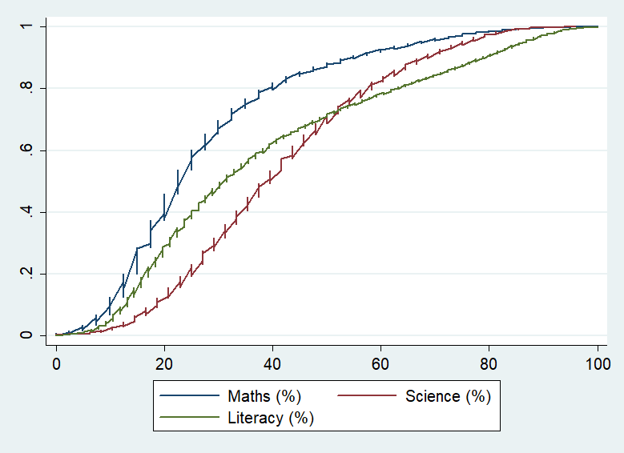

```{r setup, include=FALSE}
knitr::opts_chunk$set(echo = FALSE, message = FALSE)
# Note: Include false implies the code is executed, but not printed in your pdf.
```
\renewcommand{\vec}[1]{\mathbf{#1}}


# Introduction \label{Intro}

This is a template designed for a dissertation/thesis, or maybe even a fancy essay. It requires [RStudio](https://www.rstudio.com/products/rstudio/download/) and [Latex](https://www.latex-project.org/get/) be installed, as well as knowledge of "coding" in RMarkdown and Latex. It would also help if you knew how to navigate a `.tex` file to fix some niggly issues when knitting (compiling) this. It *is* a work in progress, so please contact me if you have any suggestions/comments!

Also, make sure you keep `git pull`ing to get the most recent updates to this template.

The layout of the template is as follows: Section \ref{Lit} "gives a brief overview of relevant literature"; section \ref{Data} "presents the model and describes certain aspects of the data descriptively and graphically"; \ref{OLS} is a section for results, section \ref{Recom} "makes some recommendations for further research" and section \ref{Concl} "concludes".


# Brief Literature Review \label{Lit}

## References

References are taken care of by using the `ref.bib` file in the `tex` folder. You can create/update this `ref.bib` file quite nicely using a program like Mendeley or just by going to Google Scholar, clicking on `cite` and then `BibTex` at the bottom of the article and copy-pasting this code into the `ref.bib` file. You can then reference in-text like this: @Shepherd2011, @Spaull2013[p. 33] or with multiple authors like this: [@vanderBerg2007 \& @Hanushek2010] (the mulitple author layout does need some fixing). 


## Section

Lorem ipsum dolor sit amet, consectetur adipiscing elit, sed do eiusmod tempor incididunt ut labore et dolore magna aliqua. Ut enim ad minim veniam, quis nostrud exercitation ullamco laboris nisi ut aliquip ex ea commodo consequat. Duis aute irure dolor in reprehenderit in voluptate velit esse cillum dolore eu fugiat nulla pariatur. Excepteur sint occaecat cupidatat non proident, sunt in culpa qui officia deserunt mollit anim id est laborum.


# Empirical Methodology and Data \label{Data} 

## Empirical Model \label{Model} 

This is an equation:

\begin{align} \label{eq:EP1}
A_{it}=f(T_i^{(t)},S_i^{(t)},P_i^{(t)},B_i^{(t)},I_i),
\end{align}

where $A_{it}$ represents student $i$'s outcome at time $t$, $T_i^{(t)}$ represents teacher inputs cumulatively up to time $t$, $S_i^{(t)}$ represents school inputs cumulatively up to time $t$, $P_i^{(t)}$ represents peer inputs cumulatively up to time $t$, $B_i^{(t)}$ represents a vector of family background traits cumulatively up to time $t$ and $I_i$ is a student-specific ability vector.

You can refer in-text to equations like this: Equation \ref{eq:EP1} entails relatively strict blah blah blah...

The following is a little treat if you are trying to do some causal-econometric analysis.

1. *What is the causal relationship of interest?* I am concerned with the causal effect of teacher job satisfaction on Grade 6 learner outcomes, represented by a $\beta_{ij}$ coefficient in the $\boldsymbol\beta$ vector in an equation.

2. *What is the experiment ideally capturing the causal effect?* The ideal experiment would be to have learner unobservables be invariant across subjects, to randomly assign teachers with different levels of accurately measured job satisfaction to South African schools (with teachers randomly assigned in all other aspects as well) and then to assess a causal difference in Grade 6 learner outcomes.

3. *What is the identification strategy?* Owing to the fact that the ideal experiment is infeasible for ethical and administrative reasons, the identification strategy is to analyse national systemic evaluation data instead. A soundly-based and well-implemented quasi-experimental method such as a learner fixed effects model would assist in approximating the causal relationship of concern.

4. *What is the mode of statistical inference?* Owing to (1) the population being Grade 6 learners in South Africa, (2) the national systemic evaluation survey being nationally representative of this group and (3) robust standard errors clustered around schools being implemented, there is a strong argument for valid statistical inference.


## Data \label{Desc}

Some more in-text referencing using Latex labels: Table \ref{tab:Desc} in the Appendix displays summary statistics, Table \ref{tab:Dep} below is not in the Appendix.


\footnotesize
\renewcommand{\thetable}{\arabic{table}}

\begin{longtable} {@{} l r r c r @{}} \caption{\textbf{Learner achievement (\%)}}
\label{tab:Dep}\\ \hline \hline
Subject & Mean & Q1 & Median & Q3 \\
\hline
Maths&      27& 15&   23&  35\\ \hline \hline
\end{longtable}
\begin{center} Source: Own calculations in Stata using 2004 Grade 6 Intermediate Phase Systemic Evaluation.\end{center}
\normalsize


Here is a figure with an R chunk pointing to a file in the `results/graphs` folder:

\setcounter{figure}{0}
\renewcommand{\thefigure}{\arabic{figure}}

\begin{figure}
\caption{\textbf{\footnotesize Cumulative graph for subject scores}}
\label{fig:1}
```{r echo=FALSE, out.width='40%', fig.align='center'}

```
\centering
{\footnotesize Source: Own calculations in Stata using 2004 Grade 6 Intermediate Phase Systemic Evaluation.}
\end{figure}
\normalsize

Again, you can reference the figure in-text: figure \ref{fig:1} is a figure and it displays etc. etc. etc.

This is an organic figure generated with an R chunk that is executed when the document is knitted (the image is also saved in the folder `final-article-template_files`):

```{r echo=FALSE, out.width='40%', fig.align='center'}
x <- c(1, 2, 6, 8)
plot(x)
```

Regarding R chunks: If you want a chunk's code to be printed, include set `echo = TRUE`. `message = FALSE` stops R printing package loading details and setting `warning = FALSE` should suppress most warnings.


Here is a biiig table on it's own page:

\scriptsize

\begin{longtable}[htbp] {p{5cm}|c|*{2}{c}|*{2}{c}|*{2}{c}|*{2}{c}} \caption{\textbf{Proportion of teachers wanting to change career or feeling under-appreciated, by teacher and classroom characteristics}}
\label{tab:Teacher}\\ \hline \hline
&\multicolumn{1}{c|}{Full}&\multicolumn{2}{c|}{Want to}&\multicolumn{2}{c|}{Society }&\multicolumn{2}{c|}{Principal}&\multicolumn{2}{c}{Learners}\\
&\multicolumn{1}{c|}{teacher}&\multicolumn{2}{c|}{Change}&\multicolumn{2}{c|}{Appreciates}&\multicolumn{2}{c|}{ Appreciates}&\multicolumn{2}{c}{Appreciate}\\
&\multicolumn{1}{c|}{sample}&\multicolumn{2}{c|}{Career}&\multicolumn{2}{c|}{My Work}&\multicolumn{2}{c|}{My Work}&\multicolumn{2}{c}{My Work}\\ \hline
                                 &        & No                    & Yes                         & No                            & Yes                         & No   & Yes     & No   & Yes     \\ \hline
Male                             & 45.6         & 41.7                  & 52***                       & 46.3                          & 45.6                        & 51   & 45.2    & 43.4 & 45.8    \\
Female                           & 54.4         & 58.3                  & 48***                       & 53.7                          & 54.4                        & 49   & 54.8    & 56.7 & 54.2    \\
Home language same as LoLT        & 18.8         & 17.3                  & 22.8***                     & 67.8                          & 11.7***                     & 28.4 & 18.5*** & 79.9 & 14.3*** \\
Home language different from LoLT & 81.2         & 82.7                  & 77.2***                     & 32.2                          & 88.3***                     & 71.6 & 81.5*** & 20.1 & 85.7*** \\
20 - 29                          & 4.3          & 4                     & 4.7                         & 7                             & 3.9                         & 2.7  & 4.3     & 6.9  & 4       \\
30 - 34                          & 20.4         & 18                    & 24.6***                     & 17                            & 21                          & 17.6 & 20.6    & 17.2 & 20.7    \\
35 - 39                          & 26.8         & 23.1                  & 33.2***                     & 27.6                          & 26.6                        & 35.8 & 26.7    & 27   & 26.7    \\
40 - 44                          & 20.6         & 20.8                  & 19.5                        & 19.7                          & 20.7                        & 20.3 & 20.5    & 22.1 & 20.5    \\
45 - 49                          & 15.2         & 17.4                  & 11.9***                     & 13.5                          & 15.5                        & 15.5 & 15      & 14.2 & 15.4    \\
50+                              & 12.7         & 16.8                  & 6.1***                      & 15.1                          & 12.4                        & 8.1  & 12.8    & 12.8 & 12.7    \\
Classroom management training    & 57.5         & 60.9                  & 51.8                        & 53.3                          & 58.3                        & 46.3 & 58.1    & 56.1 & 57.8    \\
<Grade 12               & 2.4          & 2.8                   & 1.8                         & 0.9                           & 2.7**                       & 2.2  & 2.5     & 0.01 & 2.5     \\
Grade 12                         & 61.1         & 64.9                  & 55.2***                     & 50.3                          & 62.9***                     & 61   & 64.2    & 49.2 & 62.1**  \\
Bachelor's Degree                & 28           & 25.7                  & 31**                        & 37.7                          & 26.4***                     & 27.9 & 26.3    & 44.5 & 26.5*** \\
Honours Degree                   & 8.1          & 6.2                   & 11.4***                     & 11.2                          & 7.6                         & 6.6  & 8.1     & 0.1  & 0.1     \\
Masters Degree                   & 0.5          & 0.4                   & 0.6                         & 0                             & 0.5                         & 0.01 & 0       & 0    & 0       \\
<2 Years Training        & 2.8          & 2.9                   & 2.5                         & 6.5                           & 2.2***                      & 2.2  & 2.9     & 9.3  & 2.3***  \\
2 Years Training                 & 11           & 12.7                  & 8.2**                       & 4.9                           & 12***                       & 6.8  & 11.2    & 2.5  & 11.7*** \\
3 Years Training                 & 51.3         & 50.5                  & 53.3                        & 33.1                          & 54.4***                     & 54.7 & 51.5    & 29.9 & 53.2*** \\
3+ Years Training                & 35           & 33.9                  & 36                          & 55.6                          & 31.3***                     & 36.5 & 34.5    & 58.3 & 32.8*** \\
No School Library                & 52           & 49.8                  & 54.6                        & 59.4                          & 28.9                        & 82.5 & 46.5    & 50.8 & 11.8    \\
No Internet                      & 17.9         & 15.3                  & 20.3                        & 50.8                          & 11.8                        & 27.1 & 16.6    & 55.2 & 14.1    \\
No Classroom Electricity         & 72.4         & 68.7                  & 77.8                        & 94.3                          & 68.5                        & 77.7 & 71.5    & 99.5 & 69.7    \\
No Class Library                 & 40.6         & 37.8                  & 45.7**                      & 29.3                          & 42.7**                      & 42.7 & 40.7    & 31.2 & 41.6**  \\
No Teacher Resource Centre       & 33.7         & 33.5                  & 32.3                        & 59.4                          & 28.9***                     & 33.6 & 33      & 61.8 & 30.6*** \\
School SES Q1                    & 23.3         & 27                    & 16.9***                     & 4.1                           & 26.4***                     & 10.8 & 24.1*** & 0    & 25.3*** \\
School SES Q2                    & 21.3         & 21.6                  & 21.5                        & 5.1                           & 23.9***                     & 12.8 & 21.8**  & 3.4  & 22.9*** \\
School SES Q3                    & 19           & 18.6                  & 20.9                        & 9.7                           & 21**                        & 23.7 & 19      & 4.9  & 20.6*** \\
School SES Q4                    & 18.4         & 16.3                  & 21.1**                      & 21.9                          & 17.6                        & 26.4 & 17.8*   & 22.1 & 17.8    \\
School SES Q5                    & 18.2         & 16.6                  & 19.7                        & 59.2                          & 11.2***                     & 26.4 & 17.2**  & 69.6 & 13.5*** \\ \hline \hline
\end{longtable}
\begin{center} Source: Own calculations in Stata using 2004 Grade 6 Intermediate Phase Systemic Evaluation.\end{center}

\normalsize


# Results: OLS Investigation into SES \label{OLS}

Quite a complexly-formatted table:

\scriptsize

\setcounter{table}{2}

\begin{longtable}[htbp] {p{6cm}*{3}{c} | c c c} \caption{
\textbf{OLS regressions for quintile 5 and quintile 1-4 schools}} \label{tab:OLS} \\ \hline\hline
                &\multicolumn{3}{c}{Quintile 5 Sample}&\multicolumn{3}{c}{Quintile 1-4 Sample}\\ \hline
                &\multicolumn{1}{c}{(1)}&\multicolumn{1}{c}{(2)}&\multicolumn{1}{c}{(3)}&\multicolumn{1}{c}{(4)}&\multicolumn{1}{c}{(5)}&\multicolumn{1}{c}{(6)}\\ 
                &\multicolumn{1}{c}{Std Maths}&\multicolumn{1}{c}{Std Science}&\multicolumn{1}{c}{Std English}&\multicolumn{1}{c}{Std Maths}&\multicolumn{1}{c}{Std Science}&\multicolumn{1}{c}{Std English}\\
\hline
Would Not Like to Change Careers&   0.200*         &   0.0115          &     -0.0461       &    -0.0362          &     -0.111*  &  -0.0528   \\
                &   (2.12)           &     (0.16)        &      (-0.86)        &     (-1.09)       &      (-2.47)    &   (-1.39) \\

Think Society Appreciates My Work&    0.0115           &  -0.00387    &       -0.0857          &      -0.0645      &      -0.0366   &   -0.00950  \\
                &    (0.09)         &       (-0.06)       &       (-1.16)      &     (-0.68)        &     (-0.40)    &  (-0.12) \\

Think The Principal Appreciates My Work&   -0.110           &    0.255*       &     0.0623        &    -0.0318       &    -0.112    &   0.112   \\
                &   (-0.79)          &    (2.14)         &      (0.43)       &    (-0.35)         &     (-1.34)    &  (1.41) \\

Think Learners Appreciate My Work&  -0.0991          &     -0.255**      &      -0.0992       &      0.123         &      -0.0234 &   -0.0169  \\
                &    (-1.09)         &        (-3.19)            &       (-1.40)             &       (0.83)        &        (-0.16)          &    (-0.14)               \\

School SES      &   -2.046         &    4.509         &    6.111** &   0.0874         &    0.125*  &    0.236***\\
                &  (-0.97)         &   (1.59)         &   (3.09)         &   (1.63)         &   (2.31)         &   (5.20)         \\

School SES Squared&    1.130         &   -1.469         &   -2.308** &   0.0280         &  0.00920         &   0.0449*  \\
                &   (1.32)         &  (-1.26)         &  (-2.63)         &   (1.28)         &   (0.34)         &   (2.27)         \\
                
Household SES   &   0.0581         &   0.0614         &    0.171*  &   0.0796***&   0.0973***&    0.123***\\
                &   (0.82)         &   (0.56)         &   (2.00)         &   (5.49)         &   (5.22)         &   (7.39)         \\
                
Household SES Squared&   0.0871         &   0.0645         &  -0.0273         &   0.0299***&   0.0310** &   0.0369***\\
                &   (1.53)         &   (1.02)         &  (-0.57)         &   (3.69)         &   (3.07)         &   (4.17)         \\

Constant        &    4.010** &  0.00387         &   -2.077         &    0.830         &   -0.269         &    0.267         \\
                &   (2.68)         &   (0.00)         &  (-1.69)         &   (1.47)         &  (-0.43)         &   (0.60)         \\
\hline
Observations    &     3395         &     3016         &     3418         &    10387         &    10402         &    10445         \\
\(R^{2}\)       &    0.620         &    0.597         &    0.650         &    0.245         &    0.299         &    0.445         \\  \hline \hline
\multicolumn{7}{l}{Note: \textit{t}-statistics in parentheses. Statistical significance at the 0.05, 0.01 and 0.001 level is represented as *, ** and *** respectively.} \\
\multicolumn{7}{l}{All regressions include pupil, school and teacher controls listed in table \ref{tab:Desc} (coefficients omitted for brevity). Robust standard errors} \\
\multicolumn{7}{l}{clustered around schools used.}\\
\multicolumn{7}{l}{Source: Own calculations in Stata using 2004 Grade 6 Intermediate Phase Systemic Evaluation.}\\
\end{longtable}

\normalsize

\setcounter{table}{3}

\newpage


And another complexly-formatted table:

\scriptsize

\begin{longtable}[htbp] {p{7cm}*{4}{c}} \caption{
\textbf{Teacher attributes for fixed effects over subject pairs}} \label{tab:FE2_In} \\ \hline\hline
                &\multicolumn{1}{c}{(1)}&\multicolumn{1}{c}{(2)}&\multicolumn{1}{c}{(3)}&\multicolumn{1}{c}{(4)}\\
                &\multicolumn{1}{c}{All Subjects}&\multicolumn{1}{c}{Maths/Science}&\multicolumn{1}{c}{Science/English}&\multicolumn{1}{c}{English/Maths}\\
\hline
Would Not Like to Change Careers&   0.0136         &   0.0129         &   0.0211         &   0.0183         \\
                &   (0.69)         &   (0.43)         &   (0.73)         &   (0.57)         \\

Think Society Appreciates My Work&   0.0502         &   0.0163         &   0.0742        &    0.110\textdagger          \\
                &   (1.41)         &   (0.31)         &   (1.40)         &   (1.95)         \\

Think The Principal Appreciates My Work&  -0.0149         &   0.0319         & -0.00744         &  -0.0476         \\
                &  (-0.41)         &   (0.57)         &  (-0.17)         &  (-0.94)         \\

Think Learners Appreciate My Work& -0.00574         &  -0.0163         &   0.0812         &  -0.0430         \\
                &  (-0.13)         &  (-0.28)         &   (1.29)         &  (-0.65)         \\

Job Satisfaction Aspects Are Valued&  0.00184         &  -0.0152         & -0.00308         &   0.0159         \\
                &   (0.19)         &  (-1.21)         &  (-0.23)         &   (0.97)         \\
Constant        &   -0.435** &   -0.177         &   -0.354*  &   -0.691*  \\
                &  (-2.87)         &  (-0.73)         &  (-2.09)         &  (-2.37)         \\ \hline
Teacher Demographic Controls & Yes & Yes & Yes & Yes \\
Teacher Training Controls & Yes & Yes & Yes & Yes\\
Classroom Resource Controls & Yes & Yes & Yes & Yes\\
\hline
Observations    &    58538         &    38712         &    38911         &    39453         \\
\(R^{2}\)       &    0.021         &    0.035         &    0.051         &    0.062         \\
\hline\hline
\multicolumn{5}{l}{Note: \textit{t}-statistics in parentheses. Statistical significance at the 0.1, 0.05, 0.01 and 0.001 level is represented as \textdagger, *, ** and} \\
\multicolumn{5}{l}{ *** respectively. Robust standard errors clustered around schools used.}\\
\multicolumn{5}{l}{Source: Own calculations in Stata using 2004 Grade 6 Intermediate Phase Systemic Evaluation.}\\
\end{longtable}

\normalsize


# Recommendations for Further Research \label{Recom}

Lorem ipsum dolor sit amet, consectetur adipiscing elit, sed do eiusmod tempor incididunt ut labore et dolore magna aliqua. Ut enim ad minim veniam, quis nostrud exercitation ullamco laboris nisi ut aliquip ex ea commodo consequat. Duis aute irure dolor in reprehenderit in voluptate velit esse cillum dolore eu fugiat nulla pariatur. Excepteur sint occaecat cupidatat non proident, sunt in culpa qui officia deserunt mollit anim id est laborum.


# Concluding Remarks \label{Concl}

Lorem ipsum dolor sit amet, consectetur adipiscing elit, sed do eiusmod tempor incididunt ut labore et dolore magna aliqua. Ut enim ad minim veniam, quis nostrud exercitation ullamco laboris nisi ut aliquip ex ea commodo consequat. Duis aute irure dolor in reprehenderit in voluptate velit esse cillum dolore eu fugiat nulla pariatur. Excepteur sint occaecat cupidatat non proident, sunt in culpa qui officia deserunt mollit anim id est laborum.

\newpage


# Appendix {.unnumbered}

\setcounter{table}{0}
\renewcommand{\thetable}{A\arabic{table}}

A table in the Appendix:

\onehalfspacing
\scriptsize

\begin{longtable}[htbp] {@{} l r r r r r @{}} \caption{
\textbf{Summary statistics of model variables}} \label{tab:Desc}  \\ \hline\hline
                \textbf{Variable } & \textbf{Mean} & \textbf{S.D.} & \textbf{Min} & \textbf{Max} & \textbf{N}\\
\hline
\bf{\emph{Educational Outcomes}} & & & & \\
   Maths Score (\%)  &   27.58797 &   17.82077 &          0 &        100 &     102048 \\
   Science Score (\%) &   41.04531 &   18.54542 &          0 &   95.83334 &     102045 \\
   English Score (\%) &   38.49276 &    24.3848 &          0 &        100 &     102048 \\
\bf{\emph{Variables of Interest}} & & & & \\
     Would Not Like to Change Careers   &   .6278206 &   .4833884 &          0 &          1 &      94261 \\
    Think Society Appreciates My Work  &   .8589375 &   .3480878 &          0 &          1 &      95681 \\
     Think The Principal Appreciates My Work  &   .9442797 &   .2293819 &          0 &          1 &      95118 \\
    Think Learners Appreciate My Work  &   .9206386 &   .2703035 &          0 &          1 &      95777 \\
  Job Satisfaction Aspects Are Valued  &   -5.85e-10 &          1 & -5.426387  &   1.264366 &      95878 \\
  \bf{\emph{Teacher Demographics}} & & & & \\
       Female Teacher  &   .5456909 &   .4979105 &          0 &          1 &      96912 \\
       Teacher Age Group  &   4.620139 &    1.414589 &          1 &          7 &      97491 \\
    Teacher Lang Same as LoLT   &   .1941929 &     .39558 &          0 &          1 &     102048 \\
  \bf{\emph{Teacher Training}} & & & & \\
      Highest Qualification  &   1.244398 &   1.585643 &          0 &          5 &      90725 \\
       Professional Teacher Training  &   2.407594 &   1.864552 &          0 &          6 &      97126 \\
       Curriculum Training This Year  &   1.608552 &   1.780161 &          0 &          4 &      96207 \\
    Inclusive Education Training  &   .4495686 &    .497453 &          0 &          1 &      86692 \\
    Learning Area Training  &   .7477317 &   .4343168 &          0 &          1 &      91478 \\
    Classroom Mgmt. Training  &   .5687338 &   .4952559 &          0 &          1 &      88901 \\
    HIV/Aids Training  &   .5322763 &   .4989599 &          0 &          1 &      90004 \\
    Race and Values Training  &   .2388007 &   .4263532 &          0 &          1 &      85653 \\
\hline \hline
\multicolumn{5}{@{}l}{Source: Own calculations in Stata using 2004 Grade 6 Intermediate Phase Systemic Evaluation.}
\end{longtable}


Another table in the Appendix spread over pages:

\begin{longtable}[htbp] {p{8cm}*{5}{c}} \caption{
\textbf{Teacher attributes for fixed effects across all three subjects}} \label{tab:FE} \\ \hline\hline
                &\multicolumn{1}{c}{(1)}&\multicolumn{1}{c}{(2)}&\multicolumn{1}{c}{(3)}&\multicolumn{1}{c}{(4)}&\multicolumn{1}{c}{(5)}\\
\hline
Would Not Like to Change Careers&   0.0233         &   0.0143         &   0.0232         &   0.0200         &   0.0136         \\
                &   (1.22)         &   (0.75)         &   (1.20)         &   (1.04)         &   (0.69)         \\

Think Society Appreciates My Work&   0.0655         &   0.0722*  &   0.0666         &   0.0514         &   0.0502         \\
                &   (1.81)         &   (2.05)         &   (1.84)         &   (1.38)         &   (1.41)         \\

Think The Principal Appreciates My Work&   0.0122         &  0.00778         &  0.00800         & -0.00698         &  -0.0149         \\
                &   (0.34)         &   (0.23)         &   (0.22)         &  (-0.18)         &  (-0.41)         \\

Think Learners Appreciate My Work&  -0.0324         & -0.00676         &  -0.0279         &  -0.0417         & -0.00574         \\
                &  (-0.69)         &  (-0.14)         &  (-0.58)         &  (-0.97)         &  (-0.13)         \\

Job Satisfaction Aspects Are Valued&-0.000127         &  0.00257         &-0.000799         &  0.00100         &  0.00184         \\
                &  (-0.01)         &   (0.26)         &  (-0.08)         &   (0.10)         &   (0.19)         \\ \hline
Observations    &    58538         &    58538         &    58538         &    58538         &    58538         \\
\(R^{2}\)       &    0.001         &    0.010         &    0.004         &    0.009         &    0.021         \\
\hline\hline
\multicolumn{6}{l}{Note: \textit{t}-statistics in parentheses. Statistical significance at the 0.05, 0.01 and 0.001 level is represented as *, ** and ***} \\
\multicolumn{6}{l}{ respectively. Robust standard errors clustered around schools used.}\\
\multicolumn{6}{l}{Source: Own calculations in Stata using 2004 Grade 6 Intermediate Phase Systemic Evaluation.}\\
\end{longtable}


Aaand one last one:

<!--
%\begin{landscape}
-->

\begin{longtable}[htbp] {p{5cm}*{4}{c}|*{4}{c}} \caption{
\textbf{Teacher attribute SES interactions for fixed effects, by SES}} \label{tab:FE_SES2} \\ \hline\hline
&\multicolumn{4}{c}{Quintile 5}&\multicolumn{4}{c}{Quintile 1-4}\\
                %&\multicolumn{1}{c}{(1)}&\multicolumn{1}{c}{(2)}&\multicolumn{1}{c}{(3)}&\multicolumn{1}{c}{(4)} &\multicolumn{1}{c}{(5)}&\multicolumn{1}{c}{(6)}&\multicolumn{1}{c}{(7)}&\multicolumn{1}{c}{(8)}  \\
                &\multicolumn{1}{c}{All}&\multicolumn{1}{c}{M/S}&\multicolumn{1}{c}{S/E}&\multicolumn{1}{c}{E/M}  &\multicolumn{1}{c}{All}&\multicolumn{1}{c}{M/S}&\multicolumn{1}{c}{S/E}&\multicolumn{1}{c}{E/M}  \\
\hline
1. Would Not Like to Change Careers&  -0.0771         &    0.203** &   0.0136         & -0.00172         &   0.0184         &  -0.0108         &-0.000547         &   0.0255         \\
                &  (-1.62)         &   (2.78)         &   (0.24)         &  (-0.02)         &   (0.74)         &  (-0.31)         &  (-0.01)         &   (0.68)         \\
\quad 1. $\times$ Household SES&   0.0310         &    0.103         &  -0.0662         &  -0.0167         &  -0.0270         &  -0.0212         &  -0.0107         &  -0.0352         \\
                &   (0.69)         &   (1.80)         &  (-1.37)         &  (-0.22)         &  (-1.30)         &  (-0.73)         &  (-0.34)         &  (-1.32)         \\
2. Think Society Appreciates Work&    0.143         &    0.223         &    0.119         &    0.304***&  0.00933         &   -0.106         &    0.106         & -0.00589         \\
                &   (1.69)         &   (1.60)         &   (1.39)         &   (3.99)         &   (0.17)         &  (-1.43)         &   (1.39)         &  (-0.07)         \\
\quad 2. $\times$ Household SES&  -0.0440         &  -0.0919         &   0.0300         &  -0.0985         &   0.0415         &  0.00348         &  -0.0258         &    0.235***\\
                &  (-0.76)         &  (-0.91)         &   (0.54)         &  (-1.20)         &   (0.92)         &   (0.08)         &  (-0.49)         &   (3.50)         \\
3. Think Principal Appreciates Work&   -0.162*  &    0.172         &   -0.240** &   -0.546***&   0.0223         &   0.0717         &  -0.0792         &   0.0392         \\
                &  (-1.99)         &   (1.13)         &  (-2.63)         &  (-6.45)         &   (0.58)         &   (1.04)         &  (-1.39)         &   (0.68)         \\
\quad 3. $\times$ Household SES&   0.0759         &    0.112         &   0.0279         &    0.169** &   0.0436         &   0.0904         &   0.0949         & -0.00261         \\
                &   (1.79)         &   (1.89)         &   (0.54)         &   (3.16)         &   (1.49)         &   (1.88)         &   (1.86)         &  (-0.06)         \\
4. Think Learners Appreciate Work&   0.0645         &   -0.260         &   0.0266         &  -0.0525         &   0.0563         &  -0.0291         &    0.332** &   0.0468         \\
                &   (0.78)         &  (-1.83)         &   (0.26)         &  (-0.64)         &   (0.60)         &  (-0.31)         &   (2.89)         &   (0.49)         \\
\quad 4. $\times$ Household SES&  -0.0719         &   -0.114         &   0.0105         &  -0.0651         &   -0.111         &  -0.0988         &  -0.0115         &   -0.152*  \\
                &  (-1.23)         &  (-1.31)         &   (0.16)         &  (-0.84)         &  (-1.60)         &  (-0.95)         &  (-0.17)         &  (-2.53)         \\
5. Job Satisfaction Aspects Are Valued&   0.0597*  &        0         &        0         &        0         &        0         &        0         &        0         &        0         \\
                &   (2.53)         &      (.)         &      (.)         &      (.)         &      (.)         &      (.)         &      (.)         &      (.)         \\
\quad 5. $\times$ Household SES&  -0.0544*  &  -0.0376         & -0.00473         &  -0.0157         &  0.00763         &  0.00755         &  -0.0203         &   0.0375         \\
                &  (-2.60)         &  (-1.09)         &  (-0.22)         &  (-0.50)         &   (0.57)         &   (0.65)         &  (-1.25)         &   (1.94)         \\
\hline
Observations    &    11946         &    21738         &    21798         &    22230         &    42010         &    31923         &    31726         &    32158         \\
\(R^{2}\)       &    0.085         &    0.158         &    0.193         &    0.216         &    0.021         &    0.038         &    0.065         &    0.075         \\
\hline\hline
\multicolumn{9}{l}{Note: \textit{t}-statistics in parentheses. Statistical significance at the 0.05, 0.01 and 0.001 level is represented as *, ** and ***} \\
\multicolumn{9}{l}{ respectively. Robust standard errors clustered around schools used.}\\
\multicolumn{9}{l}{Source: Own calculations in Stata using 2004 Grade 6 Intermediate Phase Systemic Evaluation.}\\
\end{longtable}

\normalsize

<!--
%\end{landscape}
-->

\newpage

\color{red}Note that the following references need to be re-ordered in the final .tex file manually so that they come after the **References**  heading (at least until I fix it). Also note how, compared to something like Microsoft Word, you don't have to worry about each reference's format, or about alphabetizing them - everything is done automatically via Latex and the `ref.bib` file in the `tex` folder.
\color{black}